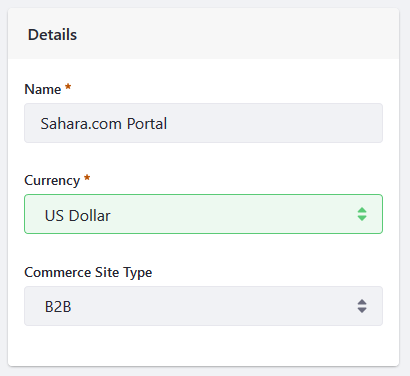
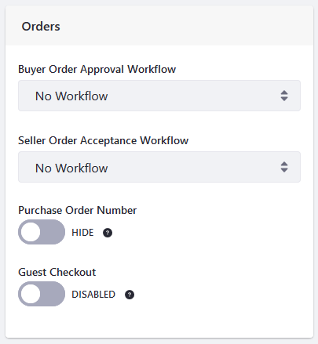
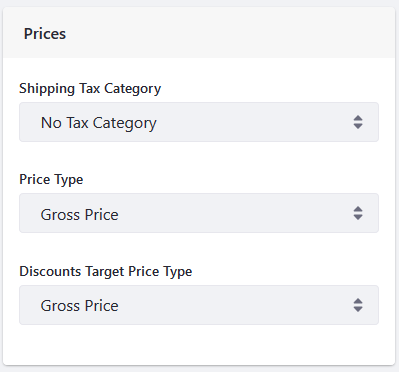
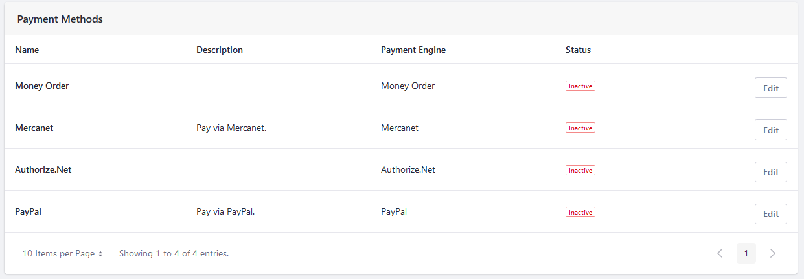
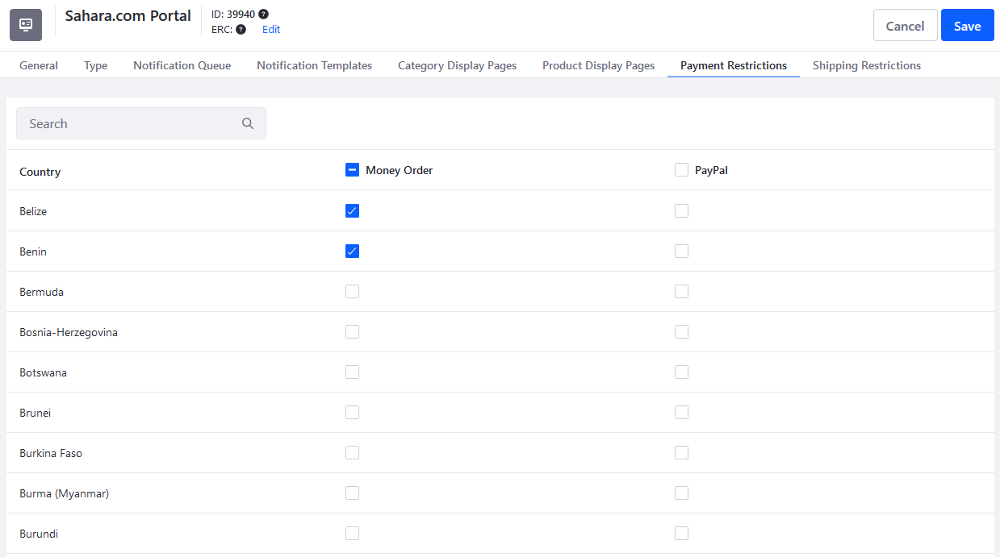
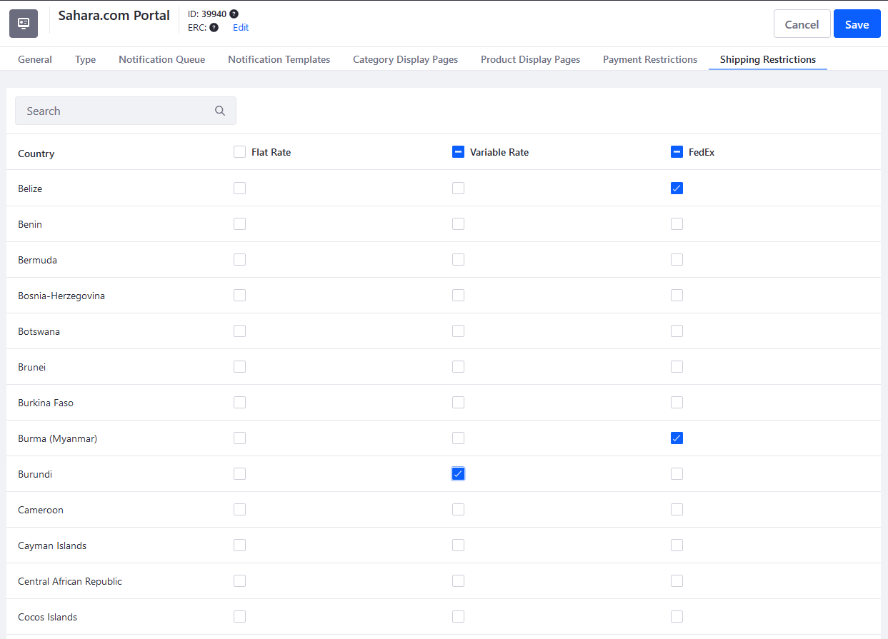

# Channels Reference Guide

> Commerce 2.1+

This article provides an overview to the Channels management interface. To create a channel, see [Managing Channels](./managing-channels.md).

## General

The _General_ tab is where many important channel settings are located, such as Currency, Order Workflows, Payments, Shipping, and Taxes.

### Details

The _Details_ section is where the channel's name, currency, and [Commerce Site Type](../../../starting-a-store/sites-and-site-types.md) are set.

### Orders

Users can enable a workflow for [buyers and sellers](../../../orders-and-fulfillment/order-workflows/introduction-to-order-workflows.md). Users can also enable or disable Guest Checkout and whether the Purchase Order Number is displayed (where applicable).

### Prices

Users can set the [Shipping Tax Category](../../../store-administration/configuring-taxes/creating-tax-categories.md), the Price Type, and the Discount Target Price Type.

For _Price Type_, users can determine whether product prices are displayed with either tax included (gross price) or tax excluded (net price).

For _Discounts Target_, users can determine whether applicable discounts are calculated based on the product's gross price or net price.

### Health Checks

Health checks allow users to quickly fix any common setup issues with their store sites, such as missing widgets that are required to have a functioning store.

### Payment Methods

Users can configure which [payment methods](../../../store-administration/configuring-payment-methods/managing-payment-methods.md) to use for the channel. In addition, users can use a [custom payment engine](../../../developer-guide/tutorials/implementing-a-new-payment-method.md).

### Shipping Methods

Users can configure the channel's shipment methods. By default, the [flat rate](../../../store-administration/configuring-shipping-methods/using-the-flat-rate-shipping-method.md) is enabled. Users can also enable a [variable rate](../../../store-administration/configuring-shipping-methods/using-the-variable-rate-shipping-method.md) shipping method. Subscribers can also enable [FedEx](../../../store-administration/configuring-shipping-methods/using-the-fedex-shipping-method.md).

Lastly, users can use a [custom shipping engine](../../../developer-guide/tutorials/implementing-a-new-shipping-engine.md).

### Tax Calculations

Users can configure the channel's tax calculations. To learn more about setting a tax rate, see [Setting Tax Rate by Address](../../../store-administration/configuring-taxes/setting-tax-rate-by-address.md) or [Setting Tax Rate by Fixed Rate](../../../store-administration/configuring-taxes/setting-tax-rate-by-fixed-rate.md)

## Type

A channel can be connected to a DXP site. Alternately, a channel can be connected to a non-DXP site, such as Amazon Marketplace. Here, users can select which DXP site to associate the channel.

## Notification Queue

Liferay Commerce can be configured to send email notifications that are triggered by a variety of events. When an event triggers a notification (for example, an order is placed), the notification is logged in the channel's _Notification Queue_ tab. By default, the Liferay Commerce instance checks whether a notification has been sent every 15 minutes and deletes any unsent notifications after 43200 minutes (30 days).

See the [Configuring the Commerce Notification Queue](../../../store-administration/sending-emails/configuring-the-commerce-notification-queue.md) article for more information.

## Notification Templates

Notification Templates allow users to customize their email notifications and define the triggering events.

To learn more about sending emails notifications, see [Store emails](../../../store-administration/sending-emails/store-emails.md).

To learn more about creating and using notification templates, see [Using Notification Templates](../../../store-administration/sending-emails/using-notification-templates.md).

## Category Display Pages

The Category Display Pages tab displays the list of all Category Display pages created on the store site. A _Category Display Page_ allow users to substitute a specific DXP site page that displays all products tagged in a given Category. Users should first create [product categories](../products/organizing-your-catalog-with-product-categories.md), associate them with the desired products, and then create the pages.

To learn more about creating DXP site pages, see [Creating Pages](https://learn.liferay.com/dxp/7.x/en/site-building/creating_pages.html). To learn more about creating Tags and Categories in general, see [Tags and Categories](https://learn.liferay.com/dxp/7.x/en/content-authoring-and-management/tags_and_categories.html).

## Product Display Pages

Product Display Pages operate on a similar premise to Category Display Pages; users can create a specific site page to highlight a specific product instead of the default Catalog page. On the _Product Display Pages_ tab, users can view the list of all Product Display Pages created on the site.

## Payment Restrictions

Users can configure which payment methods are _restricted_ for the buyer's country. (If no billing address is listed, the channel checks the shipping address.) To do so, at least one [payment methods](../../../store-administration/configuring-payment-methods/managing-payment-methods.md) must be activated. Check the boxes for each country so that accounts from that country cannot use that payment method.

## Shipping Restrictions

Users can configure which shipment methods are _restricted_ for the buyer's country.

## Additional Information

* [Configuring Product Visibility Using Channels](./configuring-product-visibility-using-channels.md)
* [Enabling or Disabling Order Workflows](../../../orders-and-fulfillment/order-workflows/enabling-or-disabling-order-workflows.md)
