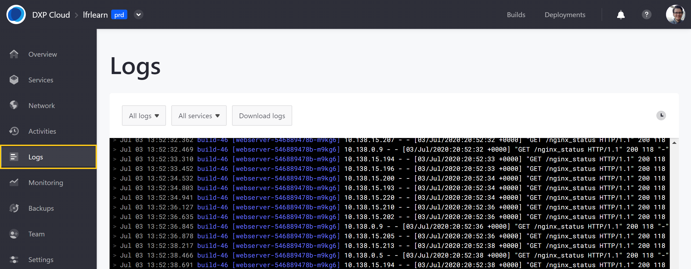

# Log Management

Logs are crucial for debugging. With DXP Cloud, you can access and download environment logs via the web console or your OS terminal.

## Accessing Logs from the Web Console

The easiest way to access environment logs is via the web console.

1. Navigate to a project environment.

1. Click on *Logs* in the environment menu.

View application and build logs across all environment services, or filter results using the drop-down menus.

To download logs, click the *Download Logs* button.



Environment service logs are also available under the *Logs* tab in each service's dedicated page.

## Accessing Logs from the Terminal

Administrators and developers can also view logs via their OS terminals.

Run the following command to list logs for all services:

```shell
lcp log
```

To access service logs from a specific environment, either enter the environment's ID after running the `lcp log` command, or run the `lcp log` command with the environment ID:

```shell
lcp log -p <environment-id>
```

Users can also specify a service as part of the `lcp log` command:

```shell
lcp log -p <environment-id> -s <service-id>
```

## Additional Information

- [Shell Access](./shell-access.md)
- [Disaster Recovery Overview](./disaster-recovery-overview.md)
- [Configuring Cross-Region Disaster Recovery](./configuring-cross-region-disaster-recovery.md)
