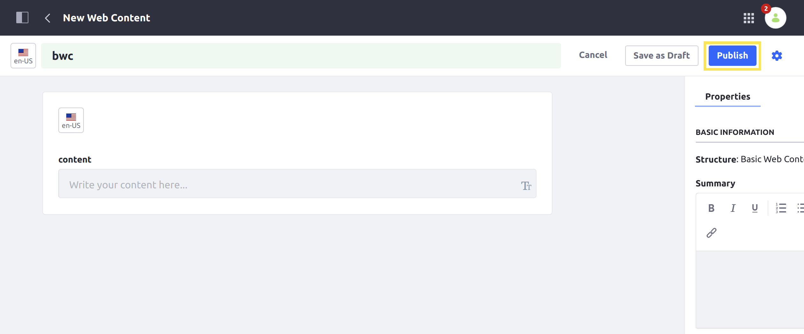
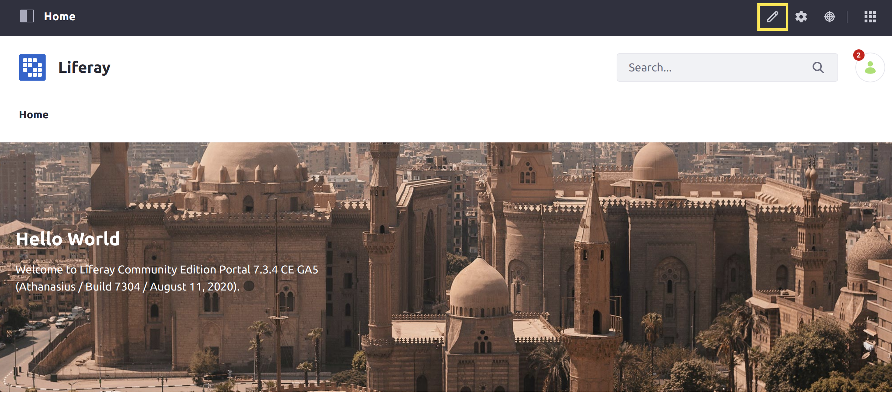
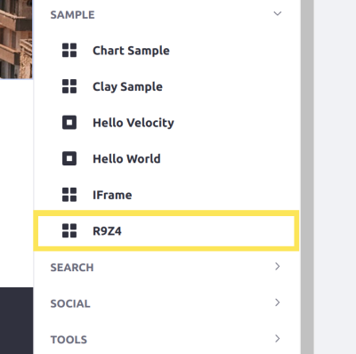
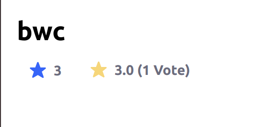

# Enabling Ratings in Your Application

The [ratings system](../user-guide/using-the-ratings-system.md) shows buttons to rate different types of content in various ways, such as with stars or thumbs (up or down). You can enable ratings for any assets using the [asset framework]().

<%-- TODO: Link above to Asset Framework --%>


Here, you'll use the ratings tag library to add ratings for content. 

## Start with a Sample MVC Portlet

To implement ratings in your application, you must first have an entity to rate. This example uses an [MVC Portlet](../../../developing-applications/developing-a-java-web-application/using-mvc/creating-an-application-with-mvcportlet.md) with a JSP view as a starting point.

To begin adding ratings, download the sample module:

```bash
curl https://learn.liferay.com/dxp/7.x/en/collaboration-and-social/social-tools/02-developer-guide/enabling-ratings-in-your-application/liferay-r9z4.zip -O
```

```
unzip liferay-r9z4.zip
```

Next, you'll enable ratings for this application.

## Enable Ratings 

To enable ratings for your application, you must define an OSGi component with ratings enabled, and then display the ratings using the taglib in your view.

### Configure Your OSGi Component

The sample already defines an OSGi component extending `MVCPortlet`: 

```java
@Component(
    immediate = true,
    property = {
        "com.liferay.portlet.display-category=category.sample",
        "com.liferay.portlet.instanceable=true",
        "javax.portlet.display-name=R9Z4",
        "javax.portlet.init-param.template-path=/",
        "javax.portlet.init-param.view-template=/view.jsp",
        "javax.portlet.security-role-ref=power-user,user"
    },
    service = Portlet.class
)
public class R9Z4JSPPortlet extends MVCPortlet {
```

1. Modify the class declaration so the class implements `PortletRatingsDefinition`: 

   ```java
   public class R9Z4JSPPortlet extends MVCPortlet implements PortletRatingsDefinition {
   ```

   If you're using an IDE, it may say there are now methods that must be overridden. 

1. Override the `getDefaultRatingsType` method and return one of the available [ratings types](../user-guide/using-the-ratings-system.md#ratings-types) to define the default ratings type for your application. If your application uses a custom asset, this becomes the default ratings type for that asset. Use the [`RatingsType`](https://docs.liferay.com/portal/7.3-latest/javadocs/portal-kernel/com/liferay/ratings/kernel/RatingsType.html) enumeration class to return your chosen type, like stars:

   ```java
   @Override
   public RatingsType getDefaultRatingsType() {
       return RatingsType.STARS;
   }
   ```

   ```note::
      The default ratings type for the asset type can still be overridden per Site via the `Site Settings` screen or across the entire DXP instance from _Control Panel_ → _Instance Settings_ → _Social_.
   ```

1. Override the `getPortletId` method to return the ID of this portlet.

   ```java
   @Override
   public String getPortletId() {
       return "R9Z4";
   }
   ```

   ```tip::
      If you want to return an ID for an existing portlet, you can use the `PortletKeys <https://github.com/liferay/liferay-portal/blob/7.3.4-ga5/portal-kernel/src/com/liferay/portal/kernel/util/PortletKeys.java>`__ class to choose the ID for that portlet.
   ```

### Use the Ratings Tag to Display Ratings

In the application's view layer, retrieve the asset to view its ratings. This example shows a web content article. 

1. Add the following code to the sample module's `view.jsp`:

   ```jsp
   <%
   List<JournalArticle> journalArticles = JournalArticleLocalServiceUtil.getArticles(themeDisplay.getScopeGroupId());

   JournalArticle firstArticle = journalArticles.get(0);
   %>
   ```

   ```note::
      In this example, the `view.jsp <./enabling-ratings-in-your-application/liferay-r9z4.zip/r9z4-web/src/main/resources/META-INF/resources/view.jsp>`__ file includes all the logic to retrieve the asset. For an MVC Portlet implementation in a production environment, you should instead separate this code into the ``render`` logic within your Java code. See the `MVC Portlet Guide <../../../developing-applications/developing-a-java-web-application/using-mvc/creating-an-application-with-mvcportlet.md>`__ for more information on creating MVC Portlets.
   ```

1. Once you have the asset, use the `liferay-ratings` tag to display ratings for the asset. The `className` and `classPK` attributes are required for the tag.

   ```jsp
   <liferay-ratings:ratings
       className="<%= JournalArticle.class.getName() %>"
       classPK="<%= Long.valueOf(firstArticle.getArticleId()) %>"
       type="stars"
   />
   ```

   ```note::
      You must declare the ``liferay-ratings`` taglib to use it in your view.
   ```

```tip::
   This example shows ratings beneath the chosen asset's title. The ``liferay-ratings`` tag should normally be displayed near where the asset's information is shown.
```

Now ratings appear on pages with your view.

## Test Your Application

Now you're ready to test your module:

1. Start a Liferay DXP Docker image. 

    ```bash
    docker run -it -p 8080:8080 liferay/portal:7.3.4-ga5
    ```

1. Build and deploy the sample module.

    ```bash
    ./gradlew deploy -Ddeploy.docker.container.id=$(docker ps -lq)
    ```

    ```note::
       This command is the same as copying the deployed jars to ``/opt/liferay/osgi/modules`` on the Docker container.
    ```

1. Confirm the deployment in the Docker console.

    ```
    STARTED com.acme.r9z4.web_1.0.0
    ```

### Create Content for Testing

Now you need some content to display your ratings. Create an article: 

1. Navigate to _Content & Data_ &rarr; _Web Content_. 

    

1. Click _Add_ () &rarr; _Basic Web Content_ to begin creating a new article.

    

1. Add a title and click _Publish_ to finish publication.

    

### Deploy the Widget and Verify

Now deploy the widget from your module and verify that ratings appear with the content title:

1. On the home page of your Site, click the Edit () icon to edit the page.

    

1. Click the Cards view () icon and then click _Widgets_.

1. Locate the _R9Z4_ widget in the list of widgets, and place it on the page.

    

1. Click _Publish_ to finalize.

1. Verify that the ratings appear beneath the title of your web content.

    

The widget displays a web content article's title, and the ratings appear beneath it.

## Conclusion

Congratulations! You now know how to use the `liferay-ratings` tag in your views by enabling ratings for a sample application in Liferay DXP.

## Additional Information

* [Using the Ratings System](../user-guide/using-the-ratings-system.md)
