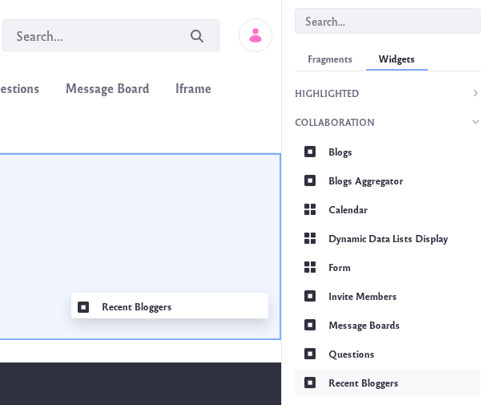
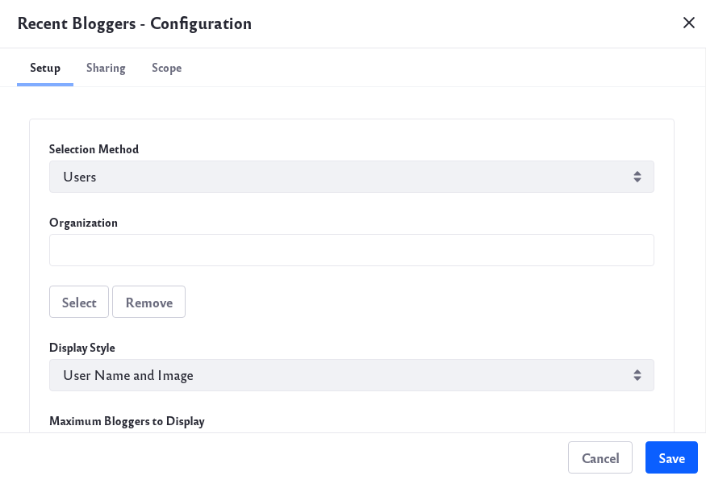

# Highlighting Recent Bloggers

The *Recent Bloggers* widget lets you highlight the work of your site’s most recent blog authors. This widget lists each recent author’s name, profile picture, and number of posts. 

Follow these steps to add a Recent Bloggers widget to a page:

1. Navigate to an existing page where you wish to add the *Recent Bloggers* widget. Click on the *Add App* icon () at the top of the page.

    Or [create a new page](../../site-building/creating-pages/adding-pages.md) on which to add the widget.

1. The *Recent Bloggers* widget is found under the Collaboration section of the list of widgets. It can also be found by searching for *Recent Bloggers*. Drag the widget onto your page.

    

1. To configure the widget, click the Options icon ()  in its title bar and select Configuration.

    

    The Setup tab contains these options:

    * **Selection Method**: Set how the widget selects blog authors to highlight. You can choose *Users* or *Scope*. If you select Users, the widget aggregates every recent blogger on your system. To refine the aggregation, you can select an organization by which to filter the users. If you select Scope, the widget aggregates the recent bloggers in the current scope. This limits the entries to members of the site where the widget resides.

    * **Organization**: Select the organization whose recent bloggers you want to aggregate.

    * **Display Style**: Select how the widget displays recent bloggers: *User Name and Image* or *User Name*.

    * **Maximum Bloggers to Display**: Select the maximum number of recent bloggers the widget displays.

1. Here are descriptions for the other tabs in the widget’s configuration:

    * **Sharing**: Embed the widget instance as a widget on any website, Facebook, Netvibes, or as an OpenSocial Gadget.

    * **Scope**: Specify the blog instance the widget displays: the current site’s blog (default), the global blog, or the page’s blog.

    When you’re finished setting the options, click *Save*. Then close the dialog box.

