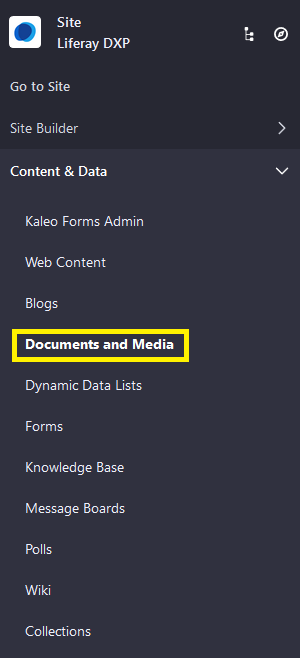
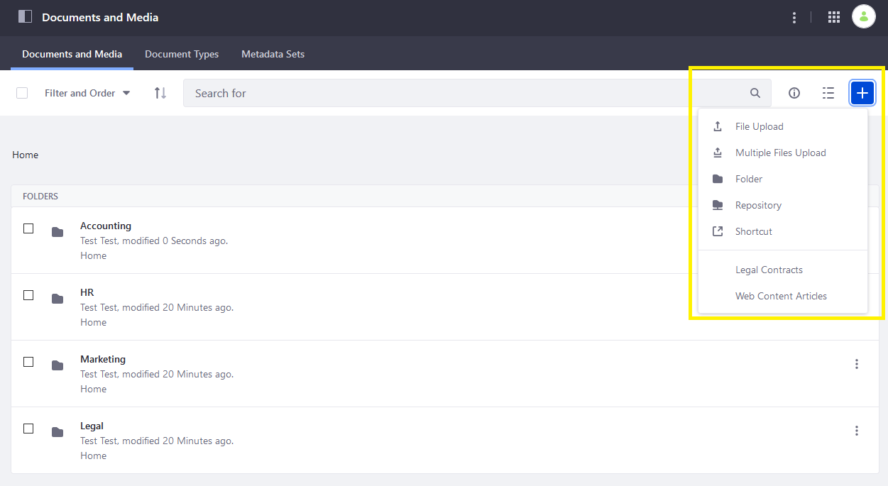
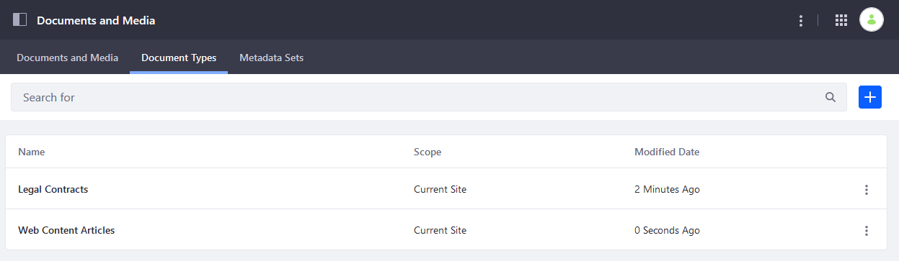
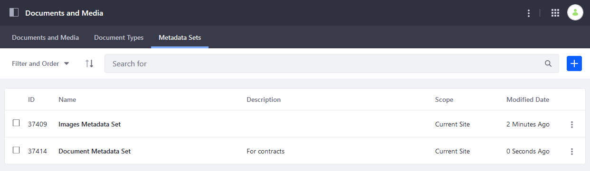
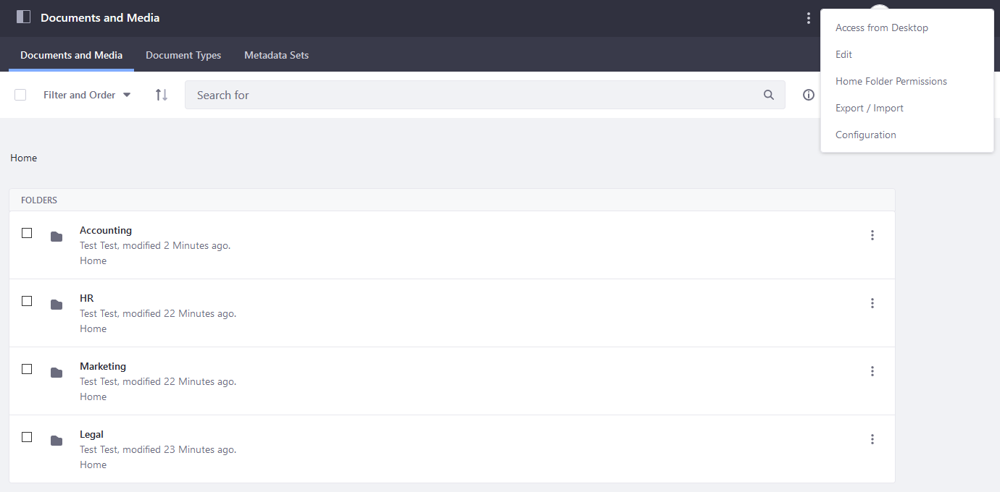
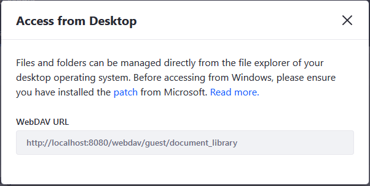
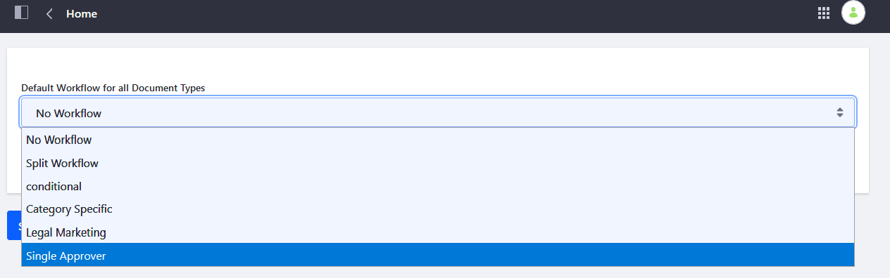
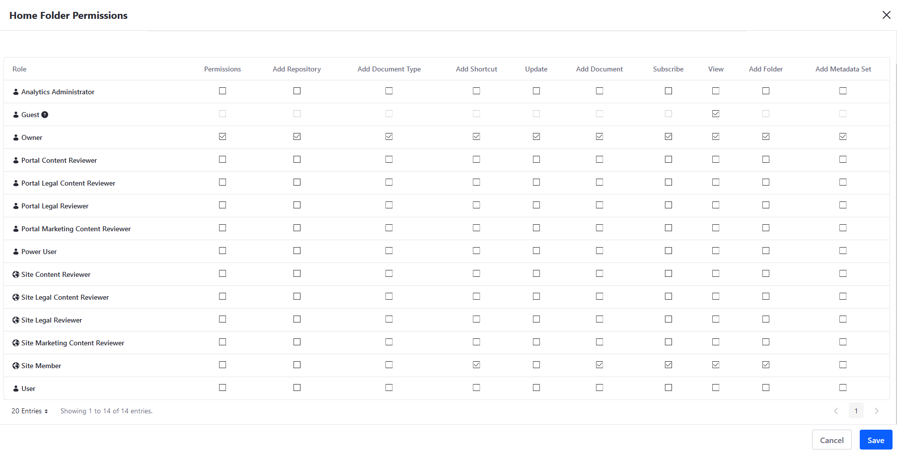
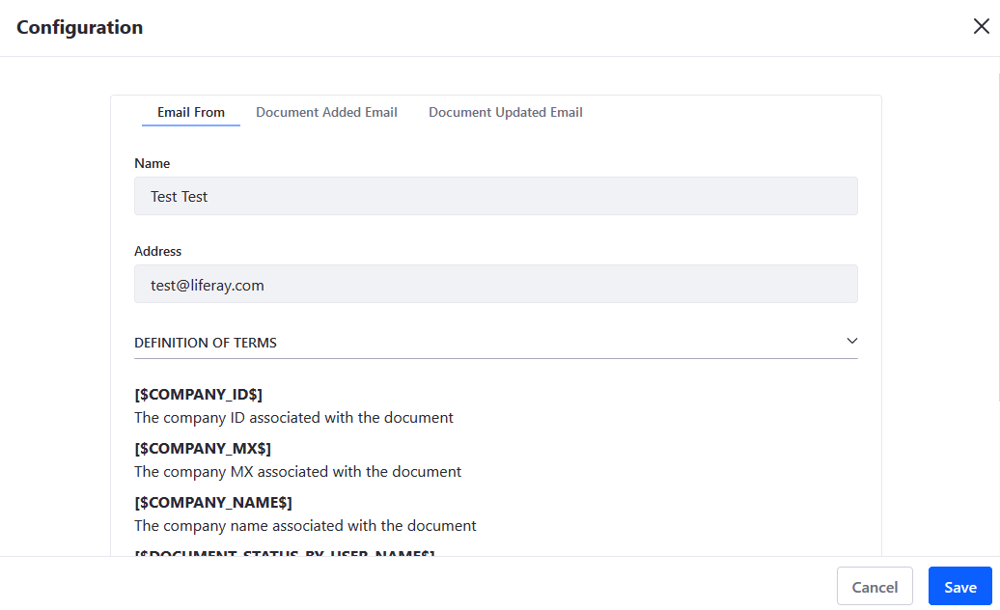
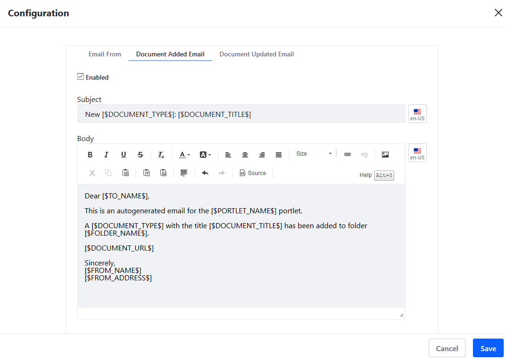

# Documents and Media UI Reference

To get to the _Documents and Media_ menu, navigate to the _Site Administration_ &rarr; _Content & Data_ &rarr; _Documents and Media_.

There are three tabs: _Documents and Media_, _Document Types_, and _Metadata Sets_.

## Documents and Media Tab

The _Documents and Media_ Tab displays that site's folders and documents, beginning at the Root folder. Here, users can upload a single document or multiple documents, add a new folder, add a new Repository (for example, Sharepoint), or a new shortcut.

Click the () to begin using the _Documents and Media_ application.

## Document Types Tab

_Document Types_ are made of metadata fields that users fill out to and help define the purpose of Document Library files. They provide additional, searchable information about uploaded documents. 

Click the () to create a new Document Type.

To learn more about using Document Types, see [Defining Document Types](./uploading-and-managing/managing-metadata/defining-document-types.md).

## Metadata Set Tab

Metadata Sets are groups of fields that can be added to Document Types. 

Metadata Sets can be grouped in a hierarchy to be used as the foundation of another metadata set (an "extension"). A "child" metadata set appears on the same level as the parent.

Click the () to create a new Metadata Set.

To learn more about Metadata Sets, see [Using Metadata Sets](./uploading-and-managing/managing-metadata/using-metadata-sets.md).

## Documents and Media Settings

You can access the application's settings from any of the three tabs by clicking the () to access the _Options_ menu.

### Access from Desktop

You can access the Documents and Media repository from your desktop using WebDAV. To do so, click _Access from Desktop_ to access the WebDAV URL.

### Edit

Users can enable or disable [Workflow](../../process-automation/workflow/user-guide/activating-workflow.md) for all Document Types. To learn more about Workflows in general, see [Introduction to Workflow](../../process-automation/workflow/user-guide/introduction-to-workflow.md).

Workflows for Documents and Media are managed here.

### Home Folder Permissions

Users can manage the permissions for the _Documents and Media_ Home folder.

See [Understanding Roles and Permissions](../../users-and-permissions/roles-and-permissions/understanding-roles-and-permissions.md) to learn more.

### Export/ Import

You can [Export or Import](../../site-building/building-sites/importing-exporting-pages-and-content.md) Documents and Media `LAR` (Liferay Archive) files. There are two primary places Export/Import is used: Sites and apps. Here, you can export the contents of your DM application or import documents from another one.

### Configuration

You can configure DM email notification settings on the _Configuration_ menu. See [Connecting to a Mail Server](../../installation-and-upgrades/setting-up-liferay-dxp-configuring-mail/connecting-to-a-mail-server.md) to set up a mail server first.

Email templates contain _Definition of Terms_ which are placeholders that parse information such as the system administrator, the recipient, and the name of the document.

#### Email From Tab

Users can enter a name and email address to populate the email's `from` field.

#### Document Added Email

Recipients receive this notification if a new document has been added.

#### Document Updated Email

Recipients receive this notification if an existing document has been updated.

## Additional Information

* [Introduction to Documents and Media](./introduction-to-documents-and-media.md)
* [Importing/Exporting Sites and Contents](../../site-building/building-sites/importing-exporting-pages-and-content.md)
