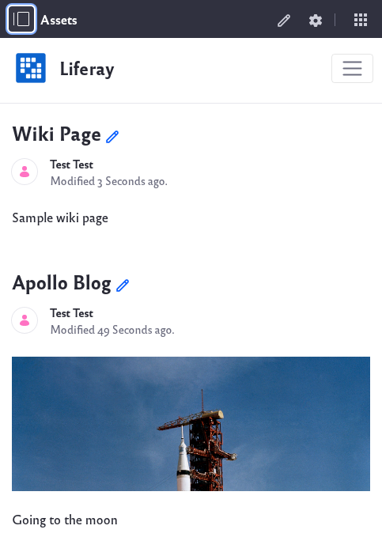

# Using the Asset Publisher Widget

The *Asset Publisher Widget* gives users a simple way to view various assets from within a site page. The widget supports various assets such as blog entries, documents, knowledge base articles, wiki pages, and more.

1. Navigate to the site page where the *Asset Publisher Widget* is deployed.

    

2. By moving your cursor next to the asset name, you can click on the edit () button to be able to edit the asset.

Learn more here about [configuring the asset publisher widget](../../../../site-building/displaying-content/using-the-asset-publisher-widget).
