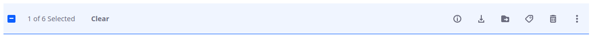

# Using the Documents and Media Widget

The *Documents and Media Widget* gives users a simple way to manage various assets from within a site page.

1. Navigate to the site page where the *Documents and Media Widget* is deployed.

2. 

3. Select the "Widgets" tab and drag the "Documents and Media" widget to your page.

4. Configure the widget by moving your cursor to the options icon at the top right of the widget and clicking "Configuration".

5. The Configuration appears with different options to configure:

    

    The Setup tab contains the following sections: 

    **Display Settings:** Lets you show each file’s actions, filter the media types to display, and choose a display template for your media.

    **Folders Listing:** Lets you select a Document Library folder to serve as the root folder from which to display files. The root folder you select becomes the highest-level folder the Media Gallery can access. For example, if you create a subfolder of a parent folder, and then set that subfolder as the Media Gallery’s root folder, the Media Gallery can no longer access the parent folder.

    **Entries Listing For Table Display Style**

    **Ratings**

    Note: To access the Carousel display template in Media Gallery, your role must have View access for that template. Since the Carousel template is in the Global scope, a Global-scope administrator must grant the role permission to view the template.

6. Configure the rest of the settings as desired in the Media Gallery app’s other configuration tabs:

    **Communication:** Lists public render parameters the widget publishes to other widgets on the page. Other widgets can take action on these parameters. For each shared parameter, you can specify whether to allow communication via the parameter and select which incoming parameter can can populate it.

    **Sharing:** Lets you embed the widget instance as a widget on on any website, Facebook, Netvibes, or as an OpenSocial Gadget.

    **Scope:** Lets you specify the Document Library instance the widget uses: the current site’s instance (default), the global instance, or the page’s instance. If the page doesn’t already have an instance of the widget, you can select Your Page (Create New) to create a page-scoped instance for the widget to display.

7. Click Save when you’re finished configuring the Media Gallery widget.

    The Documents and Media Widget now shows your files, with images appearing as thumbnails.