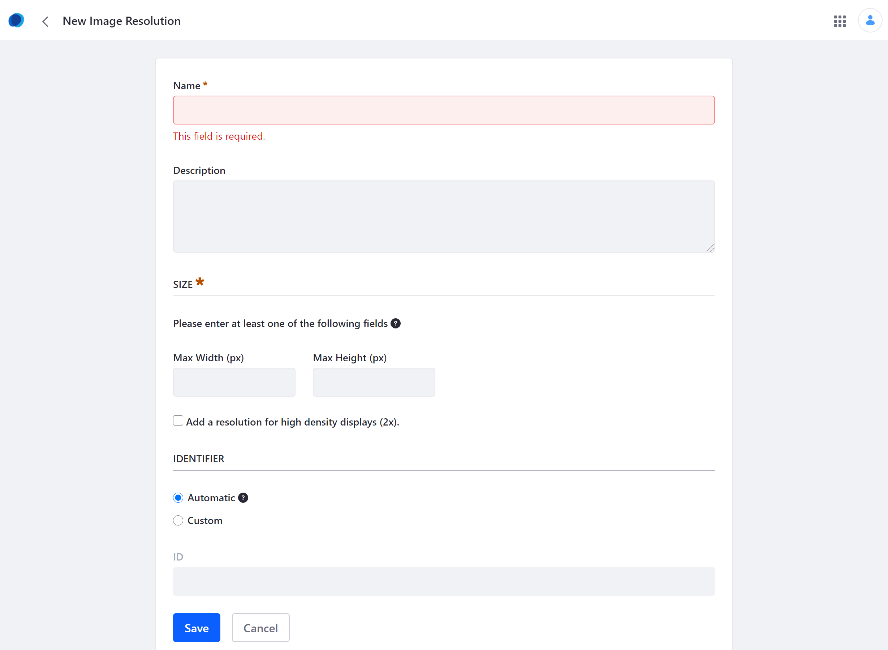

# Adaptive Media Configuration Reference

This article is a reference guide to the Adaptive Media UI. To access the Adaptive Media, navigate to the _Global Menu_ *rarr; _Control Panel_ &rarr; _Adaptive Media_.

Users can adapt all images at once using all the existing Image Resolution rules by clicking the () at the upper right.

## Managing Image Resolutions

The Home screen is where all existing Image Resolution rules are displayed.

Users can edit or disable a rule by clicking the () icon.

## Creating a New Image Resolution

Clicking the () icon creates a new Image Resolution.

| Field | Description |
| --- | --- |
| Name | Enter a name for the Image Resolution. |
| Description | Enter a description for the Image Resolution |
| Max Width | Enter a numeric value in pixels for the maximum width. |
| Max Height | Enter a numeric value in pixels for the maximum height. |
| Automatic | Select this to generate an identifier. |
| Custom | Select this to generate your own identifier.
| ID | This field is active only when the _Custom_ option is chosen; users can enter their own identifier for this Image Resolution. |

## Additional Information

* [Adding Image Resolutions](./adding-image-resolutions.md)
* [Managing Image Resolutions](./managing-image-resolutions.md)
