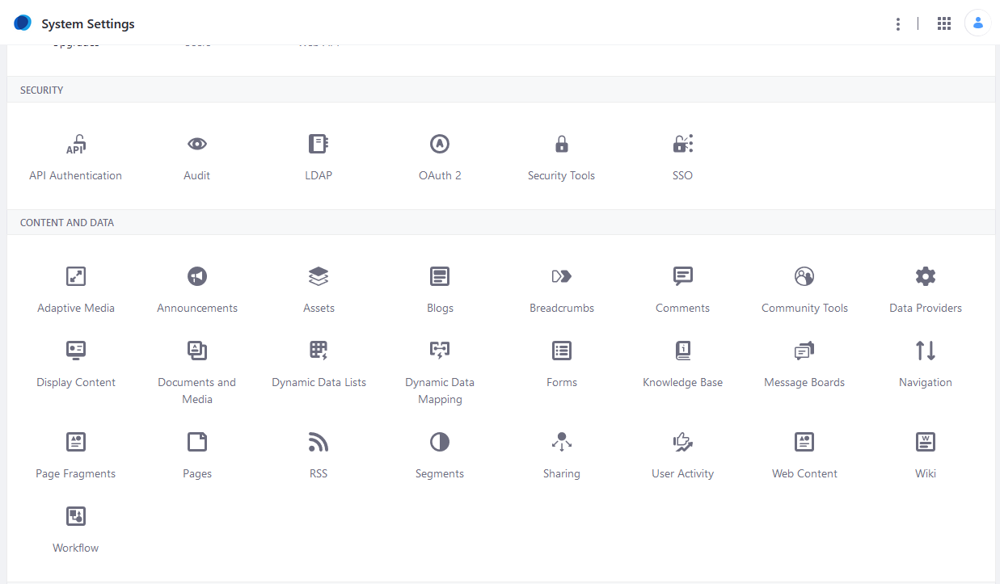
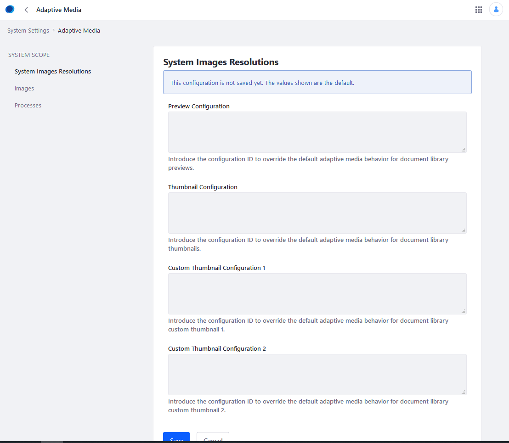
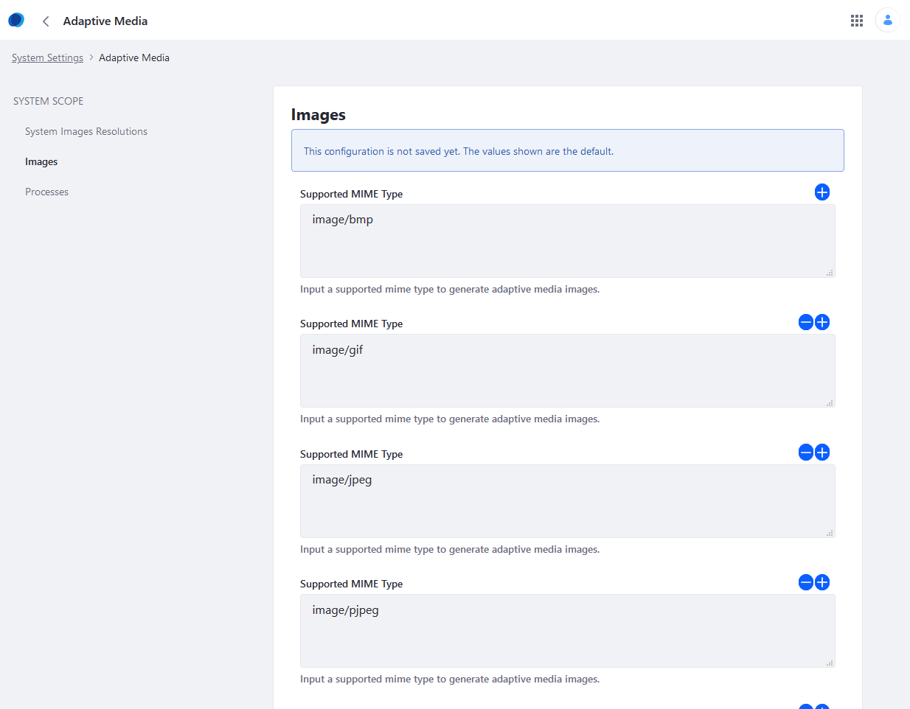
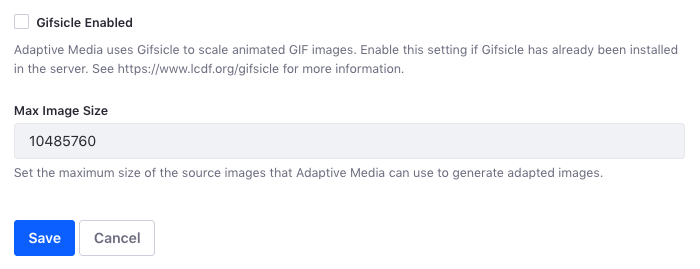
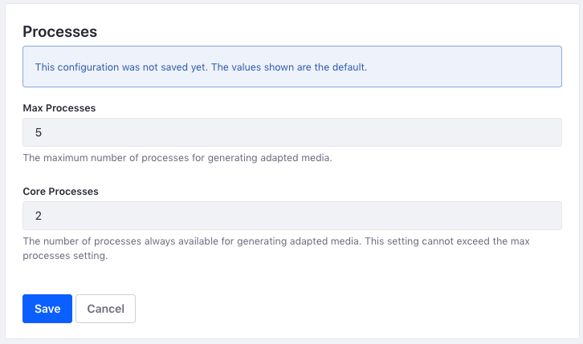

# Adaptive Media Configuration Reference

This article is a reference guide to the Adaptive Media UI. To access the Adaptive Media, navigate to the _Global Menu_ *rarr; _Control Panel_ &rarr; _Adaptive Media_.

Users can adapt all images at once using all the existing Image Resolution rules by clicking the () at the upper right.


## Managing Image Resolutions

The Home screen is where all existing Image Resolution settings are displayed.

| Field | Description |
| --- | --- |
| Name | This is the name of the Image Resolution. |
| State | The _State_ field describes whether this setting is enabled or not. |
| Adapted Images | This status bar tracks the migration progress. |
| Max Width | This refers to the maximum width of the thumbnail. |
| Max Height | This refers to the maximum height of the thumbnail. |

Users can edit or disable a rule by clicking the () icon.


## Creating a New Image Resolution

Clicking the () icon creates a new Image Resolution.


| Field | Description |
| --- | --- |
| Name | Enter a name for the Image Resolution. |
| Description | Enter a description for the Image Resolution. |
| Max Width | Enter a numeric value in pixels for the maximum width. |
| Max Height | Enter a numeric value in pixels for the maximum height. |
| Automatic | Select this to generate an identifier. |
| Custom | Select this to generate your own identifier. |
| ID | This field is active only when the _Custom_ option is chosen; users can enter their own identifier for this Image Resolution. |

## Advanced Configuration

Adaptive Media's advanced configuration options are available in System Settings. To access the System Settings:

1. Navigate to the _Global Menu_ &rarr; _Control Panel_ &rarr; _System Settings_.

    

1. Click _Adaptive Media_.

    

There are three configurations listed under _SYSTEM SCOPE_:

* System Images Resolutions
* Images
* Processes

### Systems Images Resolutions

Normally, Adaptive Media choose the best image based on the closet dimensions. The System Images Resolution settings overrides its own heuristics and whichever specified image here will be used. Enter the ID generated (for example: _Preview-1000_).



| Field | Description |
| --- | --- |
| Preview Configuration | Enter the configuration ID to override the default adaptive media behavior for document library previews. |
| Thumbnail Configuration | Enter the configuration ID to override the default adaptive media behavior for document library thumbnails. |
| Custom Thumbnail Configuration 1 | Enter the configuration ID to override the default adaptive media behavior for document library custom thumbnail 1. |
| Custom Thumbnail Configuration 2 | Enter the configuration ID to override the default adaptive media behavior for document library custom thumbnail 2. |

### Images

The _Images_ configuration contains the following options:

| Field | Description |
| --- | --- |
| Supported MIME Types | A list of the image MIME types that Adaptive Media supports. If an image is uploaded and its MIME type isn't in this list, Adaptive Media ignores the image. By default, this list contains many common MIME types. |



| Field | Description |
| --- | --- |
| Gifsicle | To scale animated GIFs, Adaptive Media uses an external tool called [Gifsicle](https://www.lcdf.org/gifsicle/). See [Enabling Optimization of Animated GIFs](../../devops/enabling-optimization-of-animated-gifs.md) to learn more. |
| Max Image Size | Maximum size of the source images that Adaptive Media can use to generate adapted images. Adaptive Media will not generate adapted images for source images larger than this setting. The default value is 10 MB. To generate adapted images for all source images regardless of size, set this to `-1`. Since generating adapted images from large source images requires significant amounts of memory, you can specify a lower *Max Image Size* to avoid out of memory errors. |



### Processes

The _Processes_ configuration is related to Adaptive Media's asynchronous processing. These values can be modified to improve performance for specific scenarios or use cases. The following options are available:



| Field | Description |
| --- | --- |
| Max Processes | The maximum number of processes for generating adapted media. The default value is `5`. |
| Core Processes | The number of processes always available for generating adapted media. The default value is `2`. This setting can't exceed the _Max processes_ setting. |

```warning::
   Larger values for Max Processes and Core Processes may cause out of memory errors, as processing more images at once can consume large amounts of memory. Out of memory errors can also occur if the source images Adaptive Media uses to generate adapted images are large. You can restrict the maximum size of such images via the _Max Image Size_ setting in the _Adaptive Media Image_ configuration, which is described next. You should run performance tests to optimize these settings for the amount of memory available on your system.
```

## Additional Information

* [Adding Image Resolutions](./adding-image-resolutions.md)
* [Managing Image Resolutions](./managing-image-resolutions.md)
