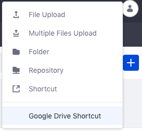
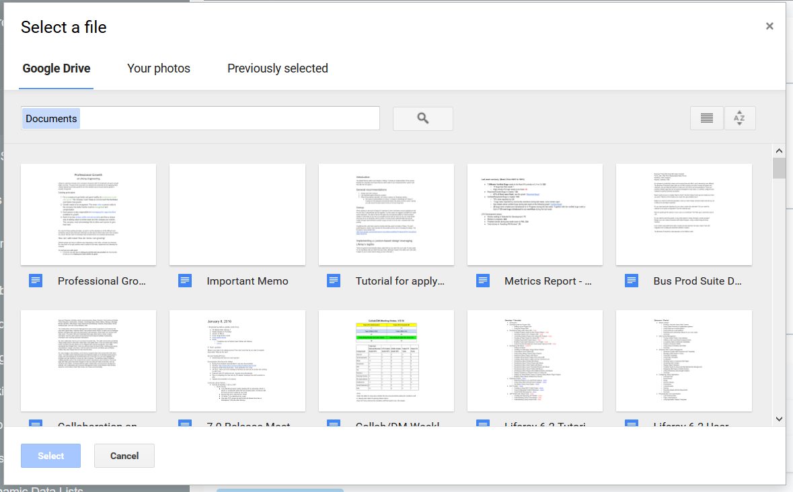

# Linking to Files on Google Drive

You can create Document Library files that link to files in Google Drive&trade; and Google Photos&trade;. This lets you access your Google files from the Document Library. Note that this functionality isn't available by default. To enable it, you must complete these steps:

1. Install the Liferay Plugin for Google Drive&trade; from Liferay Marketplace.
1. Create and/or configure a Google project capable of communicating with your DXP instance. The [Google Picker API](https://developers.google.com/picker/) must be enabled for this project. This API lets you select Google files to link to. You must also create the credentials the Google project needs to communicate with your DXP instance.
1. Configure your portal to communicate with your Google project.

This article shows you how to complete these steps and finishes with an example of linking to a Google file from the Document Library.

```Important::
   The Liferay Plugin for Google Drive&trade; is a Labs application available for Liferay CE Portal and Liferay DXP. Labs apps are experimental and not supported by Liferay. They're released to accelerate the availability of useful and cutting-edge features. This status may change without notice. Use Labs apps at your own discretion.
```

## Install the App

First, you must install the the Liferay Plugin for Google Drive&trade; from Liferay Marketplace. This app is available via the following links for Liferay CE Portal and Liferay DXP:

* [Liferay Plugin for Google Drive - CE](https://web.liferay.com/marketplace/-/mp/application/105847499)
* [Liferay Plugin for Google Drive - DXP](https://web.liferay.com/marketplace/-/mp/application/98011653)

1. Place the `LPKG` file in the `{liferay.home}/deploy folder`. See [Liferay.Home](../../../installation-and-upgrades/reference/liferay-home.md) to learn more about Liferay.Home works.
1. Start the application server.
1. Verify the following message displays:

    ```
    2020-08-07 16:15:55.122 INFO  [fileinstall-/../liferay-dxp-7.2.10.2-sp2/osgi/marketplace][LPKGArtifactInstaller:222] The portal instance needs to be restarted to complete the installation of file:/../liferay-dxp-7.2.10.2-sp2/osgi/marketplace/Liferay%20Plugin%20for%20Google%20DriveΓäó%20-%20Impl.lpkg
    2020-08-07 16:16:05.256 INFO  [fileinstall-/../liferay-dxp-7.2.10.2-sp2/osgi/marketplace][LPKGArtifactInstaller:222] The portal instance needs to be restarted to complete the installation of file:/../liferay-dxp-7.2.10.2-sp2/osgi/marketplace/Liferay%20Plugin%20for%20Google%20DriveΓäó%20-%20Impl.lpkg
    ```

1. Shut down the application server.
1. Start the application server again.
1. Verify the following message displays:

    ```
    2020-08-07 16:19:22.342 INFO  [main][UpgradeProcess:93] Upgrading com.liferay.document.library.google.docs.internal.upgrade.v1_0_0.UpgradeFileEntryTypeName
    2020-08-07 16:19:22.348 INFO  [main][UpgradeProcess:107] Completed upgrade process com.liferay.document.library.google.docs.internal.upgrade.v1_0_0.UpgradeFileEntryTypeName in 6 ms
    ```

The plugin has been successfully deployed.

If you need help installing apps from Marketplace, see the documentation on [using Marketplace](../../../system-administration/installing-and-managing-apps/getting-started/using-marketplace.md).

## Configuring the Portal

You have to configure the portal to connect to Google Drive&trade;. See the [Enabling Document Creation and Editing with Google Drive](../devops/google-drive-integration/enabling-document-creation-and-editing-with-google-drive.md) to learn more.

## Creating Linked Files

With the preceding configuration steps complete, you can create files in your Document Library that link to files in Google Drive&trade; or images in Google Photos&trade;. Follow these steps to do so:

1. In your Document Library, click the _Add_ button () and select _Google Drive Shortcut_. The _New Google Drive Shortcut_ screen appears.

    

2. Click the _Select File_ button to open Google's file picker.
3. Use the file picker to select a file from Google Drive&trade; or Google Photos&trade;.

4. Click _Publish_.

    

A new file entry appears for the Google document you linked to. You can view the file entry as you would any file entry. The Google document's contents show in the file entry's preview pane. As with any file entry, the _Options_ button () gives you access to the Download, Edit, Move, Permissions, Move to Recycle Bin, and Checkin/Checkout/Cancel Checkout options.

```tip::
   You can also use Google Docs&trade; for online file creation and editing. See `Creating and Editing Documents with Google Drive <./creating-documents/creating-and-editing-documents-with-google-drive.md>`_.
```

## Additional Information

* [Creating and Editing Documents with Google Drive](./creating-documents/creating-and-editing-documents-with-google-drive.md)
