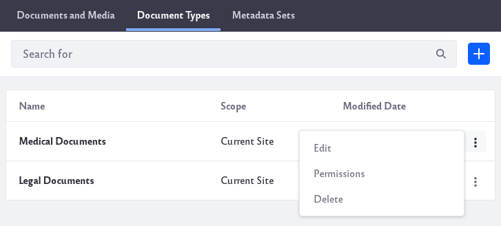

# Editing Document Metadata

To see the available document types, navigate to your *Documents and Media*. Then click on the *Document Types* tab. A searchable table lists the document types. The following actions are available for each document type via its Actions button ():

* **Edit**: Edit the document type.

* **Permissions**: Set the document type’s permissions.

* **Delete** : Delete the document type. Note that document types don’t support the Recycle Bin. Once you delete a document type, it’s gone forever.

