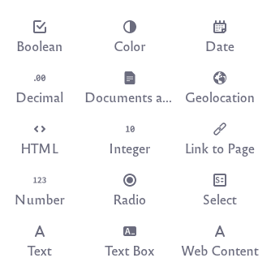

# Setting and Defining Metadata

Working with Document Types allows you to set various metadata fields. Here are the kinds of fields that Liferay supports:

| **Metadata Field Type** | **Description** |
| --- | --- |
| **Boolean** | Check the check box |
| **Color** | Specify a color. |
| **Date** | Enter a date. |
| **Decimal** | Enter a decimal number up to 2 decimal points. |
| **Documents and Media** | Select a file from a Documents and Media library. |
| **Geolocation** | Specify a location to associate with the document. |
| **HTML** | Use a WYSIWYG editor to enter HTML to enhance the content. |
| **Integer** | Enter an integer |
| **Link to Page** | Link to another page in the same site. |
| **Number** | Enter a decimal number or an integer. |
| **Radio** | Displays several clickable options but only one option can be selected at a time. |
| **Select** | This is just like the radio field except that the options are hidden and must be accessed from a drop-down menu. |
| **Text** | Enter a single line of text. |
| **Text Box** | Enter multiple lines of text or separate paragraphs. |
| **Web Content** | Select a Web Content article. |