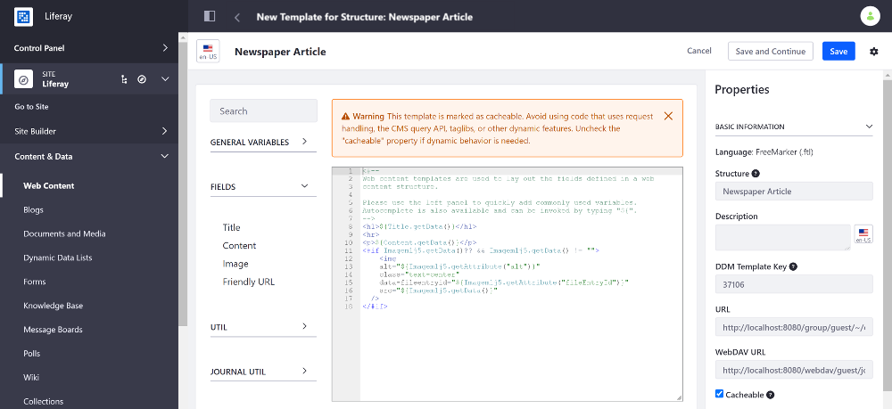
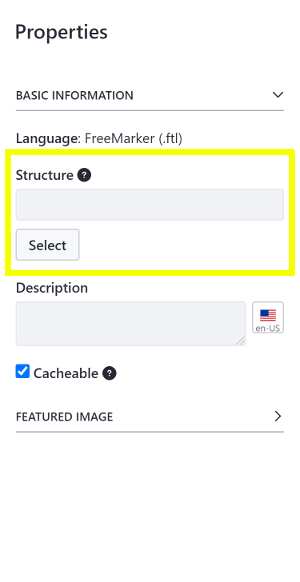
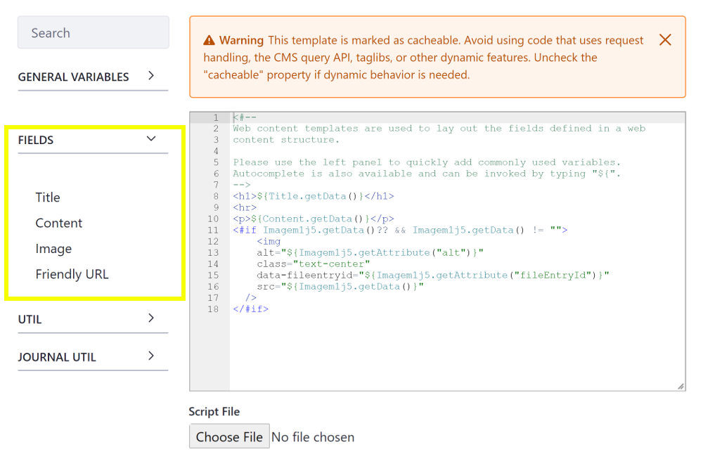

# Creating Web Content Templates

Structures define the available fields for creating Web Content, while Web Content Templates define how the [Structure's](../web-content-structures/creating-structures.md) content is presented on the page. A Web Content Template can be associated with a Structure or even [embedded in another Web Content Template](./advanced-web-content-templates/embedding-web-content-templates.md). Changes in the Structure may require changes in the associated Web Content Template, if a Structure field name referenced in the Template is renamed or removed.

```note::
   Web Content Templates are written in the FreeMarker Template Language (FTL).
```

To create a Web Content Template, follow these steps:

1. Open the Product Menu and go to the Site Menu &rarr; *Content & Data* &rarr; *Web Content*.
1. Select the *Templates* tab.
1. Click the *Add button* () to create a new Web Content Template.
1. Enter the title of your new Web Content Template and add your code to the script window. If you're creating a Web Content Template to [embed in another Template](./advanced-web-content-templates/embedding-web-content-templates.md), you can skip to step eight.

    

1. Optionally link a Structure to the Template by clicking *Select* under the *Structure* field in the *Properties* panel on the right and clicking the name of the Structure in the dialog that appears.
   
    

    The fields configured in the Structure show up in the *Fields* panel on the left side of the script window.

    

1. Place your cursor in the script editor where you want to add the field to the Template, and click the field in the *Fields* panel to add it. An example is shown below:

    ```markup
    ${title.getData()}
    ${abstract.getData()}
    <#if image.getData()?? && image.getData() != "">  </#if>
    ${body.getData()}
    ```

1. Add any additional HTML or FreeMarker that your require for the Template. The example below wraps the fields with some basic HTML elements to provide formatting: 

    ```markup
    <h1>${title.getData()}</h1>
    <p>${abstract.getData()}</p>
    <#if image.getData()?? && image.getData() != "">  </#if>
    <p>${body.getData()}</p>
    ```

1. Click *Save*.