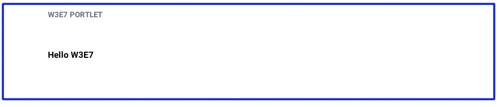

# Using a JSP and MVC Portlet

An easy way to start developing a web application is to add markup to a JSP file, and render it using a portlet Java class.

Here you will deploy and examine an example application that displays some static markup--a "hello world" of sorts.



A simple JSP file and MVCPortlet class produce this application.

## Deploy a Simple MVC Portlet Module

Start with deploying the example.

1. Download and unzip the example.

   ```bash
   curl https://learn.liferay.com/dxp-7.x/developing-applications/using-mvc/liferay-w3e7.zip -O
   ```

   ```bash
   unzip liferay-w3e7.zip
   ```

1. Start a [Liferay Docker container](../../installation-and-upgrades/installing-liferay/using-liferay-dxp-docker-images/dxp-docker-container-basics.md).

   ```bash
   docker run -it -p 8080:8080 [$LIFERAY_LEARN_DXP_DOCKER_IMAGE$]
   ```

1. Build and deploy the example.

    ```bash
     ./gradlew deploy -Ddeploy.docker.container.id=$(docker ps -lq)
    ```

    ```note::
       This command is the same as copying module JARs to ``/opt/liferay/osgi/modules`` on the Docker container.
    ```

1. Confirm the deployment in the Docker container console.

    ```bash
    STARTED com.acme.w3e7.web_1.0.0
    ```

1. Verify the application's availability. Open your browser to `https://localhost:8080`. Add the *W3E7 Portlet* widget from the *Samples* category to a widget page.


Congratulations, you've successfully built and deployed a new application.

Next, learn how the example works.

## How to Create an Application Using MVC Portlet

In this section, we'll review the steps for building the example portlet. First, we create the view using a JSP. Second, we create an [`MVCPortlet`](https://docs.liferay.com/dxp/portal/7.3-latest/javadocs/portal-kernel/com/liferay/portal/kernel/portlet/bridges/mvc/MVCPortlet.html) to register the application and render it.

### Create a View Template

In the module's `src/main/resources/META-INF/resources` folder, create a JSP file as your view template. The file name is arbitrary; the example JSP file is `view.jsp`.

```javascript
<p>
	<b>Hello W3E7</b>
</p>
```

Add your application's Markup to the JSP.

### Create an MVCPortlet

In the module's `src/main/java` folder, create a package called `com.acme.w3e7.web.internal.portlet`. In that pacakage, add a class called `W3E7Portlet` that extends [`MVCPortlet`](https://docs.liferay.com/dxp/portal/7.3-latest/javadocs/portal-kernel/com/liferay/portal/kernel/portlet/bridges/mvc/MVCPortlet.html).

```java
public class W3E7Portlet extends MVCPortlet {
}
```

```note::
   The ``-web.internal.portlet`` part of the package name is a convention: `web` for the web module type, ``internal`` because a portlet implementation is private, and ``portlet`` because the class is a portlet.
```

This example doesn't require any methods; `MVCPortlet`'s built-in methods render the `view.jsp` template specified via component annotations (discussed next).

### Configure the Portlet Using Annotations

```java
@Component(
   property = {
       "com.liferay.portlet.display-category=category.sample",
       "javax.portlet.display-name=W3E7 Portlet",
       "javax.portlet.init-param.template-path=/",
       "javax.portlet.init-param.view-template=/view.jsp"
   },
   service = Portlet.class
)
public class W3E7Portlet extends MVCPortlet {
}
```

The `service = Portlet.class` attribute registers the class as a `Portlet`.

The display property values describe the portlet web application. The `javax.portlet.display-name=W3E7 Portlet` property specifies the app's name. The `com.liferay.portlet.display-category=category.sample` property adds the app to the sample widget category.

The template path initialization parameter `javax.portlet.init-param.template-path` declares the starting location in the `resources/META-INF/resources` for finding the view templates. `javax.portlet.init-param.template-path=/` means the view template path root is the `resources/META-INF/resources/` folder. The `javax.portlet.init-param.view-template=/view.jsp` property declares the portlet's view template `resources/META-INF/resources/view.jsp`. When you add the portlet to a page, the view template renders.

```note::
   The `Portlet Descriptor to OSGi Service Property Map <docs/dxp/7.x/en/developing-applications/reference/portlet-descriptor-to-osgi-service-property-map.md>`_ specifies how OSGi component property values map to traditional portlet descriptors.
```

## Conclusion

Congratulations! You've created a web application using a JSP and one simple Java class. There are lots of directions you can go from here. To add actions to your application, see [MVC Action Command](./mvc-action-command.md). Or implement a back-end data model using [Service Builder](../../data-frameworks/service-builder.md).

## Additional Information

* [Portlet Descriptor to OSGi Service Property Map](../../reference/portlet-descriptor-to-osgi-service-property-map.md)
* [Using MVC](./using-mvc.md)