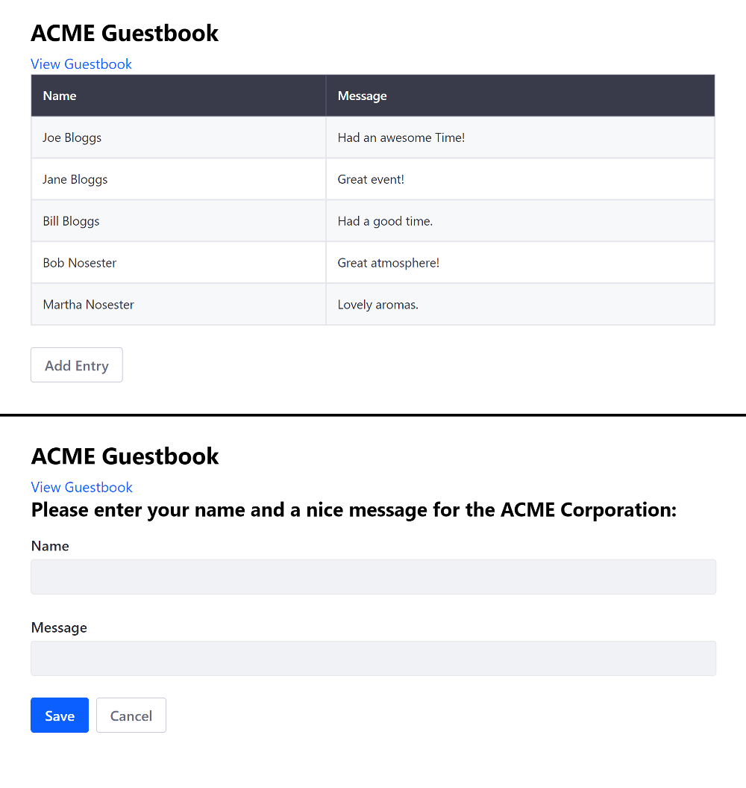

# Using Angular

> Liferay DXP 7.1+

Running an existing Angular app on Portal makes the app available as a widget for using on site pages. You can [adapt your existing Angular app](TODO), but this doesn't give you access to the bundler and its various loaders to develop your project further. To have access to all of Liferay DXP's features, you must use the Liferay JS Generator and Liferay npm Bundler to merge your files into a portlet bundle, adapt your routes and CSS, and deploy your bundle.

1. [Deploy an Example](#deploy-an-example)
1. [Walk Through the Example](#walk-through-an-example)
1. [Modify the example](#modify-the-example)
1. [Deploy and Test](#deploy-and-test)

This example uses a Docker image with a fresh install of Liferay DXP 7.3.

## Deploy an Example

First you must deploy an example migrated Angular app.

1. Run the command below to start the Docker container:

    ```bash
    docker run -it -p 8080:8080 liferay/portal:7.3.2-ga3
    ```

1. Download and unzip [ACME Angular Guestbook App](https://learn.liferay.com/dxp/7.x/en/developing-applications/developing-a-single-page-application/liferay-a5x2.zip):

    ```bash
    curl https://learn.liferay.com/dxp/7.x/en/developing-applications/developing-a-single-page-application/liferay-a5x2.zip
    ```
    
    ```bash
    unzip liferay-a5x2.zip
    ```

    ```note::
      The original app, before it was migrated, is included in the `/before` folder of the zip file for reference.
    ```

1. Install the app's dependencies and deploy the JAR to Docker:

    ```bash
    cd liferay-a5x2
    ```
    
    ```bash
    .\gradlew deploy -D deploy.docker.container.id=$(docker ps -lq)
    ```

    ```note::
      If testing on Windows, you may need to build the module and install its dependencies first with ``.\gradlew build`` and then manually copy the JAR with ``docker cp a5x2-impl\dist\my-angular-guestbook-app-1.0.0.jar docker-container-name:/opt/liferay/osgi/modules`` directly if deployment fails.
    ```

1. Confirm the deployment to the Liferay Docker container console:

    ```bash
    INFO  [fileinstall-/opt/liferay/osgi/modules][BundleStartStopLogger:39] STARTED my-angular-guestbook-app_1.0.0 [1118]
    ```

1. Verify that the app is available. Open your browser to `https://localhost:8080`. Add the react widget onto the [Content Page](../../site-building/creating-pages/building-and-managing-content-pages/using-widgets-on-a-content-page.md#adding-widgets-on-content-pages) or [Widget Page](../../site-building/creating-pages/using-widget-pages/adding-widgets-to-a-page.md) from the *Sample* category.


Great! You successfully built and deployed a migrated Angular app. Next, you'll walk through the example and learn how it works.

## Walk Through the Example

* [Generate the app](#generate-the-app)
* [Copy your app's files into the new project ](#copy-your-apps-files-into-the-new-project)
* [Update Template URLs to Use the Web Context](#update-template-urls-to-use-the-web-context)
* [Use portlet level styling](#use-portlet-level-styling)
* [Update Your Routing Module](#update-your-routing-module)
* [Merge Your Root Module With the App Module](#merge-your-root-module-with-the-app-module)
* [Merge your package json with the generated files](#merge-your-package-json-with-the-generated-files)

### Generate the App

The ACME Angular Guestbook uses the [Liferay JS Generator](../../developing-applications/tooling/other-tools/liferay-js-generator/liferay-js-generator.md) to generate the base Angular app. The external Angular app's code is merged/migrated into this base app, so that it can run on Liferay DXP.

```note::
  To use the Liferay JS Generator, you must have the Liferay JS Portlet Extender activated in your Portal instance. It's activated by default in Liferay DXP 7.2+. You can confirm this by opening the Product Menu, navigating to *Control Panel* -> *Apps* -> *App Manager*, and searching for ``com.liferay.frontend.js.portlet.extender``.
```

The example is a `Angular Widget` project that includes sample code.

```note::
  To deploy to a Docker container, answer No (n) to the question "Do you have a local installation of Liferay for development?". You can build and manually deploy the app later.
```    

Here's the bundle's structure: 

*   `[my-angular-portlet-bundle]`
    *   `assets/` &rarr; CSS, HTML templates, and resources
        *   `css/` &rarr; CSS files
            *   `styles.css` &rarr; Default CSS file
        *   `app/` &rarr; HTML templates
            *   `app.component.html` &rarr; Root component template
    * `features/` &rarr; App features
        *   `localization/` &rarr; Resource bundles
            *   `Language.properties` &rarr; Default language keys
    *   `src/` &rarr; JavaScript an TypeScript files
        *   `app/` &rarr; Application modules and Components
            *   `app.component.ts` &rarr; Main component
            *   `app.module.ts` &rarr; Root module
            *   `dynamic.loader.ts` &rarr; Loads an Angular component dynamically for the portlet to attach to
        *   `types/`
            *   `LiferayParams.ts` &rarr; Parameters passed by Portal to the JavaScript module
        *   `index.ts` &rarr; Main module invoked by the "bootstrap" module to initialize the portlet
        *   `polyfills.ts` &rarr; Fills in browser JavaScript implementation gaps
    *   `package.json` &rarr; npm bundle configuration
    *   `README.md`
    *   `.npmbuildrc` &rarr; Build configuration
    *   `.npmbundlerrc` &rarr; Bundler configuration
    *   `tsconfig.json` &rarr; TypeScript configuration

### Copy Your App's Files into the New Project

The external app's files are merged into the project, as shown below:

    | File type | Destination | Comments |
    | --------- | ----------- | -------- |
    | HTML | `assets/app/` | Merge your main component with the existing `app.component.html`. |
    | CSS  | `assets/css/` | Overwrite `styles.css`. |
    | TypeScript and JavaScript | `src/app/` |  Merge with all files **except** `app.module.ts`---the root module merge is explained in a later step. |

### Update Template URLs to Use the Web Context

Component class `templateUrl`s are updated to use the `web-context` value declared in the project's `.npmbundlerrc` file. 

Here's the format:

```properties
templateUrl: '/o/[web-context]/app/[template]'
```

Here's an example:

```properties
templateUrl: '/o/acme-angular-guestbook-app/app/add-entry/add-entry.component.html'
```

### Use Portlet Level Styling

All component CSS files are imported through the CSS file (default is `styles.css`) your bundle's `package.json` file sets for your portlet. Here's the default setting:

```json
"portlet": {
"com.liferay.portlet.header-portlet-css": "/css/styles.css",
    ...
}
```

`selector` and `styleUrls` properties are removed from the component classes.

### Update Your Routing Module

In the routing module's `@NgModule` decorator, the router option `useHash: true` is configured. This tells Angular to use client-side routing in the form of `.../#/[route]`, which prevents client-side parameters (i.e., anything after `#`) from being sent back to Portal.

For example, the routing module class `@NgModule` decorator might look like this:

```javascript
@NgModule({
  imports: [RouterModule.forRoot(routes, {useHash: true})],
  exports: [RouterModule]
})
export class AppRoutingModule { }
```

The view components for the root module (discussed next), in the routing module, are also exported:

```javascript
export const routingComponents = [ViewComponent1, ViewComponent2]
```

### Merge Your Root Module With the App Module

The root module is merged with `src/app/app.module.ts` and configured to dynamically load components.

```note::
  Components must be loaded dynamically to attach to the portlet's DOM. The DOM is determined at run time when the portlet's page is rendered.
```

The `routingComponents` constant and the `AppRoutingModule` class from the app routing module are imported, as shown in the example below:

```javascript
import { AppRoutingModule, routingComponents } from './app-routing.module';
```

The base href for the router to use in the navigation URLs is also specified:

```javascript
import { APP_BASE_HREF } from '@angular/common';
...

@NgModule({
    ...
    providers: [{provide: APP_BASE_HREF, useValue: '/'}]
})
```

The `routingComponents` constant is declared in the `@NgModule` decorator.

```javascript
@NgModule({
  declarations: [
      routingComponents,
      ...
  ],
  ...
})
```

```note::
  The ``@NgModule`` ``bootstrap`` property has no components. All components are loaded dynamically using the ``entryComponents`` array property. The empty ``ngDoBootstrap()`` method nullifies the default bootstrap implementation.
```

```javascript
@NgModule({
  ...
  entryComponents: [AppComponent],
    bootstrap: [],
    ...
})
export class AppModule {
    ngDoBootstrap() {}
    ...
}
```

The complete root module `app.module.ts` is shown below for reference:

```javascript
import { APP_BASE_HREF } from '@angular/common';
import { AppRoutingModule, routingComponents } from './app-routing.module';
// more imports ...

@NgModule({
  declarations: [
    AppComponent,
    routingComponents, 
    // more declarations ...
  ],
  imports: [
    AppRoutingModule,
    // more imports ...
  ],
  entryComponents: [AppComponent],
  providers: [{provide: APP_BASE_HREF, useValue: '/'}],
  bootstrap: [],
  // more properties ...
})
export class AppModule {
    ngDoBootstrap() {}

    // ...
}
```

### Merge Your Package JSON

The app's `package.json` file's `dependencies` and `devDependencies` are merged into the bundle's `package.json`.

```note::
  To work around build errors caused by the `rxjs` dependency, set the dependency to version `"6.0.0"`. See [LPS-92848](https://issues.liferay.com/browse/LPS-92848) for details.
```

## Modify the Example

1. Open the `liferay-a5x2/ahx2-impl/assets/app/view-guestbook.component.html` file, and replace the `thead-light` class with `thead-dark`:

    ```html
    <table class="table table-striped table-bordered mb-4">
      <thead class="thead-dark">
        <tr>
          <th>Name</th>
          <th>Message</th>
        </tr>
      </thead>
      <tbody>
        <tr *ngFor="let entry of entries">
          <td>{{entry.name}}</td>
          <td>{{entry.message}}</td>
        </tr>
      </tbody>
    </table>
    ```

1. Open the `liferay-a5x2/ahx2-impl/assets/app/add-entry.component.html` file and add the `<h2>...</h2>` element shown below to provide a description for the guests:

    ```html
    <form>
      <h2 class="mb-3">Please enter your name and a nice message for the ACME Corporation:</h2>
      <div class="form-group">
        <label for="addEntryNameInput">Name</label>
        <input #name class="form-control" id="addEntryNameInput" aria-label="name">
      </div>
      <div class="form-group mb-4">
        <label for="addEntryMessageInput">Message</label>
        <input #message class="form-control" id="addEntryMessageInput" aria-label="message">
      </div>
      <button class="btn btn-primary mr-2" (click)="add(name.value, message.value)">Save</button>
      <button class="btn btn-outline-secondary" (click)="goBack()">Cancel</button>
    </form>
    ```

## Deploy and Test

1. Re-build and deploy the ACME React Guestbook app as you did before:

    ```bash
    cd liferay-a5x2
    ```

    ```bash
    .\gradlew deploy -D deploy.docker.container.id=$(docker ps -lq)
    ```

    ```note::
      If testing on Windows, you may need to build the module first with ``.\gradlew build`` and then manually copy the JAR with ``docker cp a5x2-impl\dist\my-angular-guestbook-app-1.0.0.jar docker-container-name:/opt/liferay/osgi/modules`` directly if deployment fails.
    ```

1. Switch between the main guestbook view and entry form view to see the changes.



## Related Information

* [Migrating React Apps to Liferay DXP](./using-react.md)
* [Migrating Vue JS Apps to Liferay DXP](./using-vuejs.md)

