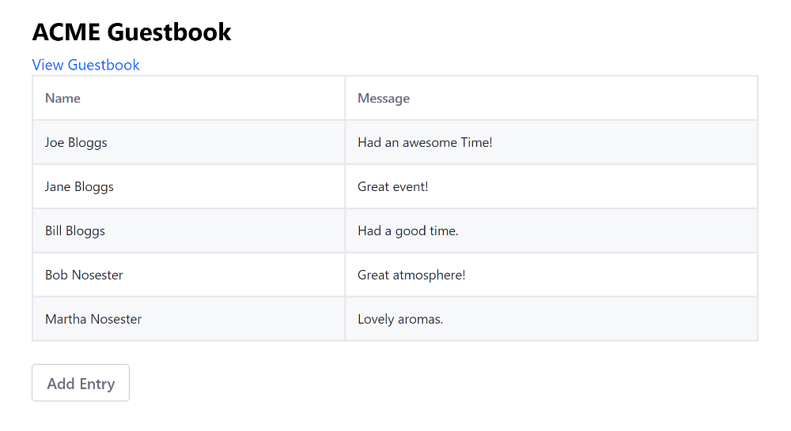

# Using Angular

Running an existing Angular app on @product@ makes the app available as a widget for using on site pages. You can [adapt your existing Angular app](TODO), but this doesn't give you access to the bundler and its various loaders to develop your project further. To have access to all of Liferay DXP's features, you must use the Liferay JS Generator and Liferay npm Bundler to merge your files into a portlet bundle, adapt your routes and CSS, and deploy your bundle.



## Overview

1. [Deploy an Example](#deploy-an-example)
1. [Walk Through the Example](#walk-through-an-example)

> Liferay DXP 7.3+

First you must deploy an example migrated Angular app. Follow these steps:

1. Start the Docker container with a bind mount:

    ```bash
    docker run -d -it -p 8080:8080 -p 8000:8000 --name mylrdev -v C:\Users\liferay\Desktop\liferay-docker:/mnt/liferay liferay/portal:7.3.0-ga1
    ```

1. Download and unzip [Angular Guestbook Migrated](https://github.com/liferay/liferay-learn/tree/master/docs/dxp/7.x/en/developing-applications/developing-a-single-page-application/using-angular/1583511312liferay99.zip):

    ```bash
    curl https://github.com/liferay/liferay-learn/tree/master/docs/dxp/7.x/en/developing-applications/developing-a-single-page-application/using-angular/1583511312liferay99.zip
    
    unzip 1583511312liferay99.zip
    ```

1. Install the app's dependencies:

    ```bash
    cd my-angular-guestbook
    npm install
    ```

1. Build the app's JAR.

    ```bash
    npm run build
    ```

1. Copy the app's JAR to the `[host_folder]/deploy` folder for your Docker image's [bind mount](TODO), or create the `[host_folder]/deploy` folder if it doesn't exist.

    ```bash
    cp my-angular-guestbook-1.0.0.jar path/to/your/bind/mount
    ```

    ```note::
        You must restart the Docker container if you're creating the `[host_folder]/deploy` folder for the first time in your bind mount.
    ```

1. Confirm the deployment to the Liferay Docker container console:

    ```bash
    INFO  [fileinstall-/opt/liferay/osgi/modules][BundleStartStopLogger:39] STARTED my-angular-guestbook_1.0.0 [1118]
    ```

1. Verify that the app is available. Open your browser to `https://localhost:8080`. Click the () in the Control Menu and drag the react widget onto the page from the *Sample* category.

Great! You successfully built and deployed a migrated React app. Next, you'll walk through the example and learn how it works.

## Walk Through the Example

* [Generate the app](#generate-the-app)
* [Copy your app's files into the new project ](#copy-your-apps-files-into-the-new-project)
* [Update Template URLs to Use the Web Context](#update-template-urls-to-use-the-web-context)
* [Use portlet level styling](#use-portlet-level-styling)
* [Update Your Routing Module](#update-your-routing-module)
* [Merge Your Root Module With the App Module](#merge-your-root-module-with-the-app-module)
* [Merge your package json with the generated files](#merge-your-package-json-with-the-generated-files)

### Generate the App

1. Using [npm](https://www.npmjs.com/), install the Liferay JS Generator:

    ```bash
    npm install -g yo generator-liferay-js
    ```

1. Generate an Angular based portlet bundle project for deploying your app to your Portal installation. 

    ```bash
    yo liferay-js
    ```

    Select `Angular Widget`, and opt for generating sample code.
    
    ```note::
        To deploy to a Docker container, answer No (n) to the question "Do you have a local installation of Liferay for development?". You can build and manually deploy the app later.
    ```    
    
    Here's the bundle's structure: 

    *   `[my-angular-portlet-bundle]`
        *   `assets/` &rarr; CSS, HTML templates, and resources
            *   `css/` &rarr; CSS files
                *   `styles.css` &rarr; Default CSS file
            *   `app/` &rarr; HTML templates
                *   `app.component.html` &rarr; Root component template
        * `features/` &rarr; App features
            *   `localization/` &rarr; Resource bundles
                *   `Language.properties` &rarr; Default language keys
        *   `src/` &rarr; JavaScript an TypeScript files
            *   `app/` &rarr; Application modules and Components
                *   `app.component.ts` &rarr; Main component
                *   `app.module.ts` &rarr; Root module
                *   `dynamic.loader.ts` &rarr; Loads an Angular component dynamically for the portlet to attach to
            *   `types/`
                *   `LiferayParams.ts` &rarr; Parameters passed by @product@ to the JavaScript module
            *   `index.ts` &rarr; Main module invoked by the "bootstrap" module to initialize the portlet
            *   `polyfills.ts` &rarr; Fills in browser JavaScript implementation gaps
        *   `package.json` &rarr; npm bundle configuration
        *   `README.md`
        *   `.npmbuildrc` &rarr; Build configuration
        *   `.npmbundlerrc` &rarr; Bundler configuration
        *   `tsconfig.json` &rarr; TypeScript configuration

### Copy Your App's Files into the New Project

Copy your app files, matching the types listed below, into your new project.

    | File type | Destination | Comments |
    | --------- | ----------- | -------- |
    | HTML | `assets/app/` | Merge your main component with the existing `app.component.html`. |
    | CSS  | `assets/css/` | Overwrite `styles.css`. |
    | TypeScript and JavaScript | `src/app/` |  Merge with all files **except** `app.module.ts`---the root module merge is explained in a later step. |

### Update Template URLs to Use the Web Context

Update your component class `templateUrl`s to use the `web-context` value declared in your project's `.npmbundlerrc`  file. Here's the format:

```properties
templateUrl: `/o/[web-context]/app/[template]`
```

Here's an example:

```properties
templateUrl: '/o/my-angular-guestbook/app/add-entry/add-entry.component.html'
```

### Use Portlet Level Styling

Import all component CSS files through the CSS file (default is `styles.css`) your bundle's `package.json` file sets for your portlet. Here's the default setting:

```json
"portlet": {
"com.liferay.portlet.header-portlet-css": "/css/styles.css",
    ...
}
```

Remove `selector` and `styleUrls` properties from your component classes.

### Update Your Routing Module

1. In your routing module's `@NgModule` decorator, configure the router option `useHash: true`. This tells Angular to use client-side routing in the form of `.../#/[route]`, which prevents client-side parameters (i.e., anything after `#`) from being sent back to Portal. 

    For example, your routing module class `@NgModule` decorator might look like this:

    ```javascript
    @NgModule({
      imports: [RouterModule.forRoot(routes, {useHash: true})],
      exports: [RouterModule]
    })
    export class AppRoutingModule { }
    ```

1. Also in your routing module, export your view components for your root module (discussed next) to use. For example,

    ```javascript
    export const routingComponents = [ViewComponent1, ViewComponent2]
    ```

### Merge Your Root Module With the App Module

Merge your root module with `src/app/app.module.ts`, configuring it to dynamically load components.

```note::
    Components must be loaded dynamically to attach to the portlet's DOM. The DOM is determined at run time when the portlet's page is rendered.
```

1. Import the `routingComponents` constant and the app routing module class from your app routing module, ash shown in the example below:

    ```javascript
    import { AppRoutingModule, routingComponents } from './app-routing.module';
    ```

1. Specify the base href for the router to use in the navigation URLs.

    ```javascript
    import { APP_BASE_HREF } from '@angular/common';
    ...
    
    @NgModule({
        ...
        providers: [{provide: APP_BASE_HREF, useValue: '/'}]
    })
    ```

1. Declare the `routingComponents` constant in your `@NgModule` decorator.

    ```javascript
    @NgModule({
      declarations: [
          routingComponents,
          ...
      ],
      ...
    })
    ```

1. Make sure your `@NgModule` `bootstrap` property has no components. All components are loaded dynamically using the `entryComponents` array property. The empty `ngDoBootstrap()` method nullifies the default bootstrap implementation.

    ```javascript
    @NgModule({
      ...
	    entryComponents: [AppComponent],
        bootstrap: [],
        ...
    })
    export class AppModule {
        ngDoBootstrap() {}
        ...
    }
    ```

    Your root module `app.module.ts` should look like this: 

    ```javascript
    import { APP_BASE_HREF } from '@angular/common';
    import { AppRoutingModule, routingComponents } from './app-routing.module';
    // more imports ...

    @NgModule({
      declarations: [
        AppComponent,
        routingComponents, 
        // more declarations ...
      ],
      imports: [
        AppRoutingModule,
        // more imports ...
      ],
      entryComponents: [AppComponent],
      providers: [{provide: APP_BASE_HREF, useValue: '/'}],
      bootstrap: [],
      // more properties ...
    })
    export class AppModule {
        ngDoBootstrap() {}

        // ...
    }
    ```

### Merge Your Package JSON

Merge your app `package.json` file's `dependencies` and `devDependencies` into the bundle's `package.json`.

```note::
    To work around build errors caused by the `rxjs` dependency, set the dependency to version `"6.0.0"`. See [LPS-92848](https://issues.liferay.com/browse/LPS-92848) for details.
```

## Related Information

* [Migrating React Apps to Liferay DXP](./using-react.md)
* [Migrating Vue JS Apps to Liferay DXP](./using-vuejs.md)

