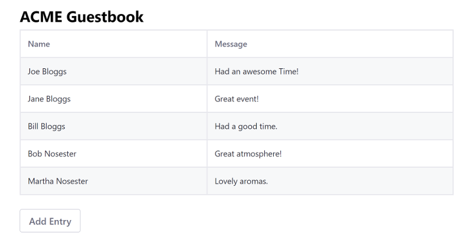

# Using React

> Liferay DXP 7.1+

Running an existing React app on Liferay DXP makes the app available as a widget for using on site pages. You can [adapt your existing Angular app](TODO) to quickly get your app in Portal, but this doesn't give you access to the bundler and its various loaders to develop your project further. To have access to all of Liferay DXP's features, you must use the Liferay JS Generator and Liferay npm Bundler to merge your files into a portlet bundle, update your static resource paths, and deploy your bundle. 



## Overview

1. [Deploy an Example](#deploy-an-example)
1. [Walk Through the Example](#walk-through-an-example)

## Deploy an Example

> Liferay DXP 7.3+

First you must deploy an example migrated React app. Follow these steps:

1. Start the Docker container with a bind mount:

    ```bash
    docker run -d -it -p 8080:8080 -p 8000:8000 --name mylrdev -v C:\Users\liferay\Desktop\liferay-docker:/mnt/liferay liferay/portal:7.3.0-ga1
    ```

1. Download and unzip [React Guestbook Migrated](https://github.com/liferay/liferay-learn/tree/master/docs/dxp/7.x/en/developing-applications/developing-a-single-page-application/using-react/1583354731liferay59.zip):

    ```bash
    curl https://github.com/liferay/liferay-learn/tree/master/docs/dxp/7.x/en/developing-applications/developing-a-single-page-application/using-react/1583354731liferay59.zip
    
    unzip 1583354731liferay59.zip
    ```

    ```note::
        The original app, before it was migrated, is included in the `/before` folder of the zip file for reference.
    ```

1. Install the app's dependencies:

    ```bash
    cd react-guestbook-migrated
    npm install
    ```

1. Build the app's JAR.

    ```bash
    npm run build
    ```

1. Copy the app's JAR to the `[host_folder]/deploy` folder for your Docker image's [bind mount](TODO), or create the `[host_folder]/deploy` folder if it doesn't exist.

    ```bash
    cp my-generated-react-guestbook-app-1.0.0.jar path/to/your/bind/mount
    ```

    ```note::
        You must restart the Docker container if you're creating the `[host_folder]/deploy` folder for the first time in your bind mount.
    ```

1. Confirm the deployment to the Liferay Docker container console:

    ```bash
    INFO  [fileinstall-/opt/liferay/osgi/modules][BundleStartStopLogger:39] STARTED my-generated-react-guestbook-app_1.0.0 [1117]
    ```

1. Verify that the app is available. Open your browser to `https://localhost:8080`. Click the () in the Control Menu and drag the react widget onto the page from the *Sample* category.

Great! You successfully built and deployed a migrated React app. Next, you'll walk through the example and learn how it works.

## Walk Through the Example

* [Generate the app](#generate-the-app)
* [Copy your app's files into the new project](#copy-your-apps-files-into-the-new-project)
* [Use portlet level styling](#use-portlet-level-styling)
* [Update static resource references](#update-static-resource-references)
* [Merge your entry module and package json with the generated files](#merge-your-entry-module-and-package-json-with-the-generated-files)

### Generate the App

1. Using [npm](https://www.npmjs.com/), install the Liferay JS Generator:

    ```bash
    npm install -g yo generator-liferay-js
    ```

    ```note::
        To use the Liferay JS Generator, you must have the Liferay JS Portlet Extender activated in your Portal instance. It's activated by default in Liferay DXP 7.2+. You can confirm this by opening the Control Menu, navigating to the *App Manager*, and searching for `com.liferay.frontend.js.portlet.extender`. In Liferay DXP 7.1 you must install the Liferay JS Portlet Extender from the Marketplace ([Liferay Digital Enterprise 7.1](https://web.liferay.com/marketplace/-/mp/application/115543020) | and | [Liferay Portal CE 7.1](https://web.liferay.com/marketplace/-/mp/application/115542926).).
    ```

1. Generate a React based portlet bundle project for deploying your app to your Portal installation. 

    ```bash
    yo liferay-js
    ```

    Select `React Widget`, and opt for generating sample code.
    
    ```note::
        To deploy to a Docker container, answer No (n) to the question "Do you have a local installation of Liferay for development?". You can build and manually deploy the app later.
    ```
    
    Here's the bundle's structure: 

    *   `my-react-portlet-bundle`
        *   `assets/` &rarr; CSS and resources
            *   `css/` &rarr; CSS files
                * `styles.css` &rarr; Default CSS file
        *   `features/` &rarr; App features
            *   `localization` &rarr; Resource bundles
                *   `Language.properties` &rarr; Default language keys
        *   `src/` &rarr; JavaScript and React component files
            *   `AppComponent.js` &rarr; Sample React component that you can remove
            *   `index.js` &rarr; Main module used to initialize the portlet
        *   `.babelrc` &rarr; Babel configuration
        *   `.npmbuildrc` &rarr; Build configuration
        *   `.npmbundlerrc` &rarr; Bundler configuration
        *   `package.json` &rarr; npm bundle configuration
        *   `README.md`

### Copy Your App's Files into the New Project

Copy your app files, matching the types listed below, into your new project.

    | File type | Destination | Comments |
    | --------- | ----------- | -------- |
    | CSS  | `assets/css/` | Overwrite `styles.css`. |
    | JavaScript | `src/` |  Merge with all files **except** `index.js`---the main module merge is explained in a later step. |
    | Static resources | `assets/` |  Include resources such as image files here |

### Use Portlet Level Styling

Import all component CSS files through the CSS file (default is `styles.css`) your bundle's `package.json` file sets for your portlet. Here's the default setting:

```json
"portlet": {
"com.liferay.portlet.header-portlet-css": "/css/styles.css",
    ...
}
```

Remove any CSS imports you have in your JavaScript files.

### Update Static Resource References

Update any static resource references to use the `web-context` value declared in your project's `.npmbundlerrc` file, and remove any imports for the resource. For example, if you have an image file called `logo.png` in your `assets` folder, you would use the format below. Note that the `assets` folder is not included in the path.

Here is the format:

```html
/o/[web-context]/[resource]
```

Here's an example image resource:

```html

```

### Merge Your Entry Module and Package JSON With the Generated Files

1. Merge your entry module with `src/index.js`, configuring it to dynamically load components. 

    ```note::
        Components must be loaded dynamically to attach to the portlet's DOM. The DOM is determined at run time when the portlet's page is rendered.
    ```

    * Use the `HashRouter` for routing between component views, as @product@ requires hash routing for proper portal navigation:
 
    ```javascript
    import { HashRouter as Router } from 'react-router-dom';
    ```

    * Place your code inside the `main()` function.

    * Render your app inside the `portletElementId` element that is passed in the `main()` function. This is required to render the React app inside the portlet.

    Your entry module `index.js` should look like this. 

    ```javascript
    import React from 'react';
    import ReactDOM from 'react-dom';
    //import './index.css';//removed for Portal Migration
    import App from './App';
    import { HashRouter as Router } from 'react-router-dom';

    export default function main({portletNamespace, contextPath, 
    portletElementId}) {
          ReactDOM.render((
            <Router>
              <App/>
            </Router>
          ), document.getElementById(portletElementId));
    }
    ```

1. Merge your app `package.json` file's `dependencies` and `devDependencies` into the bundle's `package.json`.

## Related Information

* [Migrating Vue JS Apps to Liferay DXP](./using-vuejs.md)
* [Migrating Angular Apps to Liferay DXP](./using-angular.md)
