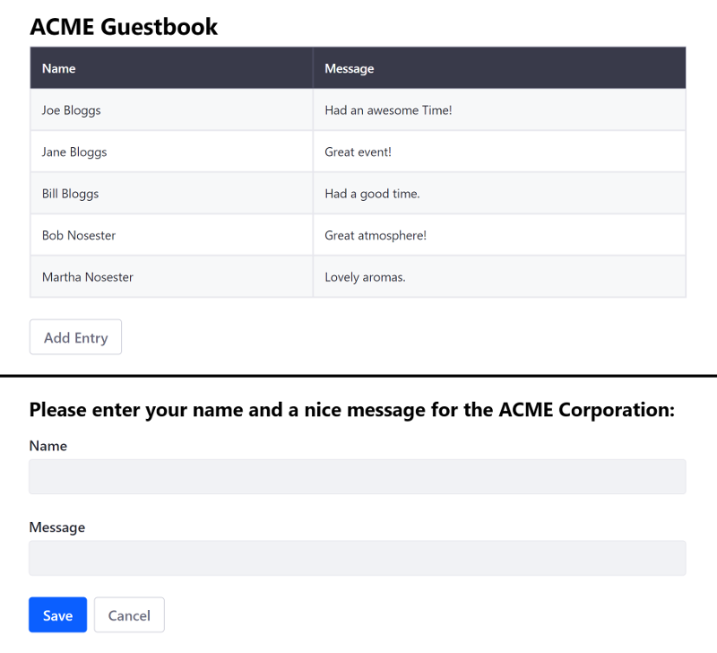

# Using React

> Liferay DXP 7.1+

Running an existing React app on Liferay DXP makes the app available as a widget for using on site pages. You can [adapt your existing Angular app](TODO) to quickly get your app in Portal, but this doesn't give you access to the bundler and its various loaders to develop your project further. To have access to all of Liferay DXP's features, you must use the Liferay JS Generator and Liferay npm Bundler to merge your files into a portlet bundle, update your static resource paths, and deploy your bundle.

Here, you'll learn how to migrate an existing React app with the Liferay JS Toolkit to run on Liferay DXP:

1. [Deploy an Example](#deploy-an-example)
1. [Walk Through the Example](#walk-through-an-example)
1. [Modify the example](#modify-the-example)
1. [Deploy and Test](#deploy-and-test)

This example uses a Docker image with a fresh install of Liferay DXP 7.3.

## Deploy an Example

First you must deploy an example migrated React app:

1. Run the command below to start the Docker container:

    ```bash
    docker run -it -p 8080:8080 liferay/portal:7.3.2-ga3
    ```

1. Download and unzip the [ACME React Guestbook App](https://learn.liferay.com/dxp/7.x/en/developing-applications/developing-a-single-page-application/liferay-r3z7.zip):

    ```bash
    curl https://learn.liferay.com/dxp/7.x/en/developing-applications/developing-a-single-page-application/liferay-r3z7.zip
    ```
    
    ```bash
    unzip liferay-r3z7.zip
    ```

    ```note::
      The original app, before it was migrated, is included in the `/before` folder of the zip file for reference.
    ```

1. Install the app's dependencies and deploy the JAR to Docker:

    ```bash
    cd liferay-r3z7
    ```
    
    ```bash
    .\gradlew deploy -D deploy.docker.container.id=$(docker ps -lq)
    ```

    ```note::
      If testing on Windows, you may need to build the module first with ``.\gradlew build`` and then manually copy the JAR with ``docker cp r3r9-impl\dist\acme-react-guestbook-app-1.0.0.jar docker-container-name:/opt/liferay/osgi/modules`` directly if deployment fails.
    ```

1. Confirm the deployment to the Liferay Docker container console:

    ```bash
    INFO  [fileinstall-/opt/liferay/osgi/modules][BundleStartStopLogger:39] STARTED acme-react-guestbook-app_1.0.0 [1117]
    ```

1. Verify that the app is available. Open your browser to `https://localhost:8080`. Add the react widget onto the [Content Page](../../site-building/creating-pages/building-and-managing-content-pages/using-widgets-on-a-content-page.md#adding-widgets-on-content-pages) or [Widget Page](../../site-building/creating-pages/using-widget-pages/adding-widgets-to-a-page.md) from the *Sample* category.


Great! You successfully built and deployed a migrated React app. Next, you'll walk through the example and learn how it works.

## Walk Through the Example

* [Generate a Base app](#generate-a-base-app)
* [Copy your app's files into the new project](#copy-your-apps-files-into-the-new-project)
* [Use portlet level styling](#use-portlet-level-styling)
* [Update static resource references](#update-static-resource-references)
* [Merge your entry module and package json with the generated files](#merge-your-entry-module-and-package-json-with-the-generated-files)

### Generate a Base App

The ACME React Guestbook uses the [Liferay JS Generator](../../developing-applications/tooling/other-tools/liferay-js-generator/liferay-js-generator.md) to generate the base React app. The external React app's code is merged/migrated into this base app, so that it can run on Liferay DXP.

```note::
  To use the Liferay JS Generator, you must have the Liferay JS Portlet Extender activated in your Portal instance. It's activated by default in Liferay DXP 7.2+. You can confirm this by opening the Product Menu, navigating to *Control Panel* -> *Apps* -> *App Manager*, and searching for ``com.liferay.frontend.js.portlet.extender``.
```

The example is a `React Widget` project that includes sample code.
    
```note::
  To deploy to a Docker container, answer No (n) to the question "Do you have a local installation of Liferay for development?". You can build and manually deploy the app later.
```
    
Here's the bundle's structure: 

*   `my-react-portlet-bundle`
    *   `assets/` &rarr; CSS and resources
        *   `css/` &rarr; CSS files
            * `styles.css` &rarr; Default CSS file
    *   `features/` &rarr; App features
        *   `localization` &rarr; Resource bundles
            *   `Language.properties` &rarr; Default language keys
    *   `src/` &rarr; JavaScript and React component files
        *   `AppComponent.js` &rarr; Sample React component that you can remove
        *   `index.js` &rarr; Main module used to initialize the portlet
    *   `.babelrc` &rarr; Babel configuration
    *   `.npmbuildrc` &rarr; Build configuration
    *   `.npmbundlerrc` &rarr; Bundler configuration
    *   `package.json` &rarr; npm bundle configuration
    *   `README.md`

### Copy Your App's Files into the New Project

The external app's files are merged into the project, as shown below:

| File type | Destination | Comments |
| --------- | ----------- | -------- |
| CSS  | `assets/css/` | Overwrite `styles.css`. |
| JavaScript | `src/` |  Merge with all files **except** `index.js`---the main module merge is explained in a later step. |
| Static resources | `assets/` |  Include resources such as image files here |

### Use Portlet Level Styling

All component CSS files are imported through the CSS file (default is `styles.css`) your bundle's `package.json` file sets for your portlet. Here's the default setting:

```json
"portlet": {
"com.liferay.portlet.header-portlet-css": "/css/styles.css",
    ...
}
```

Any CSS imports in the JavaScript files are removed.

### Update Static Resource References

Static resource references are updated to use the `web-context` value declared in the project's `.npmbundlerrc` file, and any imports for the resource are removed. For example, if you have an image file called `logo.png` in your `assets` folder, you would use the format below. Note that the `assets` folder is not included in the path.

Here is the format:

```html
/o/[web-context]/[resource]
```

Here's an example image resource:

```html

```

### Merge Your Entry Module and Package JSON With the Generated Files

The entry module is merged into the `src/index.js` file and configured to dynamically load components. 

```note::
  Components must be loaded dynamically to attach to the portlet's DOM. The DOM is determined at run time when the portlet's page is rendered.
```

* The `HashRouter` is used for routing between component views. Liferay DXP requires hash routing for proper portal navigation:

```javascript
import { HashRouter as Router } from 'react-router-dom';
```

* Code is placed inside the `main()` function.

* The app is rendered inside the `portletElementId` element that is passed in the `main()` function. This is required to render the React app inside the portlet.

The entry module's complete `index.js` file is shown below for reference:

```javascript
import React from 'react';
import ReactDOM from 'react-dom';
//import './index.css';//removed for Portal Migration
import App from './App';
import * as serviceWorker from './serviceWorker';
import { HashRouter as Router } from 'react-router-dom';


export default function main({portletNamespace, contextPath, portletElementId}) {
    
      ReactDOM.render((
        <div className="mx-auto">
          <div className="ml-3 mr-3 mt-3">
            
            <Router>
              <App/>
            </Router>
          </div>
        </div>
      ), document.getElementById(portletElementId));
    
}
```

The `package.json` file's `dependencies` and `devDependencies` are merged into the bundle's `package.json`.

Now that you understand how the ACME React Guestbook app is migrated to run on Liferay DXP, you can modify it next.

## Modify the Example

1. Open the `liferay-r3z7/r3z7-impl/src/view-guestbook.js` file.
1. Update the `<h1>...</h1>` element to read `React Guestbook` and replace the `thead-light` class with `thead-dark`:

    ```html
    return (
      <div className="guestbook">
        <h1>React Guestbook</h1>
        <table className="table table-striped table-bordered mb-4 ">
          <thead className="thead-dark">
            <tr>
              <th>Name</th>
              <th>Message</th>
            </tr>
          </thead>
          <CreateTableData entryData={this.props.entries}/>
        </table>
        <div>
          <Link to="/add-entry" onClick={this.props.resetRedirect} className="btn btn-outline-secondary">Add Entry</Link>
        </div>
      </div>
    );
    ```

1. Open the `liferay-r3z7/r3z7-impl/src/add-entry.js` file and add the `<h2>...</h2>` element shown below to provide a description for the guests:

    ```html
    <form>
      <h2 class="mb-3">Please enter your name and a nice message for the ACME Corporation:</h2>
      <div className="form-group">
        <label htmlFor="addEntryNameInput">Name</label>
        <input className="form-control" id="addEntryNameInput" value={this.state.name} onChange={this.handleChange.bind(this)} name="name" aria-label="name" />
      </div>
      <div className="form-group mb-4">
        <label htmlFor="addEntryMessageInput">Message</label>
        <input className="form-control" id="addEntryMessageInput" value={this.state.message} onChange={this.handleChange.bind(this)} name="message" aria-label="message" />
      </div>
      <button type="button" className="btn btn-primary mr-2" onClick={this.handleClick.bind(this)}>Save</button>
      <Link to="/view-guestbook" className="btn btn-outline-secondary">Cancel</Link>
    </form>
    ```

## Deploy and Test

1. Re-build and deploy the ACME React Guestbook app as you did before:

    ```bash
    cd liferay-r3z7
    ```

    ```bash
    .\gradlew deploy -D deploy.docker.container.id=$(docker ps -lq)
    ```

    ```note::
      If testing on Windows, you may need to build the module first with ``.\gradlew build`` and then manually copy the JAR with ``docker cp r3r9-impl\dist\acme-react-guestbook-app-1.0.0.jar docker-container-name:/opt/liferay/osgi/modules`` directly if deployment fails.
    ```

1. Switch between the main guestbook view and entry form view to see the changes.



## Related Information

* [Migrating Vue JS Apps to Liferay DXP](./using-vuejs.md)
* [Migrating Angular Apps to Liferay DXP](./using-angular.md)
