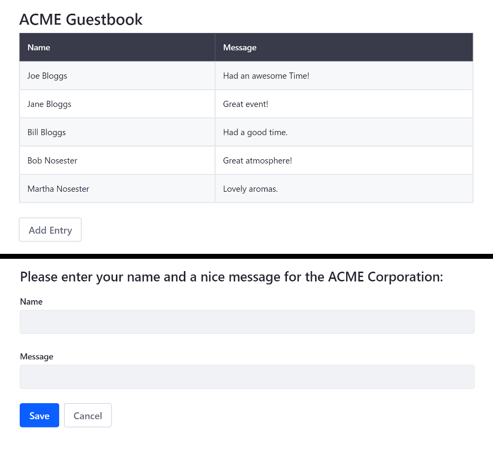

# Using Vue.js

> Liferay DXP 7.1+

Running an existing Vue app on Portal makes the app available as a widget for using on site pages. You can [adapt your existing Angular app](TODO), but this doesn't give you access to the bundler and its various loaders to develop your project further. To have access to all of Liferay DXP's features, you must use the Liferay JS Generator and Liferay npm Bundler to merge your files into a portlet bundle, update your static resource paths, and deploy your bundle. The steps below demonstrate how to prepare a Vue app that uses single file components (`.vue` files) with multiple views. 

```note::
  If you have a tree of components expressed as `.vue` templates, only the root one will be available as a true AMD module.
```

Here, you'll learn how to migrate an existing Vue app with the Liferay JS Toolkit to run on Liferay DXP:

1. [Deploy an Example](#deploy-an-example)
1. [Walk Through the Example](#walk-through-an-example)
1. [Modify the example](#modify-the-example)
1. [Deploy and Test](#deploy-and-test)

This example uses a Docker image with a fresh install of Liferay DXP 7.3.

## Deploy an Example

First you must deploy an example migrated Vue JS app. Follow these steps:

1. Run the command below to start the Docker container:

    ```bash
    docker run -it -p 8080:8080 liferay/portal:7.3.2-ga3
    ```

1. Download and unzip the [ACME Vue JS Guestbook App](https://learn.liferay.com/dxp/7.x/en/developing-applications/developing-a-single-page-application/liferay-c7z3.zip):

    ```bash
    curl https://learn.liferay.com/dxp/7.x/en/developing-applications/developing-a-single-page-application/liferay-c7z3.zip
    ```
    
    ```bash
    unzip liferay-c7z3.zip
    ```

    ```note::
      The original app, before it was migrated, is included in the `/before` folder of the zip file for reference.
    ```

1. Install the app's dependencies and deploy the JAR to Docker:

    ```bash
    cd liferay-c7z3
    ```
    
    ```bash
    .\gradlew deploy -D deploy.docker.container.id=$(docker ps -lq)
    ```

    ```note::
      If testing on Windows, you may need to build the module first with ``.\gradlew build`` and then manually copy the JAR with ``docker cp c7z3-impl\dist\acme-vue-guestbook-app-1.0.0.jar docker-container-name:/opt/liferay/osgi/modules`` directly if deployment fails.
    ```

1. Confirm the deployment to the Liferay Docker container console:

    ```bash
    INFO  [fileinstall-/opt/liferay/osgi/modules][BundleStartStopLogger:39] STARTED acme-vue-guestbook-app_1.0.0 [1117]
    ```

1. Verify that the app is available. Open your browser to `https://localhost:8080`. Add the Vue widget onto the [Content Page](../../site-building/creating-pages/building-and-managing-content-pages/using-widgets-on-a-content-page.md#adding-widgets-on-content-pages) or [Widget Page](../../site-building/creating-pages/using-widget-pages/adding-widgets-to-a-page.md) from the *Sample* category.


Great! You successfully built and deployed a migrated Vue JS app. Next, you'll walk through the example and learn how it works.

## Walk Through the Example

* [Generate the app](#generate-the-app)
* [Copy your app's files into the new project](#copy-your-apps-files-into-the-new-project)
* [Use portlet level styling](#use-portlet-level-styling)
* [Update static resource references](#update-static-resource-references)
* [Merge your entry module and package json with the generated files](#merge-your-entry-module-and-package-json-with-the-generated-files)
* [Update the Babel Preset](#update-the-babel-preset)
* [Update the Build Script](#update-the-build-script)

### Generate the App

The ACME Vue Guestbook uses the [Liferay JS Generator](../../developing-applications/tooling/other-tools/liferay-js-generator/liferay-js-generator.md) to generate the base Vue app. The external Vue app's code is merged/migrated into this base app, so that it can run on Liferay DXP.

```note::
  To use the Liferay JS Generator, you must have the Liferay JS Portlet Extender activated in your Portal instance. It's activated by default in Liferay DXP 7.2+. You can confirm this by opening the Product Menu, navigating to *Control Panel* -> *Apps* -> *App Manager*, and searching for ``com.liferay.frontend.js.portlet.extender``.
```

The example is a `Vue Widget` project that includes sample code.
    
```note::
  To deploy to a Docker container, answer No (n) to the question "Do you have a local installation of Liferay for development?". You can build and manually deploy the app later.
```
    
Here's the bundle's structure: 

*   `my-vue-portlet-bundle`
    *   `assets/` &rarr; CSS and resources
        *   `css/` &rarr; CSS not included in `.vue` files.
    * `features/` &rarr; App features
        *   `localization/` &rarr; Resource bundles
            *   `Language.properties` &rarr; Default language keys
        *   `settings.json` &rarr; Placeholder System Settings
    *   `src/` &rarr; JavaScript and Vue files
        *   `index.js` &rarr; Main module used to initialize the portlet
    *   `.babelrc` &rarr; Babel configuration
    *   `.npmbuildrc` &rarr; Build configuration
    *   `.npmbundlerrc` &rarr; Bundler configuration
    *   `package.json` &rarr; npm bundle configuration
    *   `README.md`

### Copy Your App's Files into the New Project

The external app's files are merged into the project, as shown below:

| File type | Destination | Comments |
| --------- | ----------- | -------- |
| CSS  | `assets/css/` | Overwrite `styles.css`. |
| Static resources | `assets` |  Include resources such as image files here |
| VUE and JS| `src` | Merge your main component with the existing `index.js`. More info on that below. |

### Use Portlet Level Styling

Internal CSS (included with `<style>` tags in the `.vue` files) are imported via `.index.css` in `/assets/styles.css`. This is generated by the modified build script further down:

```css
@import '../index.css';
```

All custom CSS files are imported (i.e. CSS not included in `.vue` files) through the CSS file (default is `styles.css`) in the bundle's `package.json` file set for the portlet. Here's the default setting:

```json
"portlet": {
"com.liferay.portlet.header-portlet-css": "/css/styles.css",
...
}
```

### Update Static Resource References

Static resource references are updated to use the `web-context` value declared in the project's `.npmbundlerrc` file:

Here's the format:

```
/o/[web-context]/[resource]
```

Here's an example image resource:

```html

```

### Merge Your Entry Module and Package JSON With the Generated Files

The entry module is merged into the `src/index.js` file and configured to dynamically load components. 

```note::
  Components must be loaded dynamically to attach to the portlet's DOM. The DOM is determined at run time when the portlet's page is rendered.
```

* Vue's runtime + compiler module (`import Vue from 'vue/dist/vue.common';`) is used, so you don't have to process templates during build time. This is imported by default at the top of the file.

* The sample content is removed from the `main()` function (i.e. the `node` constant and its use), and replaced with the router code.

* These updates are made to the `new Vue` instance:

    * The default data properties (the ones you just removed in the sample content) are removed, and the render element is set to `portletElementId`. This is required and ensures that the app is rendered inside the portlet.
    * The router is added.
    * A render function is added to mount the component wrapper to the Vue instance and display it.
        
The complete updated configuration is shown below for reference:

```javascript
new Vue({
  el: `#${portletElementId}`,
  render: h => h(App),
  router
})
```

The entry module's complete `index.js` file is shown below for reference:

```javascript
import Vue from 'vue/dist/vue.common';
import App from './App.vue'
import VueRouter from 'vue-router'
//Component imports

export default function main({portletNamespace, contextPath, portletElementId}) {

  Vue.config.productionTip = false

  Vue.use(VueRouter)

  const router = new VueRouter({
      routes: [
          {
            ...
          }
      ]
  })
  new Vue({
    el: `#${portletElementId}`,
    render: h => h(App),
    router
  })
}
```

The `package.json` file's `dependencies` and `devDependencies` are merged into the bundle's `package.json`, and the `babel-cli` and `babel-preset-env` dev dependencies are replaced with the newer `"@babel/cli": "^7.0.0"` and `"@babel/preset-env": "^7.4.2"` packages instead. The `"vueify": "9.4.1"` dev dependency is also added.

### Update the Babel Preset

Update the `.babelrc` file to use `@babel/preset-env` instead of `env`:

    ```json
    "presets": ["@babel/preset-env"]
    ```

### Update the Build Script

The example uses `.vue` files, so the build script in the `package.json` is replaced with the one below to use `vue-cli-service`. The updated build script uses vue-cli to access the main entrypoint for the app (`index.js` in the example below) and combines all the Vue templates and JS files into one single file named `index.common.js` and generates an `index.css` file for any internal CSS included with `<style>` tags in `.vue` files:

```json
"scripts": {
  "build": "babel --source-maps -d build src && vue-cli-service build --dest 
  build/ --formats commonjs --target lib --name index ./src/index.js && npm 
  run copy-assets && liferay-npm-bundler",
  "copy-assets": "lnbs-copy-assets",
  "deploy": "npm run build && lnbs-deploy",
  "start": "lnbs-start"
}
```

The `main` entry of the `package.json` is updated to match the new [CommonJS](http://www.commonjs.org/) file name specified in the previous step:
 
```json
"main": "index.common"
```

Now that you understand how the ACME Vue Guestbook app is migrated to run on Liferay DXP, you can modify it next.

## Modify the Example

1. Open the `liferay-c7z3/c7z3-impl/src/components/ViewGuestbook.vue` file.
1. Replace the `thead-light` class with `thead-dark`:

    ```html
    <table class="table table-striped table-bordered mb-4">
      <thead class="thead-dark">
        <tr>
          <th>Name</th>
          <th>Message</th>
        </tr>
      </thead>
      <tbody>
        <tr v-for="entry in entries" :key="entry.id">
          <td>{{entry.name}}</td>
          <td>{{entry.message}}</td>
        </tr>
      </tbody>
    </table>
    ```

1. Open the `liferay-c7z3/c7z3-impl/src/components/AddEntry.vue` file and add the `<h2>...</h2>` element shown below to provide a description for the guests:

    ```html
    <form>
      <h2 class="mb-3">Please enter your name and a nice message for the ACME Corporation:</h2>
      <fieldset>
        <div class="form-group">
          <label for="addEntryNameInput">Name</label>
          <input class="form-control" id="addEntryNameInput" name="name" v-model="name" aria-label="name" />
        </div>
        <div class="form-group mb-4">
          <label for="addEntryMessageInput">Message</label>
          <input class="form-control" id="addEntryMessageInput" name="message" v-model="message" aria-label="message" />
        </div>
      </fieldset>

      <div class="button-footer">  
        <button type="button" class="btn btn-primary mr-2" v-on:click="add(name, message)">Save</button>
        <routerLink to="/view-guestbook" class="btn btn-outline-secondary">Cancel</routerLink>
      </div>
    </form>
    ```

## Deploy and Test

1. Re-build and deploy the ACME Vue Guestbook app as you did before:

    ```bash
    cd liferay-c7z3
    ```

    ```bash
    .\gradlew deploy -D deploy.docker.container.id=$(docker ps -lq)
    ```

    ```note::
      If testing on Windows, you may need to build the module first with ``.\gradlew build`` and then manually copy the JAR with ``docker cp r3r9-impl\dist\acme-vue-guestbook-app-1.0.0.jar docker-container-name:/opt/liferay/osgi/modules`` directly if deployment fails.
    ```

1. Switch between the main guestbook view and entry form view to see the changes.



## Related Information

* [Migrating React Apps to Liferay DXP](./using-react.md)
* [Migrating Angular Apps to Liferay DXP](./using-angular.md)

