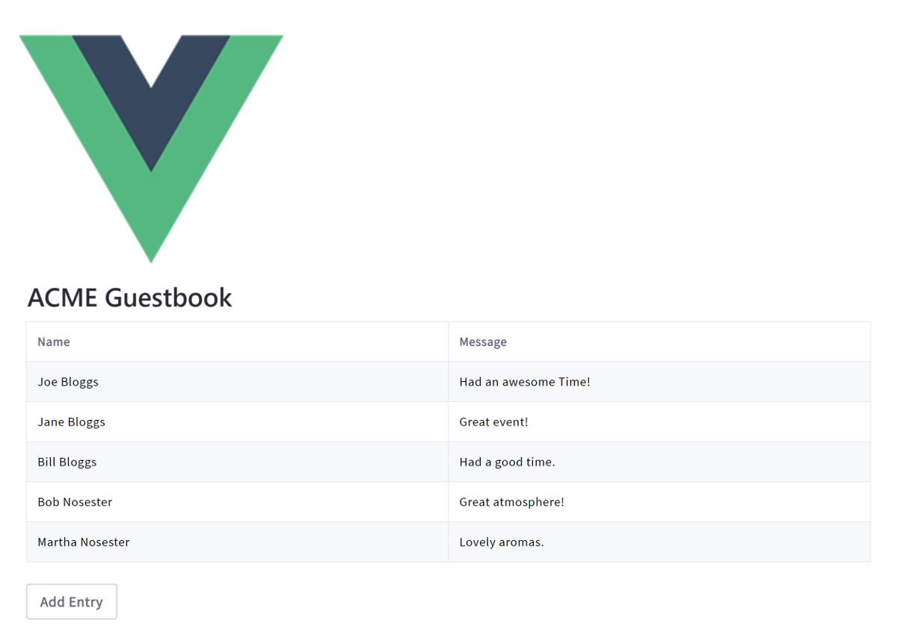

# Using Vue.js

> Liferay DXP 7.1+

Running an existing Vue app on @product@ makes the app available as a widget for using on site pages. You can [adapt your existing Angular app](TODO), but this doesn't give you access to the bundler and its various loaders to develop your project further in @product@. To have access to all of @product@'s features, you must use the Liferay JS Generator and Liferay npm Bundler to merge your files into a portlet bundle, update your static resource paths, and deploy your bundle. The steps below demonstrate how to prepare a Vue app that uses single file components (`.vue` files) with multiple views. 



```note::
    If you have a tree of components expressed as `.vue` templates, only the root one will be available as a true AMD module.
```

## Overview

1. [Deploy an Example](#deploy-an-example)
1. [Walk Through the Example](#walk-through-an-example)

## Deploy an Example

> Liferay DXP 7.3+

First you must deploy an example migrated Vue JS app. Follow these steps:

1. Start the Docker container with a bind mount:

    ```bash
    docker run -d -it -p 8080:8080 -p 8000:8000 --name mylrdev -v C:\Users\liferay\Desktop\liferay-docker:/mnt/liferay liferay/portal:7.3.0-ga1
    ```

1. Download and unzip [Vue JS Guestbook Migrated](https://github.com/liferay/liferay-learn/tree/master/docs/dxp/7.x/en/developing-applications/developing-a-single-page-application/using-vue/1583523242liferay84.zip):

    ```bash
    curl https://github.com/liferay/liferay-learn/tree/master/docs/dxp/7.x/en/developing-applications/developing-a-single-page-application/using-vue/1583523242liferay84.zip
    
    unzip 1583523242liferay84.zip
    ```

    ```note::
        The original app, before it was migrated, is included in the `/before` folder of the zip file for reference.
    ```

1. Install the app's dependencies:

    ```bash
    cd vue-guestbook-migrated
    npm install
    ```

1. Build the app's JAR.

    ```bash
    npm run build
    ```

1. Copy the app's JAR to the `[host_folder]/deploy` folder for your Docker image's [bind mount](TODO), or create the `[host_folder]/deploy` folder if it doesn't exist.

    ```bash
    cp vue-guestbook-migrated-1.0.0.jar path/to/your/bind/mount
    ```

    ```note::
        You must restart the Docker container if you're creating the `[host_folder]/deploy` folder for the first time in your bind mount.
    ```

1. Confirm the deployment to the Liferay Docker container console:

    ```bash
    INFO  [fileinstall-/opt/liferay/osgi/modules][BundleStartStopLogger:39] STARTED vue-guestbook-migrated_1.0.0 [1119]
    ```

1. Verify that the app is available. Open your browser to `https://localhost:8080`. Click the () in the Control Menu and drag the react widget onto the page from the *Sample* category.

Great! You successfully built and deployed a migrated Vue JS app. Next, you'll walk through the example and learn how it works.

## Walk Through the Example

* [Generate the app](#generate-the-app)
* [Copy your app's files into the new project](#copy-your-apps-files-into-the-new-project)
* [Use portlet level styling](#use-portlet-level-styling)
* [Update static resource references](#update-static-resource-references)
* [Merge your entry module and package json with the generated files](#merge-your-entry-module-and-package-json-with-the-generated-files)
* [Update the Babel Preset](#update-the-babel-preset)
* [Update the Build Script](#update-the-build-script)

### Generate the App

1. Using [npm](https://www.npmjs.com/), install the Liferay JS Generator:

    ```bash
    npm install -g yo generator-liferay-js
    ```

    ```note::
        To use the Liferay JS Generator, you must have the Liferay JS Portlet Extender activated in your Portal instance. It's activated by default in Liferay DXP 7.2+. You can confirm this by opening the Control Menu, navigating to the *App Manager*, and searching for `com.liferay.frontend.js.portlet.extender`. In Liferay DXP 7.1 you must install the Liferay JS Portlet Extender from the Marketplace ([Liferay Digital Enterprise 7.1](https://web.liferay.com/marketplace/-/mp/application/115543020) | and | [Liferay Portal CE 7.1](https://web.liferay.com/marketplace/-/mp/application/115542926).).
    ```

1. Generate a React based portlet bundle project for deploying your app to your Portal installation. 

    ```bash
    yo liferay-js
    ```

    Select `Vue.js Widget`, and opt for generating sample code.
    
    ```note::
        To deploy to a Docker container, answer No (n) to the question "Do you have a local installation of Liferay for development?". You can build and manually deploy the app later.
    ```
    
    Here's the bundle's structure: 

    *   `my-vue-portlet-bundle`
        *   `assets/` &rarr; CSS and resources
            *   `css/` &rarr; CSS not included in `.vue` files.
        * `features/` &rarr; App features
            *   `localization/` &rarr; Resource bundles
                *   `Language.properties` &rarr; Default language keys
            *   `settings.json` &rarr; Placeholder System Settings
        *   `src/` &rarr; JavaScript and Vue files
            *   `index.js` &rarr; Main module used to initialize the portlet
        *   `.babelrc` &rarr; Babel configuration
        *   `.npmbuildrc` &rarr; Build configuration
        *   `.npmbundlerrc` &rarr; Bundler configuration
        *   `package.json` &rarr; npm bundle configuration
        *   `README.md`

### Copy Your App's Files into the New Project

Copy your app files, matching the types listed below, into your new project.

    | File type | Destination | Comments |
    | --------- | ----------- | -------- |
    | CSS  | `assets/css/` | Overwrite `styles.css`. |
    | Static resources | `assets` |  Include resources such as image files here |
    | VUE and JS| `src` | Merge your main component with the existing `index.js`. More info on that below. |

### Use Portlet Level Styling

1. If you have internal CSS included with `<style>` tags in your `.vue` files, import `.index.css` in `/assets/styles.css`. This is generated by the modified build script further down:

    ```css
    @import '../index.css';
    ```

1. Import all custom CSS files (i.e. CSS not included in `.vue` files) through the CSS file (default is `styles.css`) your bundle's `package.json` file sets for your portlet. Here's the default setting:

    ```json
    "portlet": {
    "com.liferay.portlet.header-portlet-css": "/css/styles.css",
    ...
    }
    ```

### Update Static Resource References

Update any static resource references to use the `web-context` value declared in your project's `.npmbundlerrc`  file. Here's the format: 

    ```
    /o/[web-context]/[resource]
    ```

    Here's an example image resource:

    ```html
    
    ```

### Merge Your Entry Module and Package JSON With the Generated Files

1. Merge your entry module with `src/index.js`, following these steps to dynamically load components. 

    ```note::
        Components must be loaded dynamically to attach to the portlet's DOM. The DOM is determined at runtime when the portlet's page is rendered. 
    ```

    * Use Vue's runtime + compiler module (`import Vue from 'vue/dist/vue.common';`) so you don't have to process templates during build time. This is imported by default at the top of the file.

    * Remove the sample content from the `main()` function (i.e. the `node` constant and its use), and replace it with your router code.

    * Make these updates to the `new Vue` instance:
    
        * Remove the default data properties (the ones you just removed in the sample content), and set the render element to `portletElementId`. This is required and ensures that your app is rendered inside the portlet.
        * Add the router.
        * Add a render function that mounts your component wrapper to the Vue instance and displays it.
            
        Your updated configuration should look like this:
    
        ```javascript
        new Vue({
          el: `#${portletElementId}`,
          render: h => h(App),
          router
        })
        ```

    Your entry module `index.js` should look like this. 

    ```javascript
    import Vue from 'vue/dist/vue.common';
    import App from './App.vue'
    import VueRouter from 'vue-router'
    //Component imports

    export default function main({portletNamespace, contextPath, portletElementId}) {

      Vue.config.productionTip = false

      Vue.use(VueRouter)

      const router = new VueRouter({
          routes: [
              {
                ...
              }
          ]
      })
      new Vue({
        el: `#${portletElementId}`,
        render: h => h(App),
        router
      })
    }
    ```

1. Merge your app `package.json` file's `dependencies` and `devDependencies` into the project's `package.json`, and replace the `babel-cli` and `babel-preset-env` dev dependencies with the newer `"@babel/cli": "^7.0.0"` and `"@babel/preset-env": "^7.4.2"` packages instead. Also include the `"vueify": "9.4.1"` dev dependency.

### Update the Babel Preset

Update the `.babelrc` file to use `@babel/preset-env` instead of `env`:

    ```json
    "presets": ["@babel/preset-env"]
    ```

### Update the Build Script

1. If you're using `.vue` files, replace the build script in the `package.json` with the one below to use `vue-cli-service`. The updated build script uses vue-cli to access the main entrypoint for the app (`index.js` in the example below) and combines all the Vue templates and JS files into one single file named `index.common.js` and generates an `index.css` file for any internal CSS included with `<style>` tags in `.vue` files:

    ```json
    "scripts": {
      "build": "babel --source-maps -d build src && vue-cli-service build --dest 
      build/ --formats commonjs --target lib --name index ./src/index.js && npm 
      run copy-assets && liferay-npm-bundler",
      "copy-assets": "lnbs-copy-assets",
      "deploy": "npm run build && lnbs-deploy",
      "start": "lnbs-start"
    }
    ```

1. Update the `main` entry of the `package.json` to match the new [CommonJS](http://www.commonjs.org/) file name specified in the previous step:
 
    ```json
    "main": "index.common"
    ```

## Related Information

* [Migrating React Apps to Liferay DXP](./using-react.md)
* [Migrating Angular Apps to Liferay DXP](./using-angular.md)

