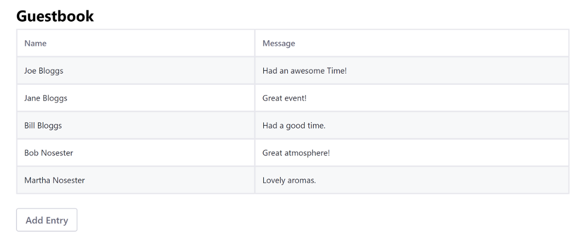

# Adapting Existing Apps to Run on Portal

Adapting your React, Angular, or VueJS application with the Liferay JS Toolkit is the fastest way to get it running in Portal. While this process can be quick, it does have some [limitations](../liferay-js-generator-intro.md#adapt-existing-applications). If you want to integrate with Portal fully and have access to all the [features and benefits](TODO:creating-and-bundling-javascript-widgets-with-javascript-tooling) that it provides, migrate your [React](../../../../developing-a-single-page-application/using-react.md)|[Angular](../../../../developing-a-single-page-application/using-angular.md)|[VueJS](../../../../developing-a-single-page-application/using-vuejs.md) project to a true Liferay JS Toolkit project instead. To adapt your project, it must meet these requirements for each framework:

* **Angular CLI projects** must use `app-root` as the application's Dom selector.
* **creact-react-app projects** must use `ReactDom.render()` call in the entry point with a `document.getElementById()` parameter.
* **Vue CLI projects** must use `#app` as the application's DOM selector.

Adapting your React, Angular, or VueJS application to run on Portal takes just a couple steps:

1. Run the Liferay JS Generator's Adapt subtarget.
1. Build the JAR and copy it to the Docker Container.

This example uses a Docker image with a fresh install of Liferay DXP.

> This example runs on Liferay DXP 7.3+

## Run the Liferay JS Generator's Adapt Subtarget

1. Install the [Liferay JS Generator](../installing-the-js-generator-and-creating-js-portlets.md).
1. Open the command line and navigate to your project's root folder.

    ```bash
    cd my-project
    ```

1. Run the Liferay JS Generator's `adapt` subtarget:

    ```bash
    yo liferay-js:adapt
    ```

1. Answer the prompts and enter yes (y) to overwrite the existing files that have conflicts. The example has the answers below:

    ```bash
    ? Under which category should your widget be listed? category.sample
    ? Do you have a local installation of Liferay for development? No

    conflict package.json
    ? Overwrite package.json? overwrite
    force package.json
    
    create .npmbuildrc
    create .npmbundlerrc
    create features\localization\Language.properties
    
    conflict .gitignore
    ? Overwrite .gitignore? overwrite
    force .gitignore
   
    Your project has been successfully adapted to Liferay JS Toolkit.
    ```

## Build the Jar and Copy it to the Docker Container

You can download and unzip the [example adapted app](https://github.com/liferay/liferay-learn/tree/master/docs/dxp/7.x/en/developing-applications/tooling/other-tools/liferay-js-generator/developer-guide/adapting-apps-for-liferay/liferay-a3w9.zip) if you want to deploy it or compare your code at this point:

```bash
curl https://github.com/liferay/liferay-learn/tree/master/docs/dxp/7.x/en/developing-applications/tooling/other-tools/liferay-js-generator/developer-guide/adapting-apps-for-liferay/liferay-a3w9.zip

unzip liferay-a3w9.zip
```

1. Start the Docker container:

    ```bash
    docker run -it -p 8080:8080 liferay/portal:7.3.0-ga1
    ```

1. Update the `package.json`'s devDependency versions to `2.13.3`:

    ```json
    "devDependencies": {
      "liferay-npm-build-support": "2.13.3",
      "liferay-npm-bundler": "2.13.3",
      "liferay-npm-bundler-preset-create-react-app": "2.13.3"
    }
    ```

    ```note::
      There is a `known issue <https://github.com/liferay/liferay-js-toolkit/issues/546>`_ that affects the latest version of the ``devDependencies``. You must use the versions shown above to build your project. The example already has these version updates.
    ```

1. Install the updated dependencies:

    ```bash
        npm install
    ```
    
1. Build the adapted app JAR:

    ```bash
    npm run build:liferay
    ```

    The adapt process automatically adds a few npm scripts to the project's `package.json` so you can build and deploy your project to your server. See [Liferay JS Generator Commands Reference](../reference/liferay-js-generator-commands-reference.md) for the available commands.

1. Copy the adapted application's JAR to the Docker container:
  
    ```bash
    cd build.liferay
    cp adapted-react-guestbook-app-0.1.0.jar docker-container-name:/path/to/deploy/folder
    ```
  
1. Confirm the deployment to the Liferay Docker container console. The log message should appear in the Docker console. The example produces the log message below:

    ```bash
    INFO [fileinstall-/opt/liferay/osgi/modules][BundleStartStopLogger:39] STARTED adapted-react-guestbook-app_0.1.0 [1132]
    ```
  
1. Verify that the app is available. Open your browser to `https://localhost:8080`. Click the () in the Control Menu and drag the adapted app onto the page. The example is listed as *Adapted React Guestbook App* under the *Sample* category.
  
    

Great! You successfully built and deployed an adapted app.

## Related Information

* [Migrating React Apps to Liferay DXP](../../../../developing-a-single-page-application/using-angular.md)
* [Migrating Vue JS Apps to Liferay DXP](../../../../developing-a-single-page-application/using-vuejs.md)
* [Migrating Angular Apps to Liferay DXP](../../../../developing-a-single-page-application/using-angular.md)