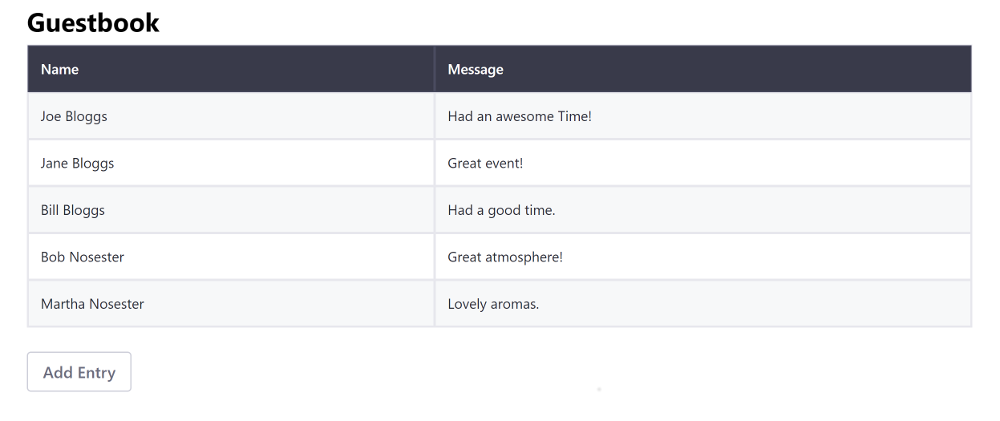

# Adapting Existing Apps to Run on Liferay DXP

Adapting your React, Angular, or VueJS application with the Liferay JS Toolkit is the fastest way to get it running in Liferay DXP. While this process can be quick, it does have some [limitations](../liferay-js-generator.md#adapt-existing-applications). If you want to integrate with Liferay DXP fully and have access to all the [features and benefits](TODO:creating-and-bundling-javascript-widgets-with-javascript-tooling) that it provides, migrate your [React](../../../../developing-a-single-page-application/using-react.md), [Angular](../../../../developing-a-single-page-application/using-angular.md), or [VueJS](../../../../developing-a-single-page-application/using-vuejs.md) project to a true Liferay JS Toolkit project instead.

This example uses a Docker image with a fresh install of Liferay DXP 7.3.

## Deploy an Adapted React Application

First, deploy an example adapted application:

1. Run the command below to start the Docker container:

    ```bash
    docker run -it -p 8080:8080 liferay/portal:7.3.2-ga3
    ```

1. Download and unzip the [example adapted app](https://github.com/liferay/liferay-learn/tree/master/docs/dxp/7.x/en/developing-applications/tooling/other-tools/liferay-js-generator/developer-guide/adapting-apps-for-liferay/liferay-a3w9.zip):
		
    ```bash
    curl https://github.com/liferay/liferay-learn/tree/master/docs/dxp/7.x/en/developing-applications/tooling/other-tools/liferay-js-generator/developer-guide/adapting-apps-for-liferay/liferay-a3w9.zip

    unzip liferay-a3w9.zip
    cd liferay-a3w9/react-guestbook-adapted
    ```

1. Adapt the app with the [Liferay JS Toolkit's](https://github.com/liferay/liferay-js-toolkit) [Liferay JS Generator's](./installing-the-liferay-js-generator.md) [Adapt subtarget](../installing-the-liferay-js-generator.md#generator-and-sub-generator-commands):

    ```bash
    yo liferay-js:adapt
    ```

1. Answer No (n) to the "Do you have a local installation of Liferay for development?" prompt so you can manually deploy to Docker, and answer all (a) to the "Overwrite `package.json`?" prompt to overwrite the `package.json` and all the other conflicting files with the adapt task:

    ```bash
    ? Under which category should your widget be listed? category.sample
    ? Do you have a local installation of Liferay for development? No

     conflict package.json
    ? Overwrite package.json? overwrite this and all others
        force package.json
       create .npmbuildrc
       create .npmbundlerrc
       create features\localization\Language.properties
        force .gitignore

    Your project has been successfully adapted to Liferay JS Toolkit.
    ```

1. Update the `devDependency` versions in the `package.json` to `2.13.3`:

    ```json
    "devDependencies": {
      "liferay-npm-build-support": "2.13.3",
      "liferay-npm-bundler": "2.13.3",
      "liferay-npm-bundler-preset-create-react-app": "2.13.3"
    }
    ```

    ```note::
      There is a `known issue <https://github.com/liferay/liferay-js-toolkit/issues/546>`_ that affects the latest version of the ``devDependencies``. You must use the versions shown above to build your project.
    ```

1. Build the adapted app JAR:

    ```bash
    cd react-guestbook-adapted
    npm run build:liferay
    ```

1. Copy the adapted application's JAR to the Docker container:

    ```bash
    cd build.liferay
    docker cp react-guestbook-adapted-0.1.0.jar docker-container-name:/path/to/osgi/modules/
    ```

1. Confirm the deployment to the Liferay Docker container console. The log message should appear in the Docker console. The example produces the log message below:

    ```bash
    INFO [fileinstall-/opt/liferay/osgi/modules][BundleStartStopLogger:39] STARTED react-guestbook-adapted_0.1.0 [1147]
    ```
  
1. Verify that the app is available. Open your browser to `https://localhost:8080`. Click the Edit button () (Add button () if on Liferay DXP 7.2) in the Control Menu and add the widget to the page. Please see the [7.3](../../../../../site-building/creating-pages/building-and-managing-content-pages/using-widgets-on-a-content-page.md#adding-widgets-on-content-pages) or [7.2](../../../../../site-building/creating-pages/using-widget-pages/adding-widgets-to-a-page.md) instructions for details. The example is listed as *react-guestbook-adapted* under the *Sample* category.
  
    

## Adapted Application Requirements and Processing

To adapt an application it must meet these requirements for each framework:

* **Angular CLI projects** must use `app-root` as the application's Dom selector.
* **creact-react-app projects** must use `ReactDom.render()` call in the entry point with a `document.getElementById()` parameter.
* **Vue CLI projects** must use `#app` as the application's DOM selector.

When the JAR is built with `build:liferay`, the standard webpack-based build is invoked, leaving the processed `.js` and `.css` files in the `/build` folder (`/dist` folder for Angular and VueJS). These files are then adapted so they can be launched from [Liferay DXP's standard entry point](../reference/js-portlet-extender-configuration-reference.md#main-entry-point).

The adapt process automatically adds a few npm scripts to the project's `package.json` so you can build and deploy your project to your server. See [Liferay JS Generator Commands Reference](../reference/liferay-js-generator-commands-reference.md) for the available commands.

## Modify the React App and Redeploy

Now that you understand the adapt process, you can update the adapted app and redeploy to see the changes.

1. Open the `react-guestbook-adapted/src/view-guestbook.js` file and update the Table's head to be dark with the class below:

    ```html
    <thead className="thead-dark">
    ```

1. Build the adapted app's JAR as you did before:

    ```bash
    cd react-guestbook-adapted
    npm run build:liferay
    ```

1. Copy the adapted application's JAR to the Docker container:
  
    ```bash
    cd build.liferay
    docker cp react-guestbook-adapted-0.1.0.jar docker-container-name:/path/to/osgi/modules/
    ```

1. Refresh the Home Page to view the changes.

    

Great! Now you know how to adapt and deploy existing applications to run on Liferay DXP.

## Related Information

* [Migrating React Apps to Liferay DXP](../../../../developing-a-single-page-application/using-angular.md)
* [Migrating Vue JS Apps to Liferay DXP](../../../../developing-a-single-page-application/using-vuejs.md)
* [Migrating Angular Apps to Liferay DXP](../../../../developing-a-single-page-application/using-angular.md)
