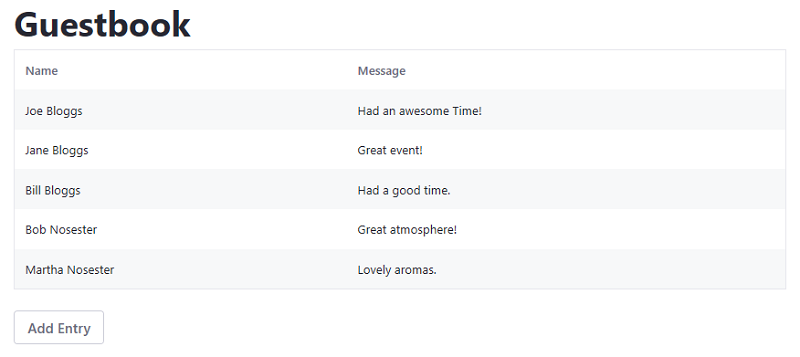

# Adapting Existing Apps to Run on Portal

Adapting your React, Angular, or VueJS application with the Liferay JS Toolkit is the fastest way to get it running in Portal. While this process can be quick, it does have some [limitations](../liferay-js-generator-intro.md#adapt-existing-applications). If you want to integrate with Portal fully and have access to all the [features and benefits](TODO:creating-and-bundling-javascript-widgets-with-javascript-tooling) that it provides, migrate your [React](../../../../developing-a-single-page-application/using-react.md)|[Angular](../../../../developing-a-single-page-application/using-angular.md)|[VueJS](../../../../developing-a-single-page-application/using-vuejs.md) project to a true Liferay JS Toolkit project instead.

To adapt your project, it must meet these requirements for each framework:

* **Angular CLI projects** must use `app-root` as the application's Dom selector.
* **creact-react-app projects** must use `ReactDom.render()` call in the entry point with a `document.getElementById()` parameter.
* **Vue CLI projects** must use `#app` as the application's DOM selector.

## Overview

1. [Deploy an Example](#deploy-an-example)
1. [Walk Through an Example](#walk-through-an-example)

## Deploy an Example

> Liferay DXP 7.3+

First you must deploy an example adapted application. Follow these steps:

1. Start the Docker container with a bind mount:

    ```bash
    docker run -d -it -p 8080:8080 -p 8000:8000 --name mylrdev -v C:\Users\liferay\Desktop\liferay-docker:/mnt/liferay liferay/portal:7.3.0-ga1
    ```

1. Download and unzip the [example adapted app](https://github.com/liferay/liferay-learn/tree/master/docs/dxp/7.x/en/developing-applications/tooling/other-tools/liferay-js-generator/developer-guide/adapting-apps-for-liferay/1584562565liferay17.zip):

    ```bash
    curl https://github.com/liferay/liferay-learn/tree/master/docs/dxp/7.x/en/developing-applications/tooling/other-tools/liferay-js-generator/developer-guide/adapting-apps-for-liferay/1584562565liferay17.zip
    
    unzip 1584562565liferay17.zip
    ```

1. Install the Application's dependencies:

    ```bash
    cd adapted-react-guestbook-app
    npm install
    ```

1. Build the adapted application's JAR file:

    ```bash
    npm run build:liferay
    ```

1. Copy the adapted application's JAR to the `[host_folder]/deploy` folder for your Docker image's [bind mount](TODO), or create the `[host_folder]/deploy` folder if it doesn't exist.
  
    ```bash
    cd build.liferay
    cp adapted-react-guestbook-app-0.1.0.jar path/to/your/bind/mount
    ```

    ```note::
        You must restart the Docker container if you're creating the `[host_folder]/deploy` folder for the first time in your bind mount.
    ```
  
1. Confirm the deployment to the Liferay Docker container console. The log message below should appear in the Docker console:

    ```bash
    INFO [fileinstall-/opt/liferay/osgi/modules][BundleStartStopLogger:39] STARTED adapted-react-guestbook-app_0.1.0 [1132]
    ```
  
1. Verify that the app is available. Open your browser to `https://localhost:8080`. Click the () in the Control Menu and drag the *Adapted React Guestbook App* onto the page from the *Sample* category.
  
    

Great! You successfully built and deployed the adapted React app. Next, you'll walk through the example and learn how it works.

## Walk Through an Example

1. Install the [Liferay JS Generator](../installing-the-js-generator-and-creating-js-portlets.md).
1. Open the command line and navigate to your project's root folder.

    ```bash
    cd my-project
    ```

1. Run the Liferay JS Generator's `adapt` subtarget:

    ```bash
    yo liferay-js:adapt
    ```

1. Answer the prompts and enter yes (y) to overwrite the existing files that have conflicts. The example has the answers below:

    ```bash
    ? Under which category should your widget be listed? category.sample
    ? Do you have a local installation of Liferay for development? No

    conflict package.json
    ? Overwrite package.json? overwrite
    force package.json
    
    create .npmbuildrc
    create .npmbundlerrc
    create features\localization\Language.properties
    
    conflict .gitignore
    ? Overwrite .gitignore? overwrite
    force .gitignore
   
    Your project has been successfully adapted to Liferay JS Toolkit.
    ```

1. Update the `package.json`'s devDependency versions to `2.13.3`:

    ```json
    "devDependencies": {
      "liferay-npm-build-support": "2.13.3",
      "liferay-npm-bundler": "2.13.3",
      "liferay-npm-bundler-preset-create-react-app": "2.13.3"
    }
    ```

    ```note::
        There is a `known issue <https://github.com/liferay/liferay-js-toolkit/issues/546>`_ that affects the latest version of the `devDependencies`. You must use the versions shown above to build your project.
    ```

1. Install the updated dependencies:

    ```bash
        npm install
    ```
    
1. Build the adapted app JAR:

    ```bash
    npm run build:liferay
    ```

The adapt process automatically adds a few npm scripts to the project's `package.json` so you can build and deploy your project to your server. See [Liferay JS Generator Commands Reference](../reference/liferay-js-generator-commands-reference.md) for the available commands.

## Related Information

* [Migrating React Apps to Liferay DXP](../../../../developing-a-single-page-application/using-angular.md)
* [Migrating Vue JS Apps to Liferay DXP](../../../../developing-a-single-page-application/using-vuejs.md)
* [Migrating Angular Apps to Liferay DXP](../../../../developing-a-single-page-application/using-angular.md)