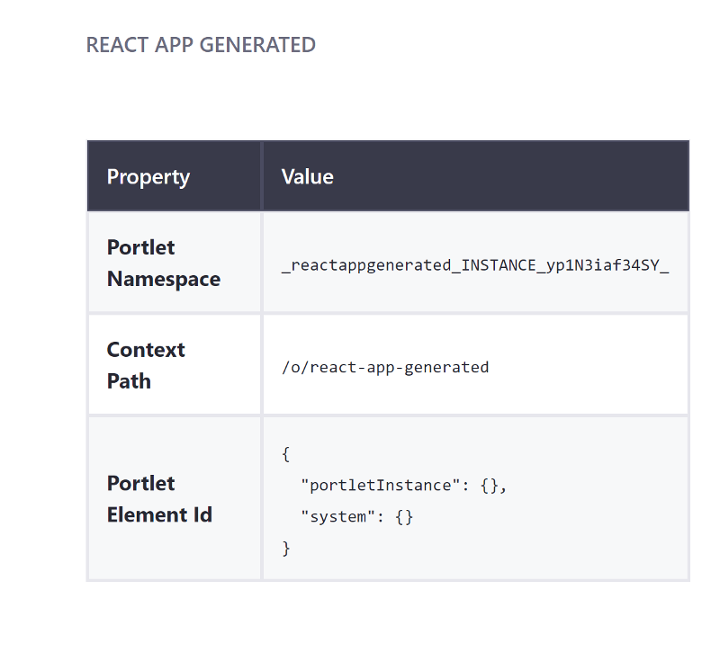

# Creating a JavaScript App with the Liferay JS Generator

You can create pure JavaScript applications, including the major frameworks (React, Angular, and VueJS), with the Liferay JS Generator. Creating your JavaScript application with the Liferay JS Generator, as opposed to just migrating your application ([React](../../../../developing-a-single-page-application/using-react.md)|[Angular](../../../../developing-a-single-page-application/using-angular.md)|[VueJS](../../../../developing-a-single-page-application/using-vuejs.md)) to use the Liferay JS Toolkit, lets you modify your application further, taking advantage of Liferay DXP features such as [system and instance setting configuration](./configuring-system-and-instance-settings-for-your-widget.md) and [localization](./localizing-your-widget.md). Here you'll learn how to create a JavaScript application with the Liferay JS Generator:

1. [Deploy a Generated Application](#deploy-a-generated-application)
1. [Modify the Application and Redeploy](#modify-the-app-and-redeploy)

This example uses a Docker image with a fresh install of Liferay DXP 7.3.

## Deploy a Generated Application

First, deploy an example generated application:

1. Run the command below to start the Docker container:

    ```bash
    docker run -it -p 8080:8080 liferay/portal:7.3.2-ga3
    ```

1. Download and unzip the [example generated app](https://github.com/liferay/liferay-learn/tree/master/docs/dxp/7.x/en/developing-applications/tooling/other-tools/liferay-js-generator/developer-guide/creating-a-js-widget-with-the-js-generator/liferay-g2a8.zip):
		
    ```bash
    curl https://github.com/liferay/liferay-learn/tree/master/docs/dxp/7.x/en/developing-applications/tooling/other-tools/liferay-js-generator/developer-guide/creating-a-js-widget-with-the-js-generator/liferay-g2a8.zip

    unzip liferay-g2a8.zip
    cd liferay-g2a8/react-app-generated
    ```

1. Build the generated React app JAR:

    ```bash
    cd react-app-generated
    npm run build
    ```

1. Copy the generated application's JAR to the Docker container:
  
    ```bash
    cd dist
    docker cp react-app-generated-1.0.0.jar docker-container-name:/path/to/osgi/modules/
    ```
  
1. Confirm the deployment to the Liferay Docker container console. The log message should appear in the Docker console. The example produces the log message below:

    ```bash
    INFO [fileinstall-/opt/liferay/osgi/modules][BundleStartStopLogger:39] STARTED react-app-generated_1.0.0 [1147]
    ```
  
1. Verify that the app is available. Open your browser to `https://localhost:8080`. Click the Edit button () (Add button () if on Liferay DXP 7.2) in the Control Menu and add the widget to the page. Please see the [7.3](../../../../../site-building/creating-pages/building-and-managing-content-pages/using-widgets-on-a-content-page.md#adding-widgets-on-content-pages) or [7.2](../../../../../site-building/creating-pages/using-widget-pages/adding-widgets-to-a-page.md) instructions for details. The example is listed as *React App Generated* under the *Sample* category.
  


## JS Toolkit Generated App Overview

The generated React app is created with the [Liferay JS Toolkit's](https://github.com/liferay/liferay-js-toolkit) [Liferay JS Generator](./installing-the-liferay-js-generator.md):

```bash
yo liferay-js
```

The example uses the answers shown below to create a React widget with all features and sample code. Note that the answer is No (n) to the "Do you have a local installation of Liferay for development?" question so the JAR file can be deployed manually to a Docker container.

```bash
? What type of project do you want to create? React Widget
? What name shall I give to the folder hosting your project? react-app-generated
? What is the human readable description of your project? React App Generated
? Do you want to add localization support? Yes
? Do you want to add configuration support? Yes
? Under which category should your widget be listed? category.sample
? Do you have a local installation of Liferay for development? No
? Do you want to generate sample code? Yes
   create package.json
   create README.md
   create .gitignore
   create .npmbuildrc
   create .npmbundlerrc
   create .npmignore
   create assets\.placeholder
   create features\localization\Language.properties
   create features\configuration.json
   create assets\css\styles.css
   create .babelrc
   create src\index.js
   create src\AppComponent.js
```

The sample generated app prints metadata information about the portlet's namespace, context path, ID, and [configuration settings](./configuring-system-and-instance-settings-for-your-widget.md). It contains an additional `assets/css/styles.css` file to hold your custom styles.

The app's entry point is configured to run on Liferay DXP. See [Liferay DXP's standard entry point](../reference/js-portlet-extender-configuration-reference.md#main-entry-point) for more information.

## Modify the Application and Redeploy

Now that you understand how the Liferay JS Toolkit generates JavaScript-based widgets, you can update the app and redeploy it to see the changes.

1. Open the `/src/AppComponent.js` file and replace the returned element with the Table markup shown below:

    ```html
    <table>
      <thead class="thead-dark">
        <tr>
          <th>Property</th>
          <th>Value</th>
        </tr>
      </thead>
      <tbody>
        <tr>
          <td><span className="tag">{Liferay.Language.get('portlet-namespace')}</span></td>
          <td><span className="value">{this.props.portletNamespace}</span></td>
        </tr>
        <tr>
          <td><span className="tag">{Liferay.Language.get('context-path')}</span></td>
          <td><span className="value">{this.props.contextPath}</span></td>
        </tr>
        <tr>
          <td><span className="tag">{Liferay.Language.get('portlet-element-id')}</span></td>
          <td><span className="value pre">{JSON.stringify(this.props.configuration, null, 2)}</span></td>
        </tr>
      </tbody>
    </table>
    ```

1. Build the updated app's JAR as you did before:

    ```bash
    cd react-app-generated
    npm run build
    ```

1. Copy the updated application's JAR to the Docker container:
  
    ```bash
    cd dist
    docker cp react-app-generated-1.0.0.jar docker-container-name:/path/to/osgi/modules/
    ```

1. Refresh the Home Page to view the changes.

    

Great! Now you know how to generate and deploy a JavaScript-based application with the Liferay JS Toolkit.

## Related Information

* [Migrating React Apps to Liferay DXP](../../../../developing-a-single-page-application/using-react.md)
* [Migrating Vue JS Apps to Liferay DXP](../../../../developing-a-single-page-application/using-vuejs.md)
* [Migrating Angular Apps to Liferay DXP](../../../../developing-a-single-page-application/using-angular.md)