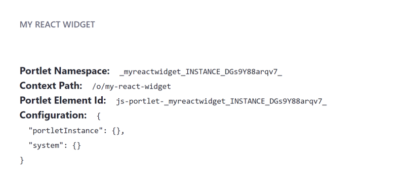

# Creating a JavaScript App with the Liferay JS Generator

You can create pure JavaScript applications, including the major frameworks (React, Angular, and VueJS), with the Liferay JS Generator. Creating your JavaScript application with the Liferay JS Generator, as opposed to just migrating your application ([React](../../../../developing-a-single-page-application/using-react.md)|[Angular](../../../../developing-a-single-page-application/using-angular.md)|[VueJS](../../../../developing-a-single-page-application/using-vuejs.md)) to use the Liferay JS Toolkit, lets you modify your application further, taking advantage of Portal features such as system and instance setting configuration and localization.

## Overview

1. [Deploy an Example](#deploy-an-example)
1. [Walk Through an Example](#walk-through-an-example)

## Deploy an Example

> Liferay DXP 7.3+

First you must deploy an example generated JavaScript application. Follow these steps:

1. Start the Docker container with a bind mount:

    ```bash
    docker run -d -it -p 8080:8080 -p 8000:8000 --name mylrdev -v C:\Users\liferay\Desktop\liferay-docker:/mnt/liferay liferay/portal:7.3.0-ga1
    ```

1. Download and unzip the [example generated app](https://github.com/liferay/liferay-learn/tree/master/docs/dxp/7.x/en/developing-applications/tooling/other-tools/liferay-js-generator/creating-a-js-widget-with-the-js-generator/1584738845liferay95.zip):

    ```bash
    curl https://github.com/liferay/liferay-learn/tree/master/docs/dxp/7.x/en/developing-applications/tooling/other-tools/liferay-js-generator/developer-guide/creating-a-js-widget-with-the-js-generator/1584738845liferay95.zip
    
    unzip 1584738845liferay95.zip
    ```

1. Install the Application's dependencies:

    ```bash
    cd my-react-widget
    npm install
    ```

1. Build the generated application's JAR file:

    ```bash
    npm run build
    ```

1. Copy the generated application's JAR to the `[host_folder]/deploy` folder for your Docker image's [bind mount](TODO), or create the `[host_folder]/deploy` folder if it doesn't exist.
  
    ```bash
    cd dist
    cp my-react-widget-1.0.0.jar path/to/your/bind/mount
    ```

    ```note::
        You must restart the Docker container if you're creating the `[host_folder]/deploy` folder for the first time in your bind mount.
    ```
  
1. Confirm the deployment to the Liferay Docker container console. The log message below should appear in the Docker console:

    ```bash
    INFO [fileinstall-/opt/liferay/osgi/modules][BundleStartStopLogger:39] STARTED adapted-react-guestbook-app_0.1.0 [1132]
    ```
  
1. Verify that the app is available. Open your browser to `https://localhost:8080`. Click the () in the Control Menu and drag the *My React Widget* onto the page from the *Sample* category.
  
    

Great! You successfully built and deployed the adapted React app. Next, you'll walk through the example and learn how it works.

## Walk Through the Example

1. Install the [Liferay JS Generator](../installing-the-js-generator-and-creating-js-portlets.md).
1. Open the command line and run the Liferay JS Generator:

    ```bash
    yo liferay-js
    ```

1. Answer the prompts to generate the JavaScript widget. The sample answers below create a React widget with all features and sample code. Note that the answer is No (n) to the "Do you have a local installation of Liferay for development?" question so the JAR file can be deployed manually to a Docker container.

    ```bash
    ? What type of project do you want to create? React Widget
    ? What name shall I give to the folder hosting your project? my-react-widget
    ? What is the human readable description of your project? My React Widget
    ? Do you want to add localization support? Yes
    ? Do you want to add configuration support? Yes
    ? Under which category should your widget be listed? category.sample
    ? Do you have a local installation of Liferay for development? No
    ? Do you want to generate sample code? Yes
       create package.json
       create README.md
       create .gitignore
       create .npmbuildrc
       create .npmbundlerrc
       create .npmignore
       create assets\.placeholder
       create features\localization\Language.properties
       create features\configuration.json
       create assets\css\styles.css
       create .babelrc
       create src\index.js
       create src\AppComponent.js
    ```

    ```note::
        To use configuration support in your widget, you must have Liferay DXP/Portal CE 7.1 with JS Portlet Extender 1.1.0 or Liferay DXP/Portal CE 7.2+.
    ```

    ```tip::
        If you specify your app server information when your widget is generated, you can deploy your widget by running the `npm run deploy` command. The `liferayDir` entry in the widget's `.npmbuildrc` defines the app server.
    ```

The adapt process automatically adds a few npm scripts to the project's `package.json` so you can build and deploy your project to your server. See [Liferay JS Generator Commands Reference](../reference/liferay-js-generator-commands-reference.md) for the available commands.

```tip::
    By default, the webpack server uses port 8080, which conflicts with the port used by Tomcat. You can point the webpack server to a different port by setting the `port` key in `.npmbuildrc`: `"webpack": {"port": 2070}`.
```

## Related Information

* [Migrating React Apps to Liferay DXP](../../../../developing-a-single-page-application/using-react.md)
* [Migrating Vue JS Apps to Liferay DXP](../../../../developing-a-single-page-application/using-vuejs.md)
* [Migrating Angular Apps to Liferay DXP](../../../../developing-a-single-page-application/using-angular.md)