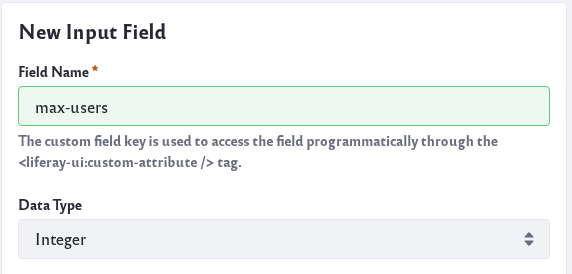
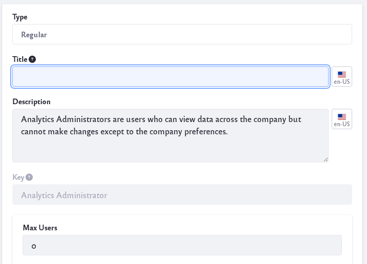
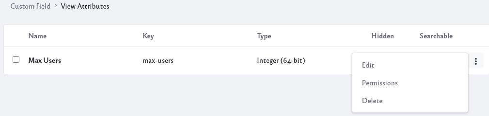
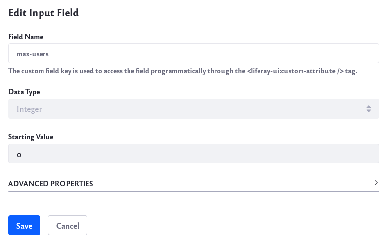

# Custom Fields

Many of Liferay DXP’s assets and resources let you add custom fields to their edit forms. Adding custom fields can give you greater control and flexibility over your Site. Here are all the different places custom fields can be used:

* Blogs Entry
* Calendar Event
* Document
* Documents Folder
* Knowledge Base Article
* Knowledge Base Folder
* Message Boards Category
* Message Boards Message
* Organization
* Page
* Role
* Site
* Site Navigation Menu Item
* User
* User Group
* Web Content Article
* Web Content Folder
* Wiki Page

There are many different reasons you might have for using custom fields. Let's look at one use case as an example.

**Max Role Use Case**: Suppose you want to limit the number of users that can be assigned to a particular Role on your Site. To accomplish this, you could create a *max-users* custom field for the Role. Then ask your developer to create some logic that would keep track and prevent more Role users to be added once the set limit was reached.

## Adding Custom Fields

Follow these steps to see how a custom field can be created for the example use case above:

1. Navigate to Control Panel → Configuration → Custom Fields.

    

1. Scroll down and click on the link for *Role*.

1. Click on the *Add* icon () to add a custom field.

1. There are a number of different field types you can choose from.

    

    * **Text and Numbers**
        * **Text Area**: This field type allows you to collect longer lines of text from the user.
        * **Input Field**: This field type allows you to collect a string of text, a decimal number, or an integer from the user. 

    * **Selection**
        * **Dropdown**: This field type allows you to provide a dropdown list for the user to select from. The list can be text, decimal numbers, or integers.
        * **Checkbox**: This field type allows you to give a checkbox for users to check.
        * **Radio**: This field type allows you to give a selection of two or more radio buttons for users to toggle.

    * **Others**
        * **Geolocation**: This field type allows you to collect geolocation information of the user.
        * **Date**: This field type allows you to collect date and time information from the user.
        * **True/False**: This field type allows you to give a true or false choice to the user. 

1. For the above use case, select *Input Field* as the field type. Input a *Field Name* and select the Data Type as Integer.

    

    Click on the *Save* button to save your changes.

    **Note**: The Field Name is the identifier stored in your database and the name that will be used by the developer to access the custom field. 

Once you have created a custom field, you can find it in the UI of the resource you created it for. Navigate to the resource and the custom field should be displayed in the UI.

For example, the *max-users* custom field we created should now be visible for all Roles:

1. Navigate to Control Panel → Users → Roles.

1. Click on the Options icon () for a Role and click Edit. 

    

    Notice the *Max Users* field at the bottom.

## Editing Custom Fields

Click on the Options icon () next to the name of the custom field to edit. You are given different options:

* **Edit** - You can change different aspects of the custom field, but note that you cannot change the custom field name or custom field type.

    

    The configuration options you have will also depend on the field type you choose.

* **Permissions** - You can modify the permissions to allow other users to edit or view a custom field.
* **Delete** - You can delete the custom field.

