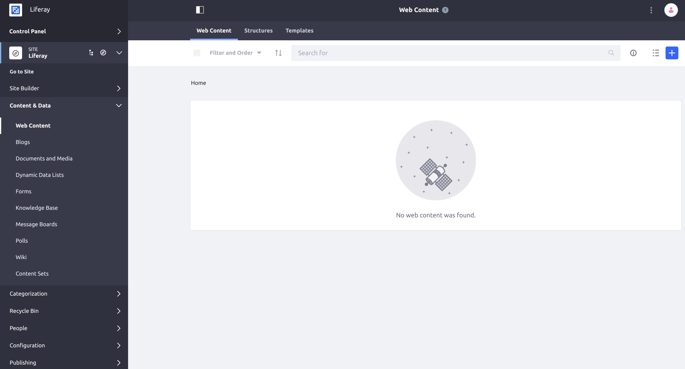

# Creating a Model Listener

You can add a custom model listener by implementing the [`ModelListener`](https://github.com/liferay/liferay-portal/blob/7.3.0-ga1/portal-kernel/src/com/liferay/portal/kernel/model/ModelListener.java) interface.

Model listeners listen for persistence method calls that signal changes to a specified model (such as `update` or `add` methods). Most of the methods model listeners use are called from DXP's [`BasePersistenceImpl`](https://github.com/liferay/liferay-portal/blob/7.3.0-ga1/portal-kernel/src/com/liferay/portal/kernel/service/persistence/impl/BasePersistenceImpl.java) class. You can define model listeners for out-of-the-box entities (like `JournalArticle` or `AssetEntry`), or for custom entities.

Here, you'll learn how to create model listeners in three steps: 

1. [Deploy a Sample Model Listener](#use-a-sample-model-listener)
2. [Create Your Own Model Listener](#create-your-own-model-listener)

## Deploy a Sample Model Model Listener

The first step is to deploy an example model listener for the `JournalArticle` model on your instance of Liferay DXP. Follow these steps:

1. Start the DXP image.

```
docker run -it -p 8080:8080 liferay/portal:7.3.0-ga1
```

1. Download and unzip `Acme Model Listener`.

```
curl https://learn.liferay.com/dxp-7.x/liferay-internals/extending-liferay/liferay-n4g6.zip -O
```

```
unzip liferay-n4g6.zip
```

1. Build and deploy the example.

```
./gradlew deploy -Ddeploy.docker.container.id=$(docker ps -lq)
```

```note::
   This command is the same as copying the deployed jars to /opt/liferay/osgi/modules on the Docker container.
```

1. Confirm the deployment in the Docker container console.

```
STARTED com.acme.n4g6.impl_1.0.0
```

1. Verify that the example model listener was added by viewing the added log message. Open your browser to `https://localhost:8080` and navigate to the Site menu → _Content & Data_ → _Web Content_.

   

   Click the add  button, then click _Basic Web Content_ to add a new article. Fill out a title and some content; then click _Publish_. A warning message appears in the console:

   ```
   2020-03-17 23:14:56.301 WARN  [http-nio-8080-exec-5][N4G6ModelListener:23] A new web content article was added.
   ```

Congratulations, you've successfully built and deployed a new model listener that implements `ModelListener`.

Next, you'll learn how model listeners work by recreating this example.

## Create Your Own Model Listener

Now you'll review and create the example you deployed. First, you'll learn more about how model listeners work. Second, you'll start creating the model listener by annotating the class for OSGi registration. Finally, you'll add custom logic to your implementation of 'ModelListener'.

### Model Listener Behavior

Model listeners implement the [`ModelListener`](https://github.com/liferay/liferay-portal/blob/7.3.0-ga1/portal-kernel/src/com/liferay/portal/kernel/model/ModelListener.java) interface for specific entities. Model listeners can have code to execute before or after those entities are created, updated, or removed. All of these methods are called from the `BasePersistenceImpl` class; the code for created or updated entities is called from the `update` method in `BasePersistenceImpl`, and the code for removed entities is called from the `remove` method in `BasePersistenceImpl`.

Model listeners can also have code to execute before or after other kinds of related entities are added or removed. These methods are called from the `_addTableMapping` method in [`TableMapperImpl`](https://github.com/liferay/liferay-portal/blob/7.3.0-ga1/portal-kernel/src/com/liferay/portal/kernel/internal/service/persistence/TableMapperImpl.java).

Next, you'll begin to create a model listener like the example you deployed.

### Annotate the Class for OSGi Registration

```java
@Component(immediate = true, service = ModelListener.class)
public class N4G6ModelListener extends BaseModelListener<JournalArticle> {
```

Define the class to listen to events for (in this example, `JournalArticle`). When this model listener is registered, it will listen to events for the model defined. The model can be an out-of-the-box entity or a custom entity.

Extending the `BaseModelListener` class gives a default, empty implementation for each of `ModelListener`'s methods. This allows you to only override the methods you need.

### Add Custom Logic to the Model Listener

The model listener needs custom logic for the events that are important to you. Override the `ModelListener` interface's methods corresponding to the events you need.

This example only needs logic after a new instance of the model listener's associated entity is created. This means the logic must be added to the `onAfterCreate` method:

```java
public void onAfterCreate(JournalArticle model)
   throws ModelListenerException {

   if (_log.isWarnEnabled()) {
      _log.warn("A new web content article was added.");
   }
}
```

## Conclusion

Congratulations! You now know the basics for implementing the `ModelListener` interface, and have added a new model listener to Liferay DXP.
