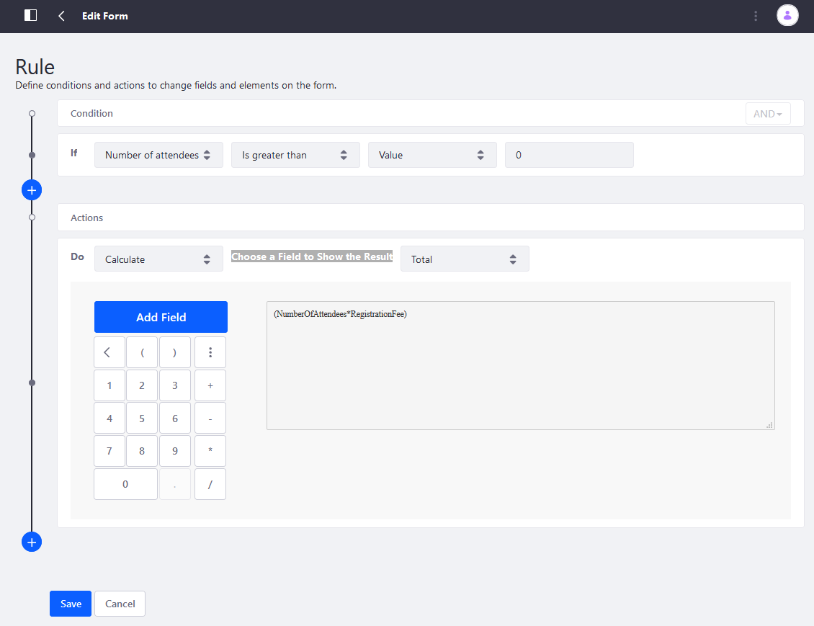
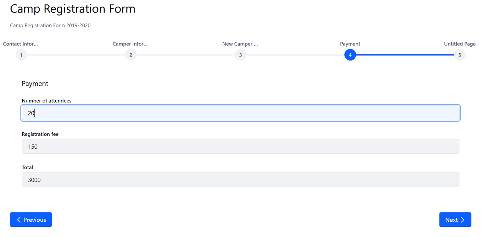

# Using the Calculate Rule

Calculate rules let you automatically populate a numeric field by calculating its value based on other fields. For example, users can use this Rule to calculate a camp or conference's total registration costs by multiplying the number of attendees and the registration fee (17 people at $130 each).

```important::
   Calculations are limited to numeric fields.
```

In this example, there is a form that has three numeric fields:

* _Number of attendees_: a numeric field.
* _Registration Fee_: a numeric field with a [predefined value](../providing-predefined-values-for-a-form.md) of 150.
* _Total_: a numeric field where the total will be displayed.

## Configuring the Calculate Rule

The calculation is defined using the embedded calculator. Use a mix of numeric field values, mathematical operators, and constants to define calculation rules.

Follow the steps below:

1. Click the _Rules_ tab.
1. Click the Add () button.
1. Select the _Number of attendees_ from the _If_ dropdown menu.
1. Create the condition: _Is greater than_ &rarr; _Value_ &rarr; _0_.
1. Select _Calculate_ from the _Do_ dropdown menu.
1. Select _Total_ from the _Choose a Field to Show the Result_ dropdown menu.
1. Using the embedded calculator, enter **(NumberofAttendees*RegistrationFee)**.

    

1. Click _Save_ when finished.

The Calculate Rule has been created.



## Additional Information

* [Creating Forms](../../creating-forms.md)
* [Form Rules Overview](./form-rules-overview.md)
* [Providing Predefined Values for a Form](../providing-predefined-values-for-a-form.md)