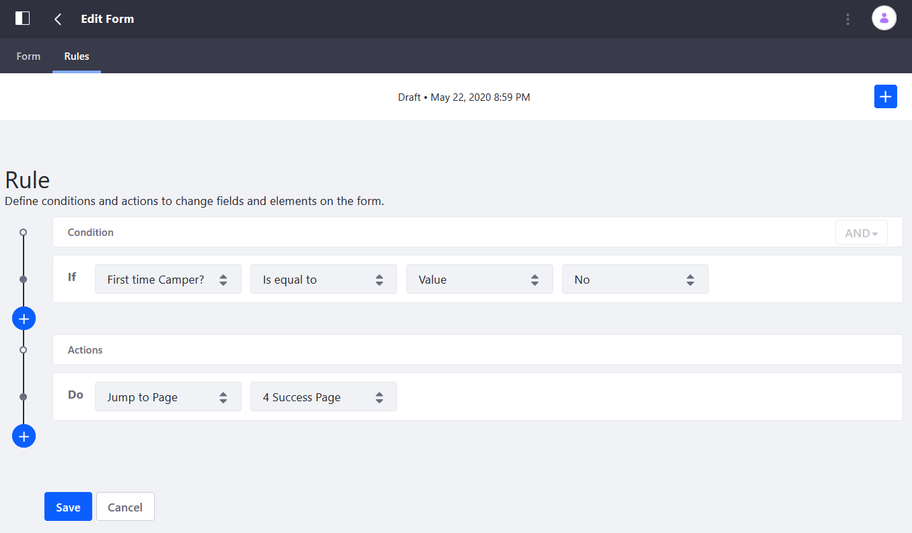
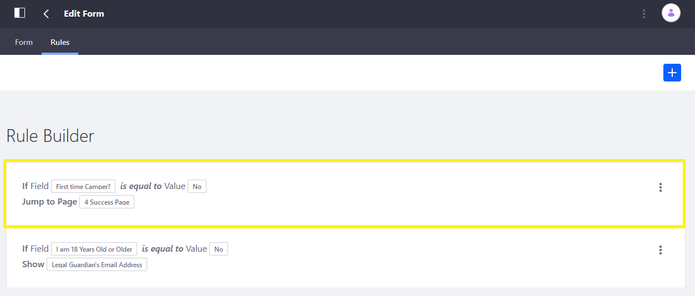

# Using the Jump to Page Rule

Use a Jump to Page rule to navigate automatically to a specific page in the form based on one or more conditions. This is useful if some pages do not apply to all the form's users. Even fields marked as required on the skipped pages can be successfully skipped using this rule.

```important::
   This action does not appear in the rule builder unless the form has multiple pages.
```

## Prerequisites

[Create a form](../../creating-forms.md) that has the following:

* _First time camper?_: a required single selection field with two options: _Yes_ and _No_.
* A second form page called _New Camper Information_.
* A third form page called _Success_.

## Configuring the Jump to Page Action Rule

To configure the Jump to Page Rule:

1. Click the _Rules_ tab.
1. Click the Add () button.
1. Select _First Camper?_ from the _If_ dropdown menu.
1. Select _Is equal to_ from the second dropdown menu.
1. Select _Value_ from the third dropdown menu.
1. Select _No_ from the last dropdown menu.
1. Select _Jump to Page_ from the _Do_ dropdown menu.
1. Select the _Success_ page to bypass the _New Camper Information_ page.

     

1. Click _Save_ when finished.



```note::
   It's best to use the *is not equal to* condition with fields existing on the same page. This is because Forms will check the first field and if it is returned as _true_, it will skip the second field.
```

## Additional Information

* [Creating Forms](../../creating-forms.md)
* [Introduction to Form Rules](./introduction-to-form-rules.md)
* [Using the Show/Hide Rule](./using-the-show-hide-rule.md)
