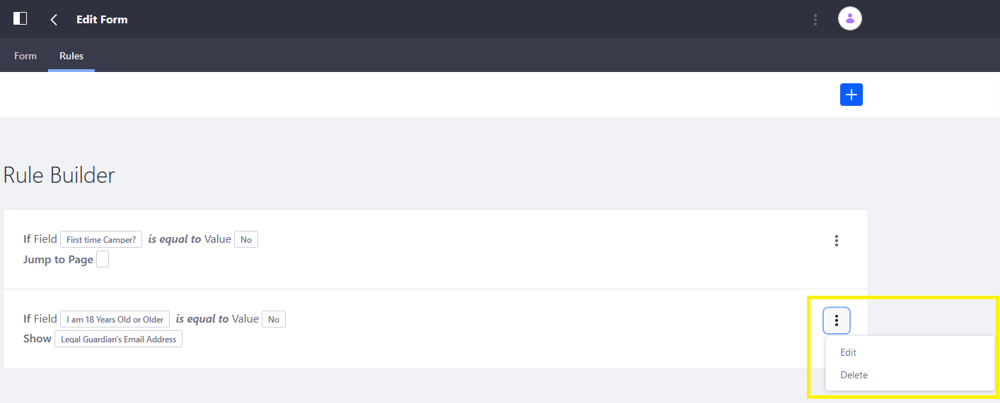
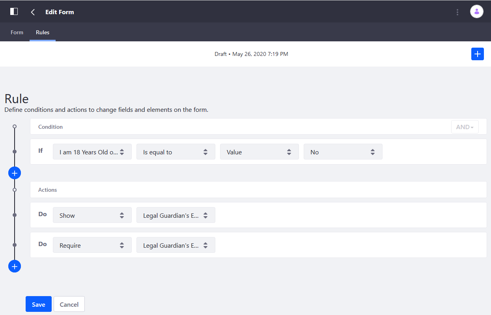
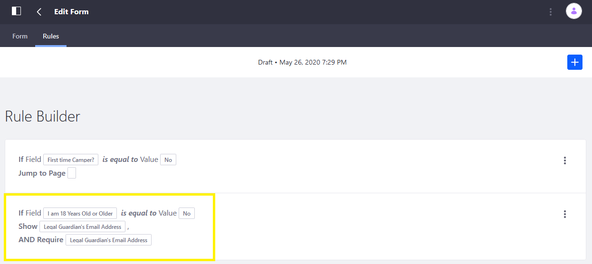

# Using the Require Rule

Use a Require rule to make a field required based on one or more conditions. Require rules let you require fields based on input from other fields.

```tip::
   Rules can contain multiple actions. In this example, a Require rule can be tied to a Show rule.
```

## Prerequisites

[Create a form](../../creating-forms.md) that includes the following:

* _I am 18 Years Old or Older_: a required single selection field with two options: _Yes_ and _No_.
* _Legal Guardian Email Address_: a text field that accepts valid email addresses.
* A [Show Rule](./using-the-show-hide-rule.md) that displays the _Legal Guardian Address_ field if the value for _I am 18 Years Old or Older_ is NO.

## Configuring the Require Rule

Follow the steps below:

1. Click the _Rules_ tab.
1. Click Actions () next to the _I am 18 Years Old or Older_ rule.

    

1. Click _Edit_.
1. Click the _Add Rule_ button under _Actions_.
1. Select _Require_ from the _Action_ dropdown menu.
1. Select the _Legal Guardian Email Address_ from the second dropdown menu.

    

1. Click _Save_ when finished.
1. Review the updated rule:

    

## Additional Information

* [Creating Forms](../../creating-forms.md)
* [Using the Show-Hide Rule](./using-the-show-hide-rule.md)
