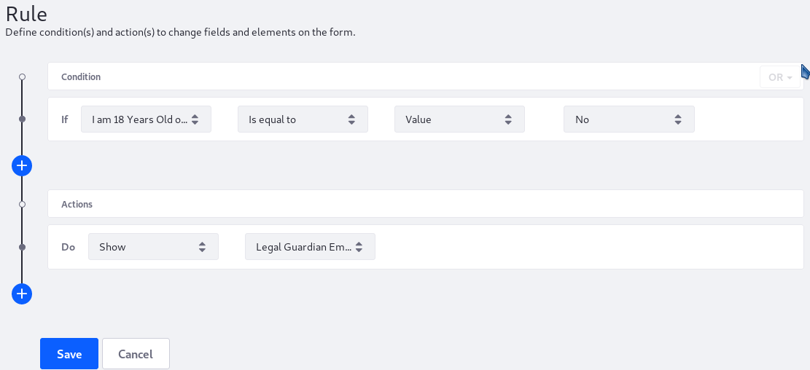
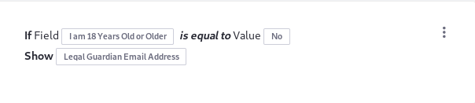

# Using the Show-Hide Rule

Using _Show_ action allows users to determine whether to show a field if the condition is met. This article demonstrates the "Show" action using the following example: If you're under 18 years old, you need the approval of a legal guardian to to participate in a camp. If you enter "No" on the form, the Legal Guardian Email Address field appears. Otherwise, this field is hidden.

## Prerequisites

[Create a form](../../creating-forms.md) that includes these two text fields:

* _I am 18 Years Old or Older_: a required single selection field with two options: _Yes_ and _No_.
* _Legal Guardian Email Address_: a text field that accepts valid email addresses.

## Configuring the Show Action Rule

To configure a Show-Hide action rule:

1. Click the _Rules_ tab.
1. Click the Add () button.
1. Select _I am 18 Years Old or Older_ from the Condition dropdown menu.
1. Create the condition: _Is equal to_ &rarr; _Value_ &rarr; _No_.

    

1. In the _Actions_ section, select _Show_ from the dropdown menu.
1. Select _Legal Guardian Email Address_ from the second Options dropdown menu.
1. Click _Save_ when finished.

     

The _Legal Guardian Email Address_ field is only displayed in the form if the user selects _No_ in the _I am 18 years old or older_ field.

## Additional Information

* [Creating Forms](../../creating-forms.md)
* [Introduction to Form Rules](./introduction-to-form-rules.md)
* [Using the Require Rule](./using-the-require-rule.md)
* [Using the Enable Rule](./using-the-enable-disable-rule.md)
* [Using the Jump to Page Rule](./using-the-jump-to-page-rule.md)
* [Using the Autofill Rule](./using-the-autofill-rule.md)
* [Using the Calculate Rule](./using-the-calculate-rule.md)
