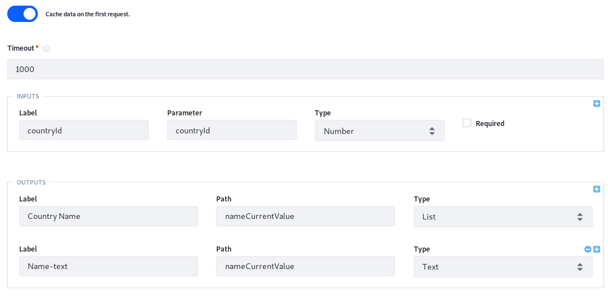

# Introduction to Data Providers

Forms can sometimes require a respondent to select from a list of options. For example, language and country of residence. If the number of options is small, users can create the list manually. However, if the list is much larger, such as list of countries (over 230), users can utilize a [REST web service](https://en.wikipedia.org/wiki/Representational_state_transfer) to provide form options. This saves time and helps to ensure accuracy.

Registered JSON web services in Liferay DXP can be viewed at [http://localhost:8080/api/jsonws](http://localhost:8080/api/jsonws) (assuming you're running a local server). For example, if populating a list of countries, there are two `get-countries` JSON web services (either one will work) and clicking _Invoke_ generates results.

The _Result_ tab shows a list of countries using JSON syntax, like this:

    [
      {
        "a2": "AF",
        "a3": "AFG",
        "countryId": "20",
        "idd": "093",
        "mvccVersion": "0",
        "name": "afghanistan",
        "nameCurrentValue": "Afghanistan",
        "number": "4"
      },
        ...

That is the record for the country Afghanistan. On the _URL Example_ tab, the URL you entered into the data provider form is the same as the one generated for accessing the `get-countries` JSON web service. Users can find the URL for any registered JSON web service using this same procedure.

Note the field you want Users to select. With this service, it is most likely `nameCurrentValue`, because it contains the full, properly capitalized name of the country.

## Data Provider Configuration Reference

### URL

The URL of an internal or external REST service endpoint. Consider the REST service at <https://restcountries.eu/> which contains a REST API endpoint to find countries by `region`:

`https://restcountries.eu/rest/v2/region/{region}`

Data Provider URLs can take two parameter types: path parameters and query parameters.

Path parameters are part of the URL calling the REST web service, and are added using the pattern `https://service-url.com/service/{path_parameter_name}`:

The `restcountries.eu` service's `region` endpoint's path parameter is `{region}`. Path parameters are mandatory parts of the URL, so make sure you specify an Input (see below) with a _Parameter_ field value matching the path parameter from the URL.

Query parameters are complementary parts of the URL that filter the output of the service call, following the pattern
`?query_parameter=query_parameter_value`:

    https://restcountries.eu/rest/v2/all?fields=capital

Unlike path parameters, query parameters are optional.

### User Name and Password

These are the Credentials used to authenticate to the REST Web Service, if necessary.

### Cache data on the first request

If the data is cached, a second load of the select list field is much faster, since a second call to the REST service provider is unnecessary.

### Timeout

The time (in ms) to allow the REST service call to process before aborting the request, if a response is not returned.

### Inputs

Configure path or query parameters from the REST service to filter the REST service's response. Specify the Label, Parameter, and Type (Text or Number), and choose whether the input is required to use the Data Provider.

### Outputs

The Parameter to display in Select from List or Text fields with autocomplete enabled. You can add multiple Outputs. Outputs can be filtered by inputs (see above) but can also be displayed without configuring input filtering. Specify the Label, Path, and Type (Text, Number, or List).

You can add multiple Inputs. To provide a way for users to specify the input value, use an
[_Autofill_ Form Rule](../form-rules/using-the-autofill-rule.md). A User enters input into one field, and their input is sent to the REST service. The REST service's response data is filtered by the input parameter.

The Output Path field is specified in [JsonPath syntax](https://github.com/json-path/JsonPath/blob/master/README.md), so it must always start with a `$`. The type of data returned by the Path must match the type you choose in the Type field. Using the `restcountries.eu` service, specify the `name` field as an Output by entering enter `$..name` in the Path field. If you have a more complex JsonPath expression to construct (for example, you need the names of all countries with a population over 100 million---`$..[?(@.population>100000000)].name` with the `restcountries.eu` service), consider using an online JsonPath evaluator, like [this one](http://jsonpath.herokuapp.com/) or [this one](https://jsonpath.com/).

```tip::
   To display one value to the user, but persist another in the database, enter both into the Paths field, separated by a semicolon: ``$..name;$..numericCode``
```

If this is used with the `restcountries.eu` data provider, the name of the country is displayed to the User, while the numeric country code is stored in the database.



## What's Next

* [Using Data Providers to Populate Form Options](./using-data-providers-to-populate-form-options.md)
* [Using the Autofill Rule](./form-rules/using-the-autofill-rule.md)
