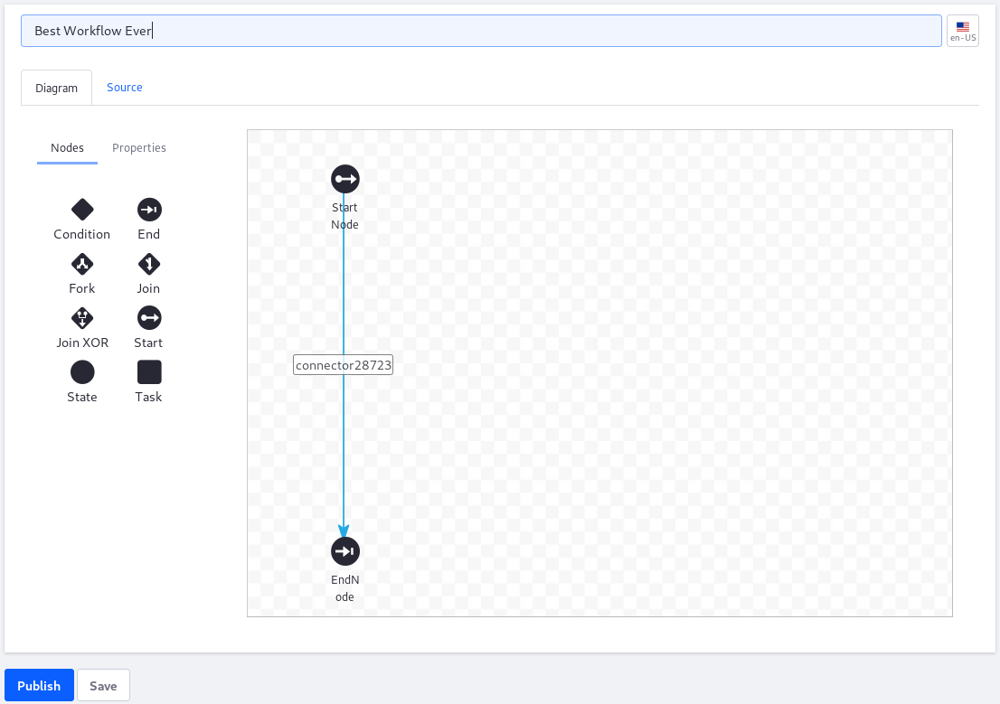

# Managing Workflows

> Subscribers

The Workflow Designer is an intuitive interface for creating workflow definitions, from the simplest approval processes to the most complex business processes. It features a drag and drop interface, workflow definition versioning, and a graphical representation of definitions and their nodes. This tutorial documents the basics in creating and managing a workflow. See [Creating Workflow Tasks](./workflow-designer/creating-workflow-tasks.md), [Using Forks, Joins, and Conditions](./workflow-designer/using-forks-joins-and-conditions.md), and [Configuring Workflow Actions and Notifications](./workflow-designer/configuring-workflow-actions-and-notifications.md) to learn more about using the different nodes and building workflows.

## Adding New Workflow Definitions

Workflow process definitions can be built in Liferay Workflow or uploaded in `XML` format; see the [Introduction to Crafting XML Workflow Definitions](https://help.liferay.com/hc/articles/360029147791-Introduction-to-Crafting-XML-Workflow-Definitions) to learn more.

By default there are three things added to the canvas: a start node, a transition, and an end node. The _End Node_ is the point in the workflow where an asset reaches the _Approved_ status. The _StartNode_ is where the asset goes from the _Draft_ status to _Pending_.

To use the canvas:

1. Navigate to the _Control Panel_ &rarr; _Workflow_ &rarr; _Process Builder_.
1. Click the Add icon ().
1. Enter a name for the new workflow definition.

    

1. Drag and drop a node from the _Nodes_ palette. Users can also delete the default End Node. Because all transitions must end with a node, Workflow Designer prompts you to select one. (See the [Workflow Designer Nodes Reference](./workflow-designer/workflow-designer-nodes-reference.md) to learn more about each type of node.)

    

1. To rename a node or a transition, double click the node to open the _Settings_ menu.
1. Double click the value of the _Name_ property.
1. Edit the name of the node. Click _Save_ to apply the name changes.
1. Repeat these steps for all the nodes and transitions.
1. Click _Save_ to save as a draft or _Publish_ when completed.

### Uploading a New Definition

Workflow Designer allows users to upload an XML file. Furthermore, after the XML file is uploaded, users can modify that existing definition if desired.

1. On the Workflow Editor, click the _Source_ tab.
1. Enter a name for the new definition.
1. Copy the content of the XML file and and overwrite the sample code or click "_import a file_" to upload the file.

    

1. Click the _Save_ button.
1. Click the _Publish_ button when finished.

The newly added definition is ready to be used as a workflow process.

## Editing a Workflow Definition

Users can save their workflows as a draft. Each time a workflow is saved or published, it creates a version that is tracked on the _Revision History_ tab.

To edit a workflow:

1. Navigate to the _Control Panel_ &rarr; _Workflow_ &rarr; _Process Builder_.
1. Click the _Actions_ button () for the workflow then _Edit_.

    

Changes to Workflow Definitions are tracked in the _Details_ and _Revision History_ menus.

### Viewing and Restoring Workflow Revisions

To view the workflow definition details and the revision history:

1. Click the _Information_ button ()
1. Next to a previous version on the _Revision History_ tab, click the *Actions* button () and select either *Preview* or *Restore*.

    

1. Clicking _Restore_ applies the prior version of the workflow. You can now edit the restored version of the workflow.
1. Click _Update_ to apply the changes. This creates another version of the workflow.

## Deleting a Workflow Definition

There are two statuses for a workflow:

* **Published:** Validation is complete, and the workflow can be assigned to assets.
* **Unpublished:** Validation is not performed on the unpublished workflow, and it cannot be assigned to assets until it is published.

Only _Unpublished_ workflows can be deleted.

_Published_ workflow definitions cannot be deleted if they are current associated with an asset type. Users have to first deactivate the workflow process and then place the workflow in the _Unpublished_ status.

1. To deactivate an asset type's workflow, reverse the steps found in the [Activating Workflow](./activating-workflow.md) article for each asset type and select _No Workflow_.
1. Navigate to the _Control Panel_ &rarr; _Workflow_ &rarr; _Process Builder_.
1. Click the _Actions_ button () for the workflow then _Unpublish_.

    

1. The selected definition is now in the _Unpublished_ section. Click the _Actions_ button () for the workflow then _Delete_.

    

## Configuring Workflow Definition Permissions

In the _System Settings_, users can enable or disable permissions for Site Administrators to publish workflows and scripts.

## Additional Information

* [Introduction to Crafting XML Workflow Definitions](https://help.liferay.com/hc/articles/360029147791-Introduction-to-Crafting-XML-Workflow-Definitions)
* [Workflow Designer (Subscription)](https://help.liferay.com/hc/articles/360028821892-Workflow-Designer)
* [Workflow Designer Nodes Reference](./workflow-designer/workflow-designer-nodes-reference.md)
