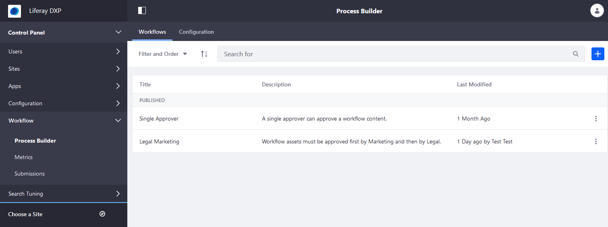
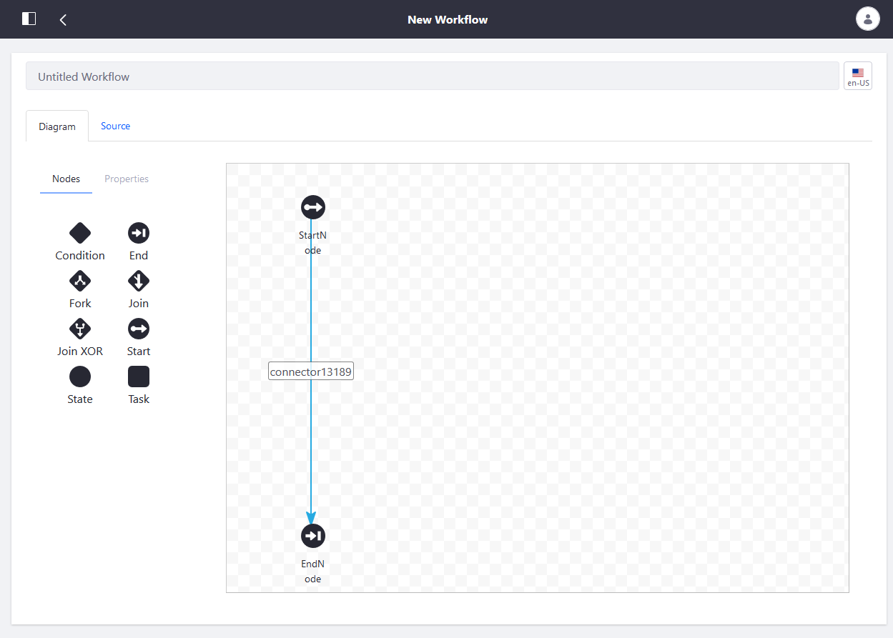
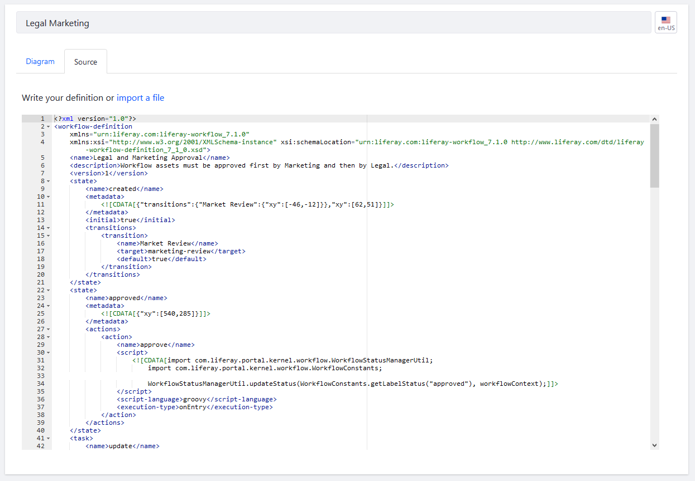

# Workflow Designer Overview

> Subscribers

The Workflow Designer provides a graphical interface for creating workflows. The convenient drag and drop user interface makes workflow design easier than writing XML definitions by hand. Lastly, some of the features can be enhanced Groovy (a supported Java-based scripting language) scripts.

By default, only one workflow definition is installed: the Single Approver Workflow definition. You can download additional definitions here:

* [Category-Specific Definition](./workflow-designer-overview/category-specific-definition.xml)
* [Legal Marketing Definition](./workflow-designer-overview/legal-marketing-definition.xml)
* [Single Approver Definition with Scripted Assignment](./workflow-designer-overview/single-approver-definition-scripted-assignment.xml)
* [Single Approver Definition](./workflow-designer-overview/single-approver-definition.xml)

## Building Workflows

To build a new workflow or to upload one, navigate to the _Control Panel_ &rarr; _Workflow_ &rarr; _Process Builder_.



Click the () to begin.



```tip::
   Alternately, users can upload XML scripts then modify the definition using the user interface. To learn more about uploading an XML script, see `Managing Workflows <./managing-workflows.md#uploading-a-new-workflow-definition>`_.
```



Each Workflow Node represents a specific point in an approval process, whether it is starting the review process, approving or rejecting the asset, or reassigning the task.

Workflow transitions link each node to create the desired flow in the review process. On exiting the first node, processing continues to the next node indicated by the transition.

## Additional Information

* [Managing Workflow with Designer](./workflow-designer/managing-workflow-with-designer.md)
* [Using Forks, Joins, and Conditions](./workflow-designer/using-forks-joins-and-conditions.md)
* [Creating Workflow Tasks](./workflow-designer/creating-workflow-tasks.md)
* [Configuring Workflow Actions and Notifications](./workflow-designer/configuring-workflow-actions-and-notifications.md)
* [Workflow Designer Nodes Reference](./workflow-designer/workflow-designer-nodes-reference.md)
