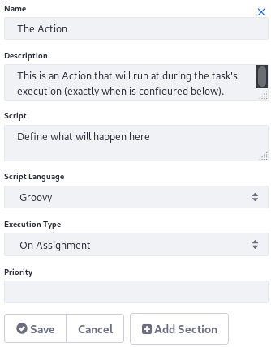
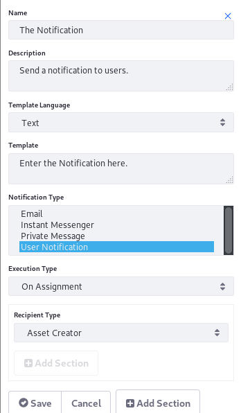
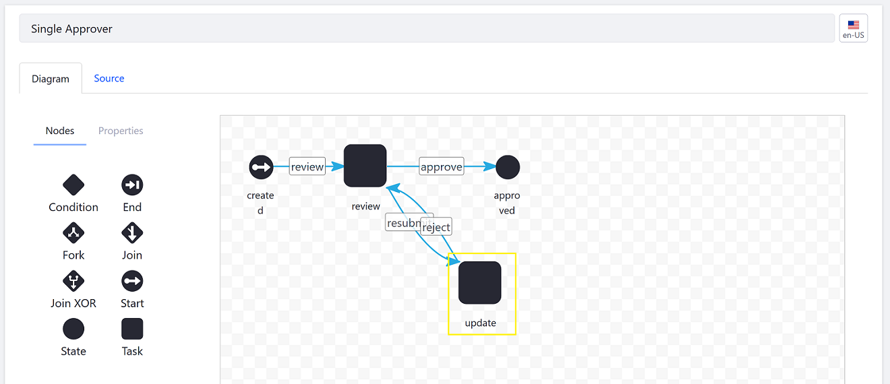
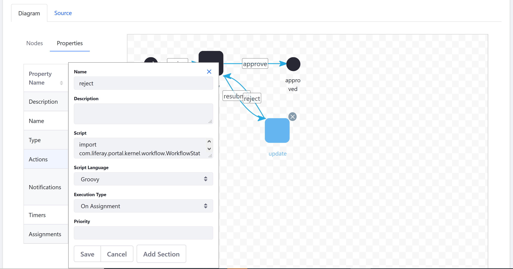
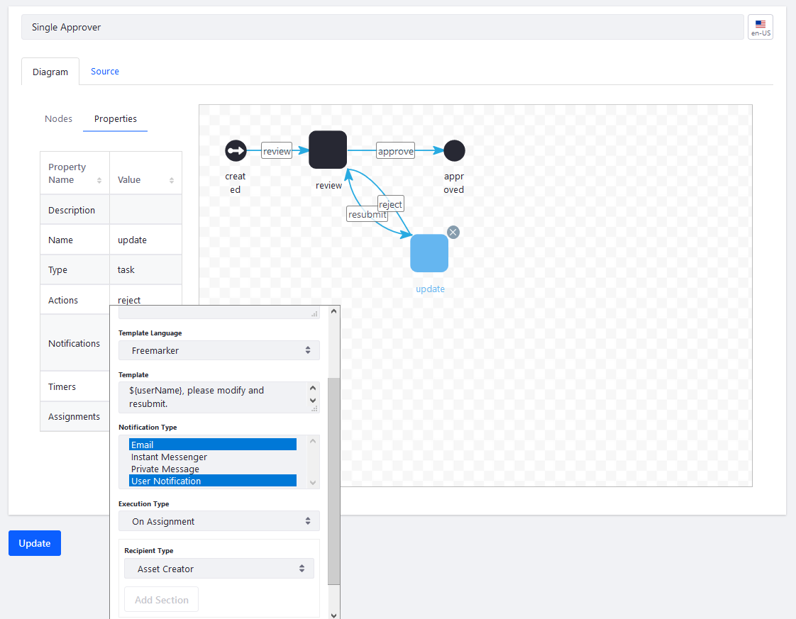
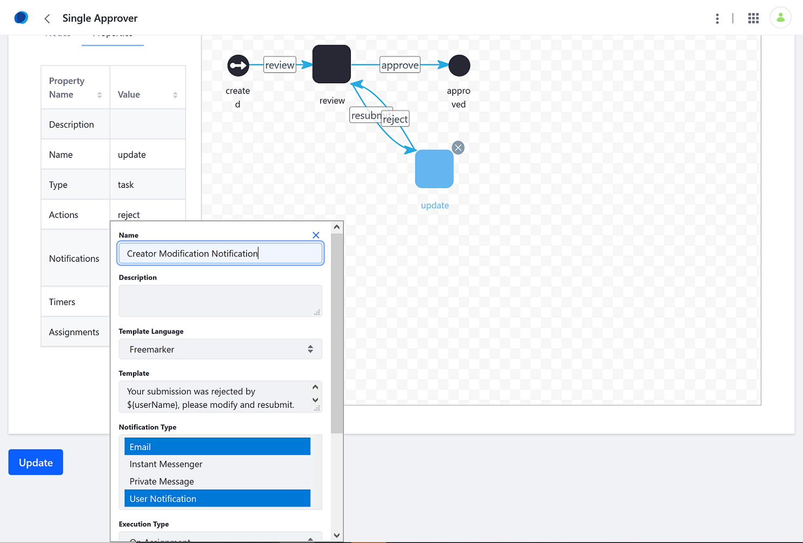

# Configuring Workflow Actions and Notifications

> Subscribers

Using the Workflow Designer, users can configure Workflow Actions and notifications for each node. By adding an action or a notification, users define what happens at each task or state node.

Actions are very adaptable and you can specify when the Action occurs: before entering the node, after exiting a node, or once a task node is assigned. For example, when a reviewer rejects an Web Content article, a Workflow Action sets the asset's status as _Pending_ and automatically reassigns the article to the original author.



In the case of notifications, a reviewer will receive a notification when the article is ready for his review.



However, not every node requires a Workflow Action or a notification. Generally, Start and End nodes do not have actions or notifications, unless you want to notify the original author that the review process has begun or ended.

This tutorial documents adding a _Reject_ action to a Task node in a Single Approver workflow and then a notification.

## Adding Actions

To add an action which rejects a submission:

1. Navigate to the _Control Panel_ &rarr; _Workflow_ &rarr; _Process Builder_.
1. Click the _Workflows_ tab.
1. Click on the Workflow definition (for example, _Single Approver_).
1. Click the _Update_ node.

    

1. Double click _Actions_ to define an action.
1. Enter _reject_ in the Name field.
1. Select _Groovy_ from the _Script Language_ dropdown menu.
1. Select _On Assignment_ from the _Execution Type_ dropdown menu.
1. Enter the script in the _Script_ field. The Single Approver workflow contains an Update task with an action written in Groovy that sets the status of the asset as _denied_, then sets it to _pending_.

    ```java
        import com.liferay.portal.kernel.workflow.WorkflowStatusManagerUtil;
        import com.liferay.portal.kernel.workflow.WorkflowConstants;

        WorkflowStatusManagerUtil.updateStatus(WorkflowConstants.getLabelStatus("denied"), workflowContext);
        WorkflowStatusManagerUtil.updateStatus(WorkflowConstants.getLabelStatus("pending"), workflowContext);
    ```

    

1. Click _Save_ when finished.

In this example, the action script first sets the status to _denied_ and then to _pending_ because for some assets, the _denied_ status sends the asset creator an email notification that the item has been denied.

## Adding Notifications

Workflow Notifications are sent to tell task assignees that the workflow needs attention or to update asset creators on the status of the process. They can be sent for tasks or any other type of node in the workflow.

To set up notifications, double click on _Notifications_ in the _Update_ node's Properties tab.

 

1. Enter the following:
    * **Name:** Creator Modification Notification
    * **Description**: Enter a description for this notification

1. Select _Freemarker_ from the _Template Language_ dropdown menu.
1. Enter a message in the _Template_ field:
    * `Your submission was rejected by ${userName}, please modify and resubmit.`

1. Select the Notification Type; this field is multiple-select so you can multiple users.
1. Select _On Assignment_ from the _Execution Type_ dropdown menu. This indicates when the notification is sent.
1. Select a recipient type.

     

1. Click _Save_ when finished.

Notifications on the Update node have been added.

## Additional Information

* [Creating Workflow Tasks](./creating-workflow-tasks.md)
* [Using Forks, Joins, and Conditions](./using-forks-joins-and-conditions.md)
* [Workflow Designer Nodes Reference](./workflow-designer-nodes-reference.md)
