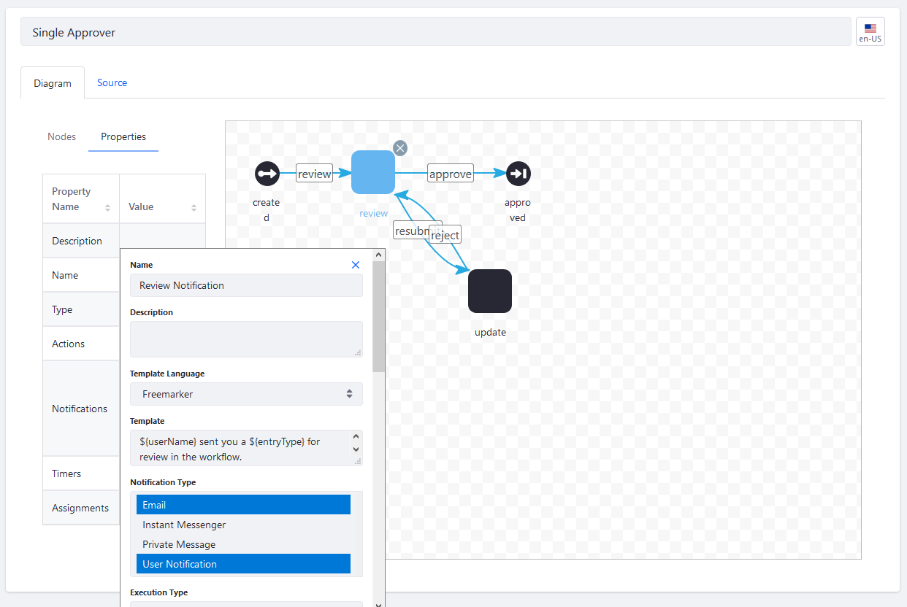

# Creating Workflow Tasks

> Subscribers

As you design your workflow to reflect the real life review process of a submitted asset, use the _Task Node_ in the _Workflow Designer_.

In this example, the default [Single Approver Definition](../workflow-designer-overview/workflow-processes/single-approver-definition.xml) has two task nodes: _Review_ and _Update_. The _Review_ node is as its name suggests - that someone is reviewing the submission. An _Update_ _Task_ node denotes that the asset needs more work before it can be accepted.

Task nodes are often the most complex parts of a workflow definition. They can have Assignments which can assign the task to users or a Resource Action (see [Workflow Task Node Reference](./workflow-task-node-reference.md)).

Furthermore, task nodes also contain Notifications and Actions (defined in scripts). See [Configuring Workflow Actions and Notifications](./configuring-workflow-actions-and-notifications.md).

Lastly, once the review is completed, _Task_ nodes can advance to the next phase, such as forwarding the submission to the next reviewer or to the _Approved_ End node.

To configure a Review _Task_ node:

1. Go to the _Global Applications_ menu &rarr; _Applications_ &rarr; _Process Builder_.
1. Click the _Workflows_ tab.
1. Click the () to add a new workflow.
1. In the Workflow Designer Canvas, delete the old connector between the _Start_ node and _End_ node.
1. Drag and drop the _Task_ node onto the canvas then connect _Start_ node to the _Fork_ node.
1. Rename the connector as _review_.
1. Click the _Task_ node to begin updating its properties.
1. Double click the _Name_ field to give the node a name: _review_.
1. Double click _Notifications_.
1. Enter the following:

    * **Name**: Review Notification
    * **Template Language**: Freemarker
    * **Template**: (Enter a message for the reviewer.) Using Freemarker allows using placeholder text such as `${userName}` to parse in values in the message.
    * **Notification Type**: Select the types of notifications; this is a multiple select field so you can choose more than one.
    * **Execution Type**: On Assignment
    * **Recipient Type**: Task Assignee

    

1. Add additional notifications as desired.
1. Click _Save_ when finished.
1. Double click _Assignments_. You can assign the review task to a Role, Role Type, a specific user, or a Resource Action. In this example, assign the _Task_ to a Role Type.
1. Define which Roles will be asked to review the submission. For more information about Roles and Permissions, see [Understanding Roles and Permissions](../../../../users-and-permissions/roles-and-permissions/understanding-roles-and-permissions.md) and [Assigning Users to Roles](../../../../users-and-permissions/roles-and-permissions/assigning-users-to-roles.md). In this case, we have designating organization and site administrators and content reviewers to review the submission.

    

1. Click _Save_ when finished.
1. Connect the _Review_ node to the _Approved_ End node.

This _Task_ node is now configured; it will send a notification that a submission is ready for review to those users assigned to a specific Role.

You can also assign the _Task_ node to a Resource Action instead of another user or a Role Type. To learn more see [Workflow Task Node Reference](./workflow-task-node-reference.md).

Create additional nodes such as an _Update_ node. You can also connect the _Task_ node to other nodes such as [Forks and Joins](./using-forks-and-joins.md) or [Conditions](./using-the-condition-node.md) nodes.

## Additional Information

* [Activating Workflow](../activating-workflow.md)
* [Configuring Workflow Actions and Notifications](./configuring-workflow-actions-and-notifications.md)
* [Workflow Designer Nodes Reference](./workflow-designer-nodes-reference.md)
* [Workflow Task Node Reference](./workflow-task-node-reference.md)
