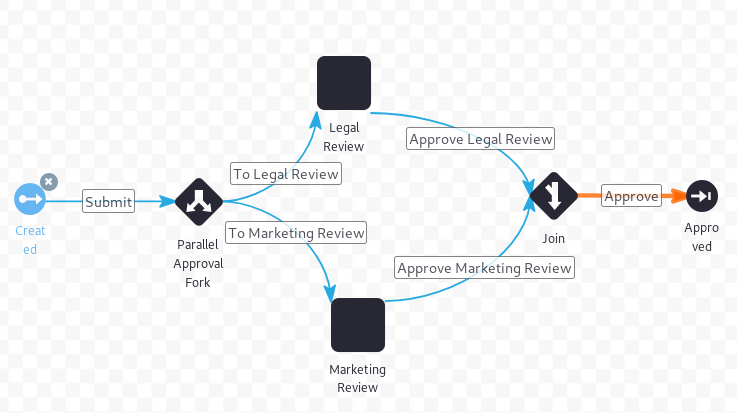
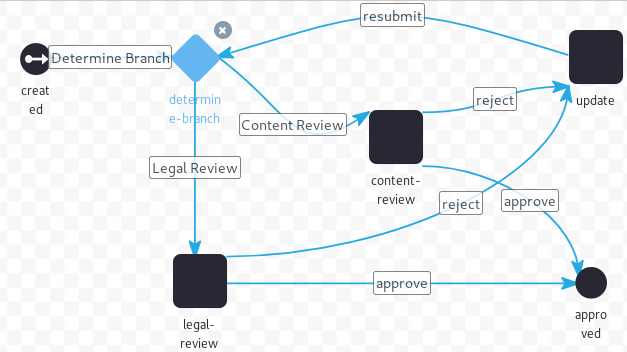

# Using Forks, Joins, and Conditions

> Subscribers

_Fork_, _Join_, and _Condition_ nodes allow users to create workflows that are more robust and diverse, such as inviting more concurrent reviewers or determining which reviewer is assigned based on certain conditions. (By comparison, the Single Approver definition is relatively linear, going from the asset creator to a single reviewer.) This article describes how to use the _Fork_, _Join_ (and _Join XOR_), and _Condition_ nodes.

## Using the Fork and Join Nodes

_Fork_ and _Join_ nodes allow uses to split the review task so that two reviewers can review the asset without waiting for the other. Once both reviewers have completed the review process, the workflow is joined together and can proceed.  To do this, add a transition to a fork node, make two transitions from the fork to your parallel tasks, and then come back together using a join node.



With a regular Join node, for the workflow to proceed beyond the join, the transition from both parallel executions must be invoked. However, if you use a Join XOR node instead, the workflow proceeds as long as the transition from one of the parallel executions is invoked.

```tip::
    Fork and Join nodes work as a pair. In other words, for every fork, there must be a join that brings the parallel workflow threads back together.
```

## Using a Condition Node

_Condition_ nodes allow users to determine the next step in the review process depending on whether a condition is met. Use the _Condition node which has a script that concludes by setting a value to one of your transitions.



From the *Category Specific Approval* (`category-specific-definition.xml`), this is the script in the condition node that starts the workflow (coming directly from the start node):

```java
    import com.liferay.asset.kernel.model.AssetCategory;
    import com.liferay.asset.kernel.model.AssetEntry;
    import com.liferay.asset.kernel.model.AssetRenderer;
    import com.liferay.asset.kernel.model.AssetRendererFactory;
    import com.liferay.asset.kernel.service.AssetEntryLocalServiceUtil;
    import com.liferay.portal.kernel.util.GetterUtil;
    import com.liferay.portal.kernel.workflow.WorkflowConstants;
    import com.liferay.portal.kernel.workflow.WorkflowHandler;
    import com.liferay.portal.kernel.workflow.WorkflowHandlerRegistryUtil;

    import java.util.List;

    String className = (String)workflowContext.get(WorkflowConstants.CONTEXT_ENTRY_CLASS_NAME);

    WorkflowHandler workflowHandler = WorkflowHandlerRegistryUtil.getWorkflowHandler(className);

    AssetRendererFactory assetRendererFactory = workflowHandler.getAssetRendererFactory();

    long classPK = GetterUtil.getLong((String)workflowContext.get(WorkflowConstants.CONTEXT_ENTRY_CLASS_PK));

    AssetRenderer assetRenderer = workflowHandler.getAssetRenderer(classPK);

    AssetEntry assetEntry = assetRendererFactory.getAssetEntry(assetRendererFactory.getClassName(), assetRenderer.getClassPK());

    List<AssetCategory> assetCategories = assetEntry.getCategories();

    returnValue = "Content Review";

    for (AssetCategory assetCategory : assetCategories) {
        String categoryName = assetCategory.getName();

        if (categoryName.equals("legal")) {
            returnValue = "Legal Review";

            return;
        }
    }
```

This example checks the asset category to choose the processing path, whether to transition to the *Legal Review* task or the *Content Review* task.

```tip::
   The `returnValue` variable is the variable that points from the condition to a transition, and its value must match a valid transition in the workflow definition.
```

This script looks up the asset in question, retrieves its [asset category](https://help.liferay.com/hc/en-us/articles/360028820492-Defining-Categories-for-Content), and sets an initial `returnValue`. Then it checks to see if the asset has been marked with the *legal* category. If not it goes through *Content Review* (the content-review task in the workflow), and if it does it goes through *Legal Review* (the legal-review task in the workflow).

## Additional Information

* [Activating Workflow](../activating-workflow.md)
* [Creating Workflow Tasks](./creating-workflow-tasks.md)
* [Configuring Workflow Actions and Notifications](./configuring-workflow-actions-and-notifications.md)
* [Workflow Designer Nodes Reference](./workflow-designer-nodes-reference.md)
