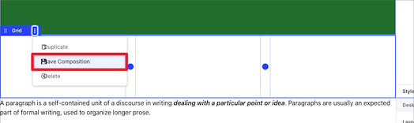
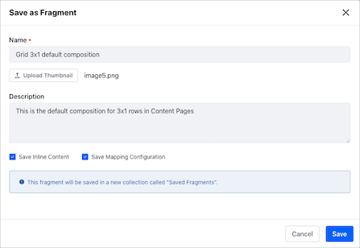

# Building Content Pages

Once you've [added a Content Page](../adding-pages/adding-a-page-to-a-site.md), you may begin building your page by adding and configuring the various [Content Page elements](./content-pages-overview.md).

1. Open the Product Menu and, under the Site Menu, go to *Site Builder* &rarr; *Pages* to open the Site Builder.
1. Click the Add Page button ) at the level where you want to add the new page, and select *Add Page*.

    

1. Select the *Blank* template or one of the exiting templates.
1. In the *Add Page* dialog, type your page's *Name*.
1. Alternatively, click the Actions Menu () of an existing Content Page and select *Edit*.

    

1. From the Content Page sidebar, select the *Fragments and Widgets* button () and start adding the Fragments and Widgets for your content.

    

    ```note::
       New Content Pages start empty and in a *Draft* status. The page is not visible until it is published.
    ```

1. Configure the look and content preferences of the Fragments and Widgets using the following configuration options:

    * [Setting the Layout Style](#setting-the-layout-style)
    * [Editing Text Inline](#editing-text-inline)
    * [Editing Hyperlinks](#editing-hyperlinks)
    * [Editing Images](#editing-images)
    * [Configuring the Grid Layout](#configuring-grid-columns)
    * [Copying a Fragment](#copying-a-fragment)
    * [Saving a Fragment Composition](#saving-a-fragment-composition)
    * [Mapping Content](#mapping-content)

    

    ```tip::
       In progress work on a Content Page is automatically saved.
    ```

1. Click the *Publish* button in the top right to make the updates available to the live page.

## Configuring Elements on a Content Page

Many elements that can be added to a content page can be configured and customized. When you clic on an element, the Content Page sidebar shows the available configuration options for the element.

### Setting the Layout Style

You can set different style options for your Content Page layout, like background color, background image, margins, opacity, etc.

1. Click the layout element you want to change.
1. In the Content Page sidebar, under the *Styles* tab, configure the style options for your content:

    - Content Display and Container Width
    - Margin
    - Padding
    - Background and Border color
    - Effects

      

```note::
   The available color palette can be configured by the Fragment developer. See [Fragment Configuration Types Reference](../../../site-building/developer-guide/reference/fragments/fragment-configuration-types-reference.md) for more information.
```

### Editing Text Inline

1. Double-click the page element containing your text to enter into the edit text mode.
1. Select the text that you want to edit.
1. Use the inline text editor to update the text styles, typographical emphasis, alignment, and other text formatting options.

    

### Editing Hyperlinks

1. Click on the link, button, or image that you want to edit.
1. On the Content Page sidebar, under the *Link* tab, choose the options for your link:

    * *Link:* defines a manual link or maps it to an existing content field
    * *URL:* set the link's URL
    * *Target:* set the link's behavior

        

    When you choose the *From Content Field* option for your link, you can configure the followin options: 

    * *Content:* set the content type
    * *Field:* set the field to display for the selected content. Some of the available content fields are:

        * Categories
        * Tags
        * Display Page URL
        * Description
        * Publish Date
        * Summary
        * Title
        * Last Editor Name
        * Author Name
        * Basic Web Content
    
    * *Target*: set where to open the linked content.

### Editing Images

1. Click on the image you want to edit.
1. In the Content Page sidebar, you can configure the image using three different options:

    - *Link*: enter the URL for your image.
    - *Image*: select an image from your computer or from the Documents and Media library.
    - *Mapping*: select an image by [mapping content](#mapping-content).

    

You can also specify a background image for a layout by [setting the layout style](#setting-the-layout-style) or provide a link for your image by [editing hyperlinks](#editing-hyperlink).

### Configuring the Grid Layout

1. Click the Grid element you want to configure.
1. In the Content Page sidebar, under the *Styles* tab, select the style options.
1. Under the *Configuration* tab, select the *Number of Modules* (from 1 to 6) to specify the number of columns for the grid.
1. Click *Show Gutter* to show the spacing between modules.

You can adjust the width of the columns to create a more custom layout:

1. Click on the Row to select it. A blue dot appears between each of the columns, indicating that they can be resized.
1. Click one of the blue dots and drag to the left or right to adjust the size of the column.

    

### Copying a Fragment

You can duplicate a Fragment on the page (Component, Section, Row, etc.) to save time:

1. Click the Fragment you want to copy.
1. Click the Action menu () for the container and select *Duplicate*.

    

```note::
  When you ducplicate a Fragment, you also ducplicate the mappings and customizations.
```

```warning::
  Layouts (Sections or Rows) containing instanceable Widgets cannot be duplicated. In this case, a message will appear, indicating the Widget preventing the duplication.
```

### Saving a Fragment Composition

You can save customized Fragment compositions (Section or Row layout Fragments) as new Fragments, so you can reuse them in your other Fragment-based pages:

1. Click the Row or Section composition you want to save.
1. Click the Action menu () for the container and select *Save Composition*.

      

1. In the Save as Fragment dialog that appears, provide a name and other optional information:

    - Fragment *Description* and *Thumbnail*.
    - *Save Inline Content* option, for including inline content such as fragment entries (links, images, text, etc.)
    - *Save Mapping Configuration* option, for including [mapped content](#mapping-content).
    - *Collection* to save the Fragment.

      

```note::
   If no Site-specific Fragment Collection exists, the saved Fragment composition is automatically saved to a new Fragment Collection called Saved Fragments.
```

You can use the saved Fragment composition immediately using the Fragments sidebar or through the Page Fragments administrative application.


Compositions can be exported/imported between sites just as any other Fragment.

```note::
  The latest version of the `Liferay Fragments Toolkit <../../developer-guide/developing-page-fragments/using-the-fragments-editor.md>`_ supports creation, export/import, and preview of Fragment compositions.
```

### Mapping Content

You can also map these elements to content. You can set the *Content* for the element (web content article, document, or blog) and choose its applicable *Field* to display (e.g., title, author name, tags, etc.). You can configure this by selecting the element's *Map* button ().

When you create Content Pages, you can create different **Experiences** for users based on User Segments. You can create a unique Experience on any Content Page for any existing User Segment. For more information, see the [Content Page Personalization guide](../../personalizing-site-experience/personalizing-site-experience.md).

<!-- 
####################################################
Content from Liferay Help Center follows
####################################################
-->
## Liferay DXP 7.2 and Below


## Related Information

* [Developing a Page Fragment](../../developer-guide/developing-page-fragments/developing-fragments-intro.md)
* [Using Master Pages](../defining-headers-and-footers/master-page-templates.md)
* [Changing Content Pages Look and Feel](./content-pages-overview.md#look-and-feel)
