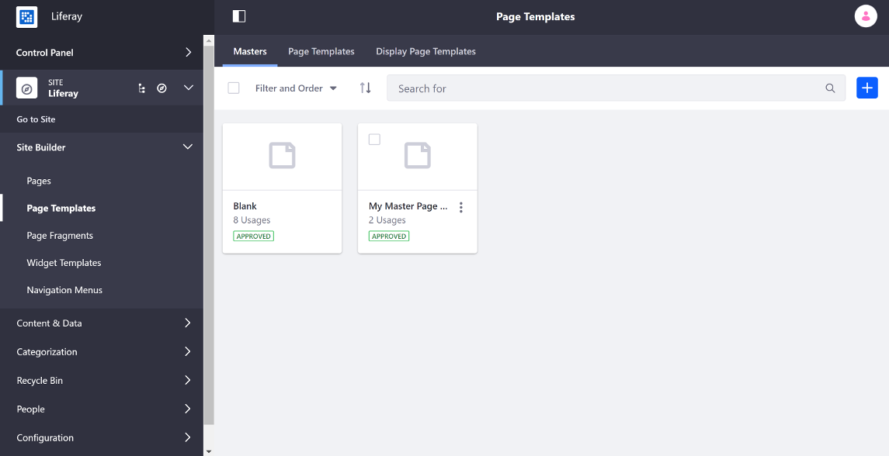
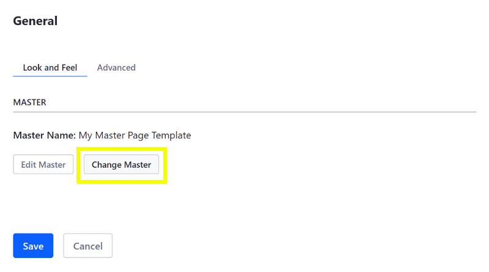
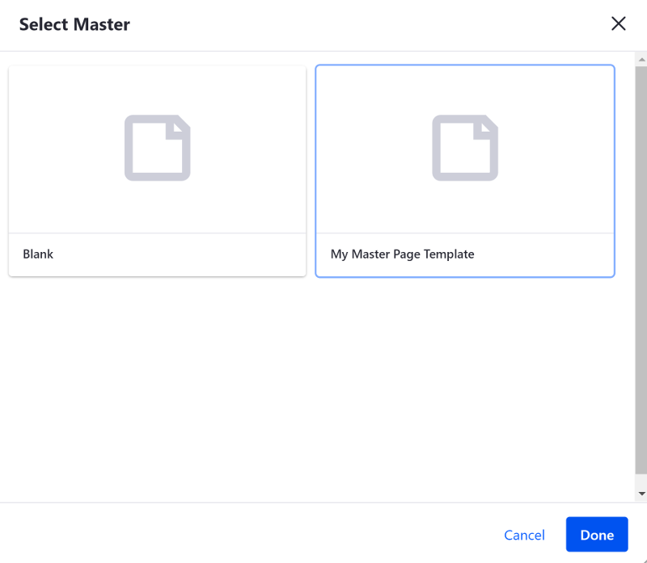
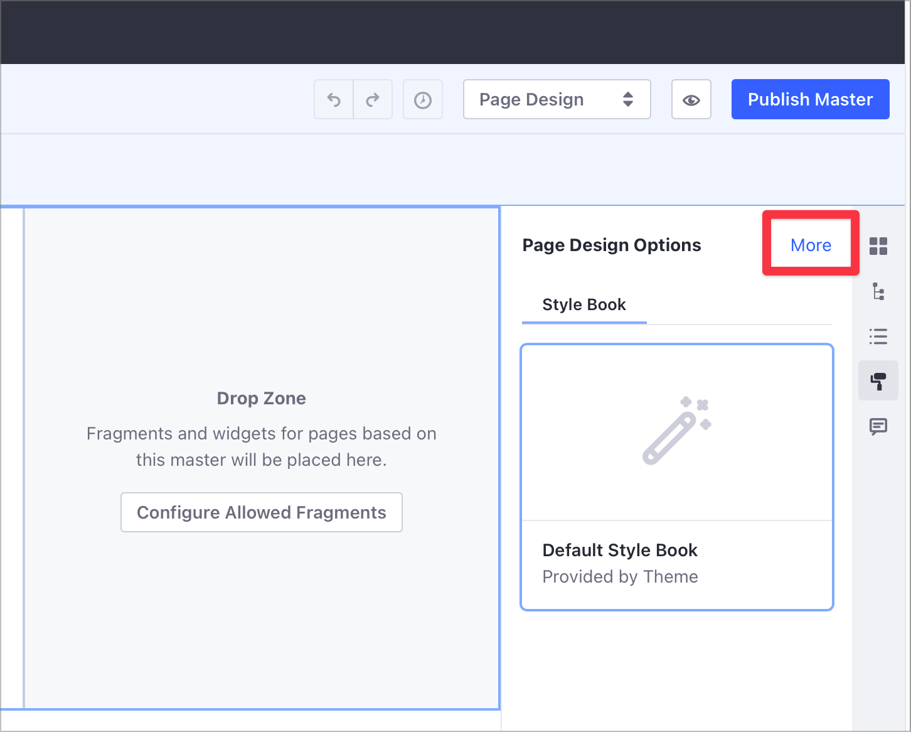
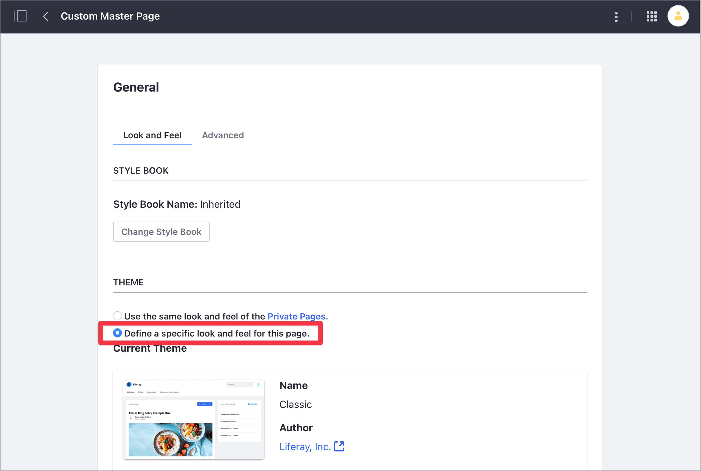

# Managing Master Page Templates

> Available: Liferay DXP 7.3+

To manage a Master Page Template, follow these steps:

1. Open the Product Menu, go to Site &rarr; *Design* &rarr; *Page Templates* and select the *Masters* tab.

    

1. Open the Actions () Menu for a Master Page Template and select one of the options listed below:

    - **Edit:** Configure the Master Page Template. Alternatively, you can edit a page's Master Page Template through the page's [Look and Feel Menu](../building-and-managing-content-pages/editing-content-pages.md#look-and-feel), by clicking the *Edit Master* button.

    - **Change Thumbnail:** Select a thumbnail image to display for the Master Page Template's card in the *Masters* tab

    - **Rename:** Change the name of the Master Page Template

    - **Make a Copy:** Duplicate the Master Page Template. The copy is automatically named after the original Master Page Template with "Copy" appended to the end.

    - **Export:** Export and download the Master Page Template definition. This options is available when the Master Page Template is in the *Approved* status.

    - **Permissions:** Define permissions for the Master Page Template

    - **Delete:** Remove the Master Page Template. You can also bulk delete Master Page Templates by checking the box for each template and clicking the `X`, or selecting the *Delete* action from the Management Toolbar.

    - **Discard Draft:** Discard the Master Page Draft. This option is available for when the Master Page Template is in the *Draft* status.

```note::
   After changes are made and published, they are propagated to all pages that use the Master Page Template.
```

## Changing the Master Page Template of a Page

You can change the Master Page Template of a page through the page's [*Look and Feel* Menu](../building-and-managing-content-pages/editing-content-pages.md#look-and-feel). Follow these steps:

1. Navigate to the page that you want to change the Master Page Template for.
1. Click the *Look and Feel* icon ().
1. Click the *Change Master* button under the *Look and Feel* tab.

    

1. Select a new Master Page Template and click *Done*. Click *save* to apply the changes.

    

## Changing a Master Page Template's Theme

When a custom Master Page Template is applied to a page, the Theme is no longer defined through the page. It is defined through the Master Page Template. Follow these steps to update the Theme for the Master Page Template:

1. Edit the Master Page Template through the Actions Menu as described above.
1. Open the *Page Design Options** Menu ().
1. Click *More* to access the Master Page Template General options.
   
   

1. Select the *Define a specific look and feel for this page* button.

    

1. Scroll down and click the *Change Current Theme* button
1. From the list of *Available Themes*, select a new Theme, and click *Save* to apply the changes.

## Additional Information

- [Master Pages Templates](./master-page-templates.md)
- [Creating a Master Page Template](./creating-a-master-page-template.md)
