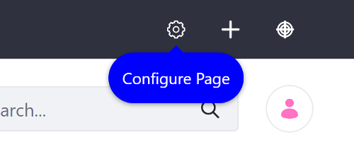

# Developing Themelets

Themelets are Small, extendable, and reusable pieces of code containing CSS and JavaScript, that you can extend Themes with. They can be shared with other developers to provide common components for Themes. The steps below show how to use the Liferay Theme Generator's Themelets sub-generator to create a Themelet.

## Overview

1. [Deploy an Example](#deploy-an-example)
1. [Walk Through the Example](#walk-through-an-example)
1. [Additional Information](#additional-information)

## Deploy an Example

```note::
  This example runs on Liferay Portal 7.3.
```

First you must deploy an example Theme that contains the Themelet. Follow these steps:

1. Download and unzip the [example Themelet Theme](https://github.com/liferay/liferay-learn/tree/master/docs/dxp/7.x/en/site-building/dev/01-developing-a-theme/developing-themelets/1582903559liferay45.zip):

    ```bash
    curl https://github.com/liferay/liferay-learn/tree/master/docs/dxp/7.x/en/site-building/dev/01-developing-a-theme/developing-themelets/1582903559liferay45.zip
    ```

1. Open the Command Line and navigate to the `my-liferay-themelet` folder.
1. Run the `npm link` command to globally install the Themelet so you can install it in the example Theme.
1. Navigate to the `my-liferay-themelet-theme` and install the Theme's dependencies:

    ```bash
    npm install
    ```

1. Extend the example Theme with the example Themelet. Run the appropriate command for your Liferay JS Themes Toolkit version:

    v9.5.0+:

    ```bash
    npm run extend
    ```

    Older versions:

    ```bash
    node_modules\.bin\gulp extend
    ```

1. Choose *Themelet* as the Theme asset to extend.
1. Select *Search globally installed npm modules*

    

1. Highlight `my-liferay-themelet`, press spacebar to select it, and press *Enter* to install it.

    

1. Build the Theme's WAR. If you're running Liferay JS Themes Toolkit v9.5.0+, run `npm run build` to build your Theme's WAR file. Otherwise, run `node_modules\.bin\gulp build` to build the WAR file.

    ```note::
      You can check the version of the toolkit by running `npm list -g generator-liferay-theme`.
    ```

1. Verify that the Themelet's CSS has been injected into `_custom.scss` and the JavaScript has been injected into `portal_normal.ftl`:

    ```bash
    [15:41:37] Starting 'build:themelets'...
    [15:41:37] Starting 'build:themelet-src'...
    [15:41:37] Finished 'build:themelet-src' after 9.91 ms
    [15:41:37] Starting 'build:themelet-css-inject'...
    [15:41:37] Starting 'build:themelet-js-inject'...
    [15:41:37] gulp-inject 1 file into _custom.scss.
    [15:41:37] gulp-inject 1 file into portal_normal.ftl.
    [15:41:37] Finished 'build:themelet-js-inject' after 24 ms
    [15:41:37] Finished 'build:themelet-css-inject' after 76 ms
    [15:41:37] Finished 'build:themelets' after 106 ms
    ```

1. Copy the Theme's WAR to the `[host_folder]/deploy` folder for your Docker image's [bind mount](TODO), or create the `[host_folder]/deploy` folder if it doesn't exist.

    ```note::
    You must restart the Docker container if you're creating the `[host_folder]/deploy` folder for the first time in your bind mount.
    ```

1. Start the Docker container with a bind mount:
    
    ```bash
    docker run -d -it -p 8080:8080 -p 8000:8000 --name mylrdev -v C:\Users\liferay\Desktop\liferay-docker:/mnt/liferay liferay/portal:7.3.0-ga1
    ```

1. Confirm the deployment to the Liferay Docker container console:

    ```bash
    INFO [fileinstall-/opt/liferay/osgi/war][BundleStartStopLogger:39] STARTED my-liferay-themelet_theme_1.0.0 [1114]
    ```

1. Verify that the Theme is available and [apply it](TODO:applying-themes). The Themelet modifies the tooltips and alerts the user whether they're viewing the Site from a mobile device.




Great! You successfully built and deployed a custom Theme with a Themelet. Next, you'll walk through the example and learn how it works.

## Walk through the Example

* Generate the Themelet
* Customize the CSS
* Customize the JavaScript
* Add the inject tags

### Generate the Themelet

1. Install the [Liferay Theme Generator](./installing-the-liferay-theme-generator.md) if it's not already installed. 
1. Run `yo liferay-theme:themelet` and follow the prompts to generate the Themelet.

    

### Customize the CSS

Add custom CSS to the Theme's `/src/css/_custom.scss` file:

```scss
.clay-tooltip-bottom .arrow::before, .clay-tooltip-bottom-left .arrow::before, .clay-tooltip-bottom-right .arrow::before {
    border-bottom-color: #0000FF;
}

.tooltip-inner {
    background-color: #0000FF;
    border-radius: 5rem;
}
```

```note::
  This changes the look of the tooltips, making them appear more round like speech bubbles and changes their color to blue.
```

### Customize the JavaScript

Add custom JavaScript to the generated `/src/js/main.js` file. If this folder doesn't exist, you must create it.

```javascript
AUI().ready(
	function() {
    if(Liferay.Browser.isMobile !== 'true'){
      alert("You're viewing this site on a desktop device.");
    }
    else if(Liferay.Browser.isMobile == 'true'){
      alert("You're viewing this site on a mobile device.");
    }
  }
);
```

```note::
  This alerts the user whether they're viewing the site on a mobile device, after the page's HTML loads.
```

### Add the Inject Tags

To extend a Theme with a Themelet's CSS and JavaScript, you must have inject tags in the Theme's `_custom.scss` and `portal_normal` Theme template.

Add these import inject tags to the top of `/src/_custom.scss`:

```scss
/* These inject tags are used for dynamically creating imports for themelet styles, you can place them where ever you like in this file. */

/* inject:imports */
/* endinject */

/* This file allows you to override default styles in one central location for easier upgrade and maintenance. */
```

Add these JavaScript inject tags to the bottom of the `<body>` tag in `/src/portal_normal.ftl`:

```html
<body>
  ...
  <!-- inject:js -->
  <!-- endinject -->
</body>
```

## Additional Information

Themelets can also be installed from registered npm packages and npm package URLS.

```note::
  You can retrieve the URL for a package by running `npm show package-name dist.tarball`. 
```