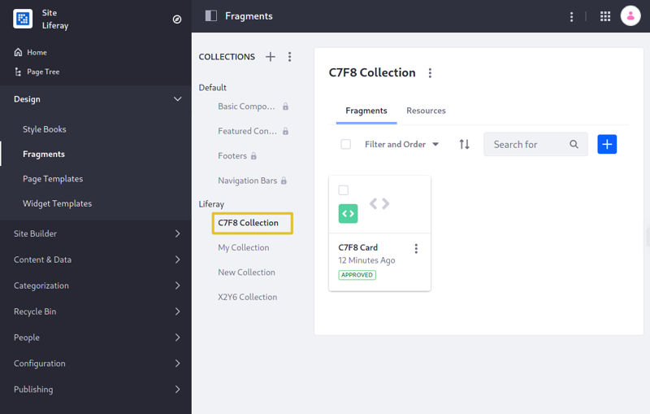
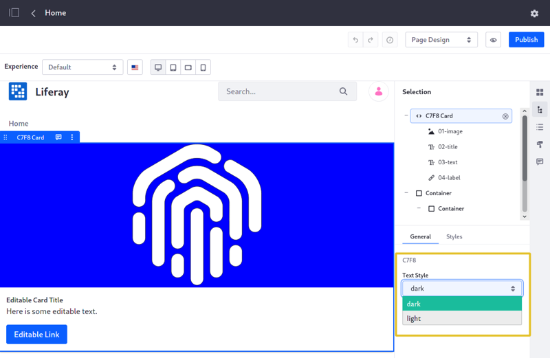
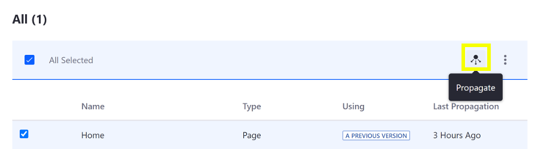
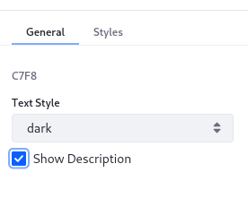

# Adding Configuration Options to Fragments

> Available: Liferay DXP 7.2 SP1+

Configurable options help make your fragments flexible, so you don't have to maintain many similar fragments. For example, instead of having one fragment that has a heading with style A and another fragment that has a heading with style B, you can create one fragment that has a configurable style for the heading with options for style A and B. Here you'll learn how to add configuration options to a fragment:

1. [Deploy a Configurable Fragment](#deploy-a-configurable-fragment)
1. [Modify the Configuration](#modify-the-configuration)
1. [Propagate the Changes and Test](#propagate-the-changes-and-test)

## Deploy a Configurable Fragment

First, deploy an example to see how fragment configuration options work:

1. Run the command below to start the Docker container:

    ```bash
    docker run -it -p 8080:8080 [$LIFERAY_LEARN_DXP_DOCKER_IMAGE$]
    ```

1. Download and unzip the [example fragment collection](https://learn.liferay.com/dxp/7.x/en/site-building/developer-guide/developing-page-fragments/liferay-c7f8.zip):

    ```bash
    curl https://learn.liferay.com/dxp/7.x/en/site-building/developer-guide/developing-page-fragments/liferay-c7f8.zip -O
    ```

    ```bash
    unzip liferay-c7f8.zip -d liferay-c7f8
    ```

1. Set up the Fragments Toolkit for the tutorial:

    ```bash
    cd liferay-c7f8
    ```

    ```bash
    ./setup_tutorial.sh 
    ```

1. Import the fragment collection to the Docker container using the Fragments Toolkit. Alternatively, you can [import the fragment manually](../../displaying-content/using-fragments/managing-page-fragments.md).

    ```bash
    npm run import

    > c7f8@ import /home/jhinkey/examples/liferay-c7f8
    > yo liferay-fragments:import

    ? Liferay host & port http://localhost:8080
    ? Username test@liferay.com
    ? Password [hidden]
    Checking connection...
    Connection successful

    ? Company ID liferay.com
    ? Group ID Liferay
    Building project...
    Importing project...
    ✔ Fragment C7F8 Card imported
    Project imported
    ```

1. Verify that the fragment collection is available. Point your browser to `https://localhost:8080`, and under the Site Menu on the left side of the screen, go to *Design* &rarr; *Fragments*. The collection appears in the collection list.

    

    ```note::
       For Liferay DXP 7.1 and 7.2, instead navigate to *Site* → *Site Builder* → *Page Fragments* under the Product Menu to get to the fragments page.
    ```

1. Go to the Home Page and click the () icon to edit the Content Page.
1. Expand the *C7F8 Collection* heading in the [Fragments and Widgets panel](../../creating-pages/building-and-managing-content-pages/content-pages-overview.md#fragments) and drag the *C7F8 Card* fragment onto the page.
1. Select the C7F8 Card. The Selection panel appears on the right. In the *General* tab you can set the component's text style to dark or light.

    

Great! You successfully imported and configured a configurable fragment.

## Configuration Overview

You can edit a fragment's configuration options in these ways:

* In the UI, edit the fragment with the [Fragments Editor](./using-the-fragments-editor.md) and click *Configuration* tab. The fragment's configuration appears in the editor.
* In your local environment, edit/create a configuration for the fragment. A fragment's `fragment.json` file can set a `configurationPath` field (optional) to a configuration `.json` file. 

The example's `fragment.json` file specifies a configuration file called `index.json`.

```json 
{
    "configurationPath": "index.json",
    "cssPath": "index.css",
    "htmlPath": "index.html",
    "jsPath": "index.js",
    "name": "C7F8 Card",
    "type": "component"
}
```

The example's configuration file below, applies a *dark* or *light* text style to the fragment:

```json
{
    "fieldSets": [
        {
            "fields": [
                {
                    "dataType": "string",
                    "defaultValue": "dark",
                    "label": "Text Style",
                    "name": "c7f8TextStyle",
                    "type": "select",
                    "typeOptions": {
                        "validValues": [
                            {
                                "value": "dark"
                            },
                            {
                                "value": "light"
                            }
                        ]
                    }
                }
            ],
            "label": "C7F8"
        }
    ]
}
```

The above configuration has a field set labeled *C7F8* (the label is optional). In the UI, the set's fields appear in a section titled after this label.

### Example Configuration Field

The field above has these properties:

| Field characteristics | Description |
| :--- | :--- |
| `"dataType": "string"` | Specifies the type of data to be configured in the component. |
| `"defaultValue": "dark"` | Default configuration setting. |
| `"label": "Text Style"` | Describes what the field configures. |
| `"name": "c7f8TextStyle"` | The configuration's ID. |
| `"type": "select"` | The UI component type that presents the configuration options. |
| `"typeOptions": {...}` | The valid values for this configuration option. |

```warning::
   The Fragments Editor won't save the configuration until it's valid. Make sure your JSON configuration is valid before previewing it.
```

The configuration values selected by the user are made available to the HTML through the FreeMarker context. They are referenced in the HTML with the notation `${configuration.fieldName}`. The example  (`${configuration.textAppliedStyle}`) returns `dark` or `light` depending on the configuration value selected by the user, setting the CSS class to `text-light` or `text-dark`:

```html
<div class="component-c7f8-card">
    <div class="card">
        

        <div class="card-body">
            <h5
                class="card-title text-${configuration.c7f8TextStyle}"
                data-lfr-editable-id="02-title"
                data-lfr-editable-type="rich-text"
            >
                Editable Card Title
            </h5>

            <p
                class="card-text text-${configuration.c7f8TextStyle}"
                data-lfr-editable-id="03-text"
                data-lfr-editable-type="rich-text"
            >
                Here is some editable text.
            </p>

            <a
                class="btn btn-primary"
                data-lfr-editable-id="04-label"
                data-lfr-editable-type="link"
                href="#"
            >
                Editable Link
            </a>
        </div>
    </div>
</div>
```

The example demonstrates a select configuration. See the [Configuration Types Reference](../reference/fragments/fragment-configuration-types-reference.md) for a complete list of the available Fragment configuration types.

## Escape Configuration Text Values

Malicious code can be inserted into the text field, wreaking havoc for other fragment users. You must escape fragment text values to guard against cross-site scripting (XSS) attacks.

For generic cases, an HTML `escape()` method is available. See the [`HtmlUtil`](https://docs.liferay.com/dxp/portal/7.3-latest/javadocs/portal-kernel/com/liferay/portal/kernel/util/HtmlUtil.html) class for more information.

```html
<div class="fragment_38816">
    "${htmlUtil.escape(configuration.text)}"
</div>
```

To prevent JavaScript attacks, such as setting an attribute or appending HTML children, use the `Liferay.Util.escapeHTML()` function:

```javascript
function (fragmentElement, configuration) {
    const escapedValue = Liferay.Util.escapeHTML(configuration.text)
}
```

## Modify the Configuration

Now that you know how the configuration works, you can modify it.

1. Under the Site Menu on the left side of the screen, go to *Design* &rarr; *Fragments*. The collection appears in the collection list.

    ```note::
       For Liferay DXP 7.1 and 7.2, instead navigate to *Site* → *Site Builder* → *Page Fragments* under the Product Menu to get to the fragments page.
    ```

1. Select the *C7F8 Collection*, click *Actions* () for the C7F8 Card and select *Edit*.

    

1. Click the *Configuration* tab and update the configuration with a checkbox field to hide/show the card's description. Insert this code on a new line after the `c7f8TextStyle` field's closing brace and comma (`},`)

    ```json
    {
        "name": "showDescription",
        "label": "Show Description",
        "description": "show-description",
        "type": "checkbox",
        "defaultValue": true
    }
    ```

1. Go back to the *Code* tab and wrap the paragraph element with a conditional statement to check for the checkbox's value. Click *Publish* to apply the changes.

    ```html
    [#if configuration.showDescription]
      <p data-lfr-editable-id="03-card-text" data-lfr-editable-type="rich-text" 
      class="card-text text-${configuration.textAppliedStyle}">
        Here is some editable text.
      </p>
    [/#if]
    ```

```note::
  You can also access the configuration's value through the JavaScript with the syntax ``const configurationValue = configuration.textAppliedStyle;``.
```

## Propagate the Changes and Test

Now you can test the updates.

1. Propagate the changes so they're reflected on the Home Page. Click *Actions* () for the C7F8 Card and select  *View Usages*. 
1. Check the box for the Home Page and click the () button.

    

1. Go back to the Home Page and once again click the () icon to edit the Content Page.
1. Select the C7F8 Card again and click the () to open the Fragment Configuration Menu.
1. Check/uncheck the *Show Description* checkbox to show/hide the card's text.

    

Great! Now you know how to add configuration options to your fragments.

## Related Information

* [Auto-deploying Fragments](./auto-deploying-fragments.md)
* [Including Default Resources with Fragments](./including-default-resources-with-fragments.md)
* [Fragment Configuration Types Reference](../reference/fragments/fragment-configuration-types-reference.md)
