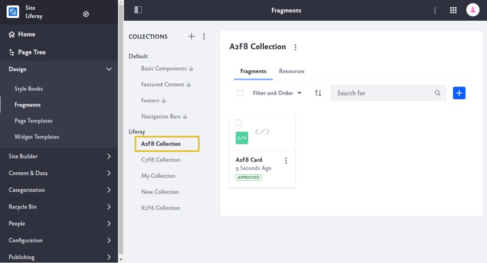

# Auto-deploying Fragments

If you're [developing Page Fragments with your own tooling](./developing-page-fragments-with-the-fragments-toolkit.md#collection-format-overview), the packaged ZIP file must be imported through the UI manually by default. You can add an auto-deployment descriptor to your Fragment Collection to automatically import it upon deployment instead; it just takes a couple steps:

1. Add the deployment descriptor to the Collection.
1. Compress and deploy the Collection.

This example uses a Docker image with a fresh install of Liferay DXP.

> This example runs on Liferay DXP 7.3+

```note::
	This process can be automated if you're using the `Fragments Toolkit <./developing-page-fragments-with-the-fragments-toolkit.md>`_ by running ``npm run compress`` and answering yes to the "Add deployment descriptor" question. If you've created your Fragment Collection with your own tooling, you must complete these steps manually.
```

## Add the Deployment Descriptor to the Collection

1. Create a `liferay-deploy-fragments.json` file in the Collection. The project structure should resemble the one below:

		* `auto-deployable-fragment-collection/`
			* `src/auto-deployed-collection/auto-deployed-fragment/`
				* Fragment files...
			* `liferay-deploy-fragments.json`
			* `package.json`

1. Open the `liferay-deploy-fragments.json` file you just created and provide information about the scope of the Fragments: System-wide, a virtual instance (Company), or a Site (group). The example has the configuration below that specifies to auto-deploy the Fragments to a Site (group) called "Guest" within a virtual instance (liferay.com):

		```json
		{
			"companyWebId": "liferay.com",
			"groupKey": "Guest"
		}
		```

		Both keys in this JSON file are optional. You can make Fragments available system-wide, for all the instances, by making the deployment descriptor an empty JSON object, or adding this configuration:

		```json
		{
			"companyWebId": "*"
		}
		```

## Compress and Deploy the Collection

You can download and unzip the [example auto-deployable Fragment Collection](https://github.com/liferay/liferay-learn/tree/master/docs/dxp/7.x/en/site-building/developer-guide/developing-page-fragments/auto-deploying-fragments/liferay-a2f8.zip) if you want to deploy it or compare your code at this point:

```bash
curl https://github.com/liferay/liferay-learn/tree/master/docs/dxp/7.x/en/site-building/developer-guide/developing-page-fragments/auto-deploying-fragments/liferay-a2f8.zip

unzip liferay-a2f8.zip
```

1. Start the Docker container:

		```bash
		docker run -it -p 8080:8080 liferay/portal:7.3.0-ga1
		```

1. Compress the Fragment project into a ZIP:

		```bash
		zip auto-deployable-fragment-collection
		```

1. Copy the Collection `zip` file to the Docker container to auto-deploy it to the scope specified in the `liferay-deploy-fragments.json` file:

		```bash
		cp auto-deployable-fragment-collection.zip docker-container-name:/path/to/deploy/folder
		```
		
1. Confirm the deployment to the Liferay Docker container console. The log message below should appear in the Docker console:

    ```bash
    INFO  [com.liferay.portal.kernel.deploy.auto.AutoDeployScanner][AutoDeployDir:263] Processing liferay-a2f8.zip
    ```

1. Verify that the Fragment Collection is available. Open your browser to `https://localhost:8080`, and open the Product Menu and go to Site &rarr; *Site Builder* &rarr; *Page Fragments*. The Collection is listed with the other Collections.

    

Great! You successfully configured a Fragment Collection for automatic import.