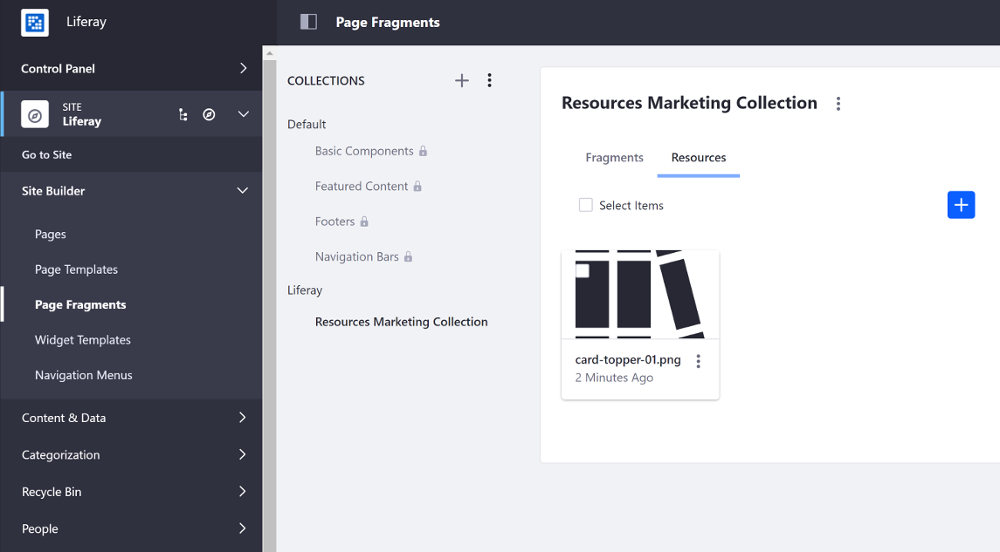

# Including Default Resources in Fragments

When creating Page Fragments, you can upload resources (e.g., images, documents, etc.) to your Fragment Collection to make them available from the Collection, rather than relying on resources uploaded in other areas of your Site (e.g., Documents and Media). This means that when your Collection is exported, the resources are included with it. Follow these steps:

1. Upload the resource through the [Fragment's *Resources* tab](TODO:managing-fragments) or include the resource in the [Fragment Collection ZIP's](./developing-page-fragments-with-the-fragments-toolkit) `resources` folder.
1. Open the Fragment [in the editor](./developing-page-fragments-with-the-editor.md) or open the [Fragment Collection's](./creating-a-contributed-fragment-collection.md) or [Fragment Toolkit project's](./developing-page-fragments-with-the-fragments-toolkit.md) HTML file.
1. Specify the image by using this syntax: `[resources:IMAGE_NAME]`. For example, you could include an image `building.png` in an HTML image tag like this:

    ```html
    
    ```

    You can view a full example snippet below:

    ```html
    <div class="fragment_38314">
        <lfr-editable id="img" type="image">
            
        </lfr-editable>
    </div>
    ```

    ```note::
        You can also reference your Fragment Collection's resources in your CSS code too. It follows the same syntax as its HTML.
    ```

