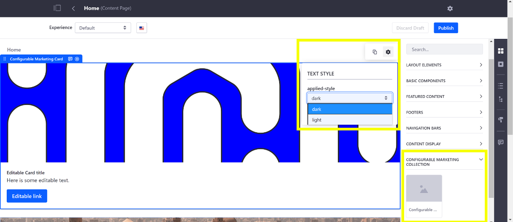
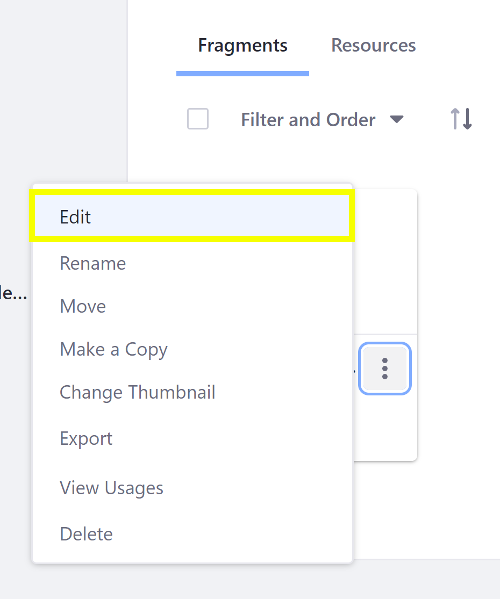

# Making a Fragment Configurable

> Liferay DXP 7.2 SP1+

You can add configurable options to your Fragments (checkboxes, selectors, etc.) that you can access through the Fragment's Configuration Menu when it's added to a page. Defining configuration options for a Fragment gives it more flexibility, reducing the number of Fragments you must maintain. For example, instead of having one Fragment that has a heading with style A and another Fragment that has a heading with style B, you can just create one Fragment that has a configurable style for the heading with options for style A or B.

## Overview

1. [Deploy an Example](#deploy-an-example)
1. [Walk Through an Example](#walk-through-an-example)
1. [Additional Information](#additional-information)

## Deploy an Example

> Liferay DXP 7.3+

First you must deploy an example configurable Fragment. Follow these steps:

1. Start the Docker container with a bind mount:

    ```bash
    docker run -d -it -p 8080:8080 -p 8000:8000 --name mylrdev -v C:\Users\liferay\Desktop\liferay-docker:/mnt/liferay liferay/portal:7.3.0-ga1
    ```

1. Download and unzip the [example configurable Fragment Collection](https://github.com/liferay/liferay-learn/tree/master/docs/dxp/7.x/en/site-building/dev/01-developing-page-fragments/making-a-page-fragment-configurable/1584025175liferay87.zip):

    ```bash
    curl https://github.com/liferay/liferay-learn/tree/master/docs/dxp/7.x/en/site-building/dev/01-developing-page-fragments/making-a-page-fragment-configurable/1584025175liferay87.zip
    
    unzip 1584025175liferay87.zip
    ```

1. Build the configurable Fragment Collection's ZIP and press Enter to accept the defaults for the prompts:

    ```bash
    cd my-configurable-fragment
    npm run compress
    ```

1. Import the configurable Fragment Collection ZIP into your Portal instance. Open your browser to `https://localhost:8080`, and open the Product Menu and go to *Site Builder* &rarr; *Page Fragments* under the Site Menu. Open the Actions Menu next to the Collections heading and choose *Import*. Locate the `liferay-fragments.zip` and click the *Import* button and close the dialog.

    

1. [Add the configurable Fragment to a Content Page](../../creating-pages/building-content-pages.md). Open the *My Configurable Collection* panel under the Fragments Menu and Drag the *Configurable Fragment* onto the Content Page.
1. Click the configurable Fragment on the page and click the () to open the Fragment's Configuration Menu.
1. Change the *applied-style* from *dark* to *light* to see the Heading text color change.

    

Great! You successfully deployed a configurable Fragment. Next, you'll walk through the example and learn how it works.

## Walk Through the Example

* [Add the Configuration Code](#add-the-configuration-code)
* [Reference the Configuration Value in the Code](#reference-the-configuration-value-in-the-code)

### Add the Configuration Code

1. [Edit the Fragment in the Editor](./developing-fragments-using-the-editor.md) and select the *Configuration* tab, or open the Fragment's `configuration.json` file in the [contributed Fragment Collection](./creating-a-contributed-fragment-collection.md) or [Fragments Toolkit project](./developing-page-fragments-with-the-fragments-toolkit.md).

    

1. Add your JSON configuration code. The example has the configuration below which provides the `select` option to choose *dark* or *light* for a Fragment's heading:

    ```json
    {
        "fieldSets": [
            {
                "label": "heading",
                "fields": [
                    {
                        "name": "headingAppliedStyle",
                        "label": "applied-style",
                        "description": "this-is-the-style-that-will-be-applied",
                        "type": "select",
                        "dataType": "string",
                        "typeOptions": {
                            "validValues": [
                                {
                                    "value": "dark"
                                },
                                {
                                    "value": "light"
                                }
                            ]
                        },
                        "defaultValue": "dark"
                    }
                ]
            }
        ]
    }
    ```

    ```note::
      The `label` property is optional. If it's left out, your configuration option has no title.
    ```

    ```note::
      An invalid JSON configuration can't be saved. Make sure your JSON configuration is valid before previewing or saving it.
    ```

### Reference the Configuration Value in the Code

Refer to your Fragment's configuration values through the HTML (e.g., the HTML pane/`index.html` file). The example below (`${configuration.headingAppliedStyle}`) returns `dark` or `light` depending on the configuration value selected by the user, setting the CSS class to `text-light` or `text-dark`:

```html
<div class="configurable-fragment text-center">
  <h2 class="text-${configuration.headingAppliedStyle}">
    Here is some text
  </h2>
</div>
```

The configuration values selected by the user are made available to the Fragment developer through the FreeMarker context. A configuration value can be referenced using the notation `${configuration.[fieldName]}`.

## Additional Information

The example only demonstrates one type of configuration that's referenced through the Fragment's HTML. See [Configuration Types](./configuration-types-reference.md) for a complete list of the available Fragment configuration types and examples of referencing the configuration through the Fragment's JavaScript.