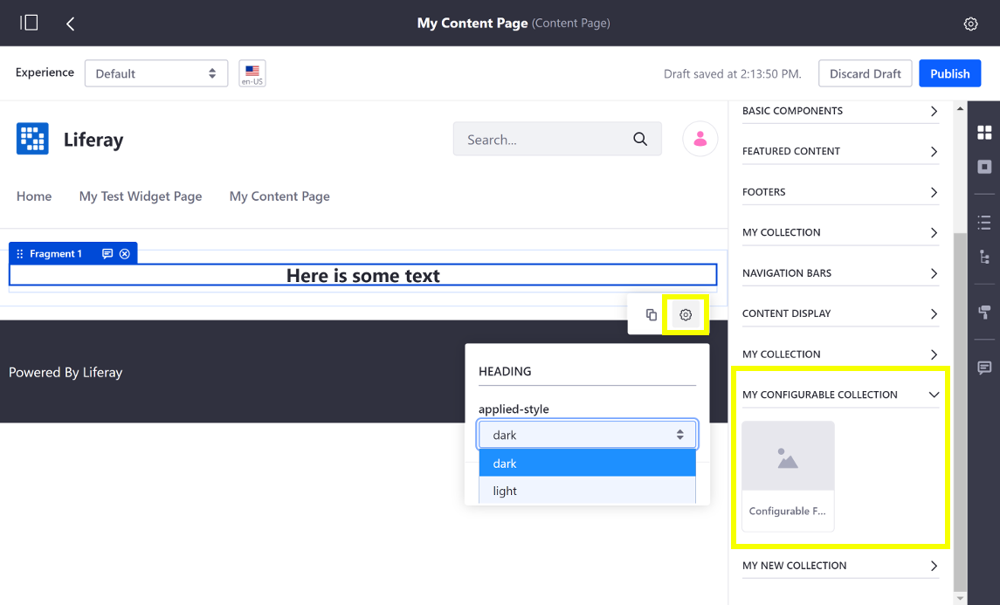

# Making a Fragment Configurable

```note::
  Fragments can be made configurable since Liferay DXP 7.2 SP1.
```

You can add configurable options to your Fragments (checkboxes, selectors, etc.) that you can access through the Fragment's Configuration Menu when it's added to a page. Defining configuration options for a Fragment gives it more flexibility, reducing the number of Fragments you must maintain. For example, instead of having one Fragment that has a heading with style A and another Fragment that has a heading with style B, you can just create one Fragment that has a configurable style for the heading with options for style A and B. You can make a Fragment configurable in just a few steps:

1. Add the configuration code.
1. Reference the configuration value in the Fragment.
1. Escape configuration text values.

This example uses a Docker image with a fresh install of Liferay DXP.

> This example runs on Liferay DXP 7.3+

## Add the Configuration Code

1. [Edit the Fragment in the Editor](./developing-fragments-using-the-editor.md) and select the *Configuration* tab, or open the Fragment's `configuration.json` file in the [contributed Fragment Collection](./creating-a-contributed-fragment-collection.md) or [Fragments Toolkit project](./developing-page-fragments-with-the-fragments-toolkit.md).

    

1. Add your JSON configuration code. The example has the configuration below which provides the `select` option to choose *dark* or *light* for a Fragment's heading:

    ```json
    {
        "fieldSets": [
            {
                "label": "heading",
                "fields": [
                    {
                        "name": "headingAppliedStyle",
                        "label": "applied-style",
                        "description": "this-is-the-style-that-will-be-applied",
                        "type": "select",
                        "dataType": "string",
                        "typeOptions": {
                            "validValues": [
                                {
                                    "value": "dark"
                                },
                                {
                                    "value": "light"
                                }
                            ]
                        },
                        "defaultValue": "dark"
                    }
                ]
            }
        ]
    }
    ```

    ```note::
      The ``label`` property is optional. If it's left out, your configuration option has no title.
    ```

    ```note::
      An invalid JSON configuration can't be saved. Make sure your JSON configuration is valid before previewing or saving it.
    ```

The example demonstrates one type of configuration. See the [Configuration Types Reference](./reference/configuration-types-reference.md) for a complete list of the available Fragment configuration types.

## Reference the Configuration Value in the Code
 
Use the configuration's value to determine the Fragment's look and feel. Use this syntax: `configuration.fieldName`. An HTML and JavaScript example are shown below:

    The configuration values selected by the user are made available to the HTML through the FreeMarker context. You can reference them in the HTML with the notation `${configuration.fieldName}`. The example  (`${configuration.headingAppliedStyle}`) returns `dark` or `light` depending on the configuration value selected by the user, setting the CSS class to `text-light` or `text-dark`:

    ```html
    <div class="configurable-fragment text-center">
      <h2 class="text-${configuration.headingAppliedStyle}">
        Here is some text
      </h2>
    </div>
    ```
    
    You can also use FreeMarker conditional statements to check the value:
    
    ```markup
    [#if configuration.headingAppliedStyle] == 'dark']
    ...
    [#else]
    ...
    [/#if]
    ```

    JavaScript configuration objects are named the same as their FreeMarker counterparts. You can access the configuration object in JavaScript with the syntax `configuration.fieldName`. The example below alerts the user with the selected value:

    ```javascript
    const configurationValue = configuration.headingAppliedStyle;
        
    alert('The selected configuration value for the heading is "' + configurationValue + '".');
    ```

## Escape Configuration Text Values

Malicious code can be inserted into the text field, wreaking havoc for other users of the Fragment. You must escape Fragment text values so you're protected from cross-site scripting (XSS) attacks. The available utilities for each language are shown below:

    For generic cases, an HTML `escape()` method is available. For more information on escape methods, see the [HtmlUtil](https://docs.liferay.com/ce/portal/7.3-latest/javadocs/portal-kernel/com/liferay/portal/kernel/util/HtmlUtil.html) class.

    ```html
    <div class="fragment_38816">
        "${htmlUtil.escape(configuration.text)}"
    </div>
    ```
    
    When including JavaScript in your Fragment, you must be aware of potential attack vectors, like setting an attribute or appending HTML children. To prevent these attacks, use the `Liferay.Util.escapeHTML()` function. You can call it from your Fragment's JavaScript like this:
    
    ```javascript
    function (fragmentElement, configuration) {
        const escapedValue = Liferay.Util.escapeHTML(configuration.text)
    }
    ```

Now when you [add the configurable Fragment to a Content Page](../../creating-pages/building-content-pages.md) and select it and open its Configuration Menu (), you can select a value for the configuration option to change the Fragment's look and feel.

You can download the [example configurable Fragment Collection](https://github.com/liferay/liferay-learn/tree/master/docs/dxp/7.x/en/site-building/dev/01-developing-page-fragments/making-a-page-fragment-configurable/liferay-c7f8.zip) and [build and deploy it](./developing-page-fragments-with-the-fragments-toolkit.md#compress-the-fragment-collection-and-copy-it-to-the-docker-container) for reference to compare your code:

    ```bash
    curl https://github.com/liferay/liferay-learn/tree/master/docs/dxp/7.x/en/site-building/dev/01-developing-page-fragments/making-a-page-fragment-configurable/liferay-c7f8.zip
    
    unzip liferay-c7f8.zip
    ```



Great! Now you know how to make your Fragments configurable.