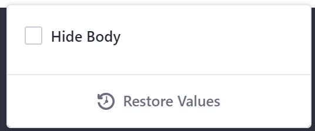
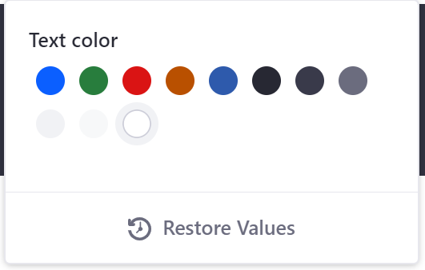
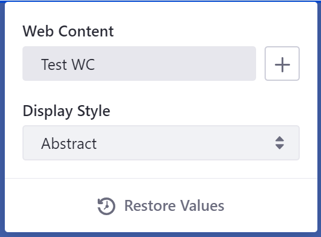
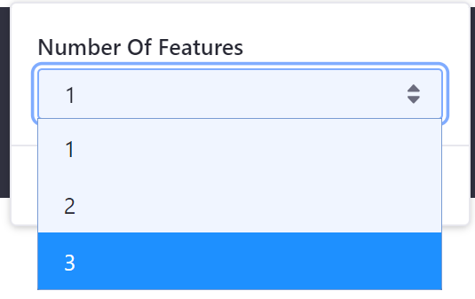
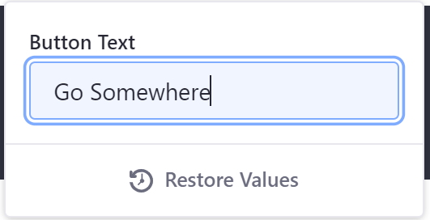

# Fragment Configuration Types Reference

This reference list the available configuration types for Fragments. See [Making a Fragment Configurable](../making-a-page-fragment-configurable.md) for more information on how to make a Fragment configurable.

There are five configurable Fragment types available to implement:

* `checkbox`
* `colorPalette`
* `itemSelector` (Available Liferay DXP 7.3)
* `select`
* `text`

```note::
  Configuration values inserted into the FreeMarker context honor the defined ``datatype`` value specified in the JSON file. For example, if the ``dataType`` is String, ``configuration.[name-value]?is_string`` is ``true``.
```

## Checkbox Configuration

This JSON configuration creates a checkbox you can implement for cases where a boolean value selection is necessary:

```json
{
    "fieldSets": [
        {
            "fields": [
                {
                    "name": "hideBody",
                    "label": "Hide Body",
                    "description": "hide-body",
                    "type": "checkbox",
                    "defaultValue": false
                }
                ...
            ]
        }
    ]
}
```



## Color Palette Configuration

This JSON configuration creates a color selector you can implement for cases where you must select a color:

```json
{
    "fieldSets": [
        {
            "fields": [
                {
                    "name": "textColor",
                    "label": "Text color",
                    "type": "colorPalette",
                    "dataType": "object",
                    "defaultValue": {
                        "cssClass": "white",
                        "rgbValue": "rgb(255,255,255)"
                    }
                }
                ...
            ]
        }
    ]
}
```

The `colorPalette` type stores an object with two values: `cssClass` and `rgbValue`.

For example, if you implement the snippet above, you can use it in the FreeMarker context like this:

```html
<h3 class="text-${configuration.textColor.cssClass}">Example</h3>
```

If you were to choose the color white, the `h3` tag heading would have the class `text-white'`.



## Item Selector Configuration

This configuration creates a selector that lets you select one existing piece of content (a web content article, blog entry, or document by default) to include in the Fragment.

```json
{
	"fieldSets": [{
		"fields": [{
			"label": "select-content",
			"name": "itemSelector1",
			"type": "itemSelector",
			"typeOptions": {
				"enableSelectTemplate": true
			}
		}]
	}]
}
```

You can provide a more advanced configuration that lets authors select only a specific type of content. The configuration below specifies that only web content articles can be selected. The optional `itemSubtype` property specifies that the selected web content article must use the structure `article-structure-key-15` to be selected:

```json
{
	"fieldSets": [{
		"fields": [{
			"label": "select-content",
			"name": "itemSelector1",
			"type": "itemSelector",
			"typeOptions": {
        "itemType" : "com.liferay.journal.model.JournalArticle",
        "itemSubtype": "article-structure-key-15"
			}
		}]
	}]
}
```

This example specifies that only a document with the `img` or `jpg` MIME type that uses the structure `metadataset-structure-key-2` can be selected:

```json
{
	"fieldSets": [{
		"fields": [{
			"label": "select-content",
			"name": "itemSelector1",
			"type": "itemSelector",
			"typeOptions": {
        "itemType" : "com.liferay.portal.kernel.repository.model.FileEntry",
        "itemSubtype": "metadataset-structure-key-2",
        "mimeTypes": ["img/jpg"]
			}
		}]
	}]
}
```

This example specifies that only blog entries can be selected:

```json
{
	"fieldSets": [{
		"fields": [{
			"label": "select-content",
			"name": "itemSelector1",
			"type": "itemSelector",
			"typeOptions": {
        "itemType" : "com.liferay.blogs.model.BlogsEntry",
			}
		}]
	}]
}
```

You can then render the content in your Fragment with this HTML snippet for the web content article:

```markup
<div class="fragment_name">
  [#if configuration.itemSelector1.content??]
       ${configuration.itemSelector1.content}
  [/#if]
</div>
```

You can also access the Java object in your Fragment, if you need access to specific portions of the content, under the key `[name-of-field]Object` (`itemSelector1Object` 
in the example below). This example renders the title, description, and body of the web content article:

```markup
<div class="fragment_name">
  [#if configuration.itemSelector1.content??]
    ${itemSelector1Object.getTitle()}
    ${itemSelector1Object.getDescription()}
    ${itemSelector1Object.getContent()}
  [/#if]
</div>
```



## Select Configuration

This JSON configuration creates a selector you can implement for cases where you must select a predefined option:

```json
{
    "fieldSets": [
        {
            "fields": [
                {
                    "name": "numberOfFeatures",
                    "label": "Number Of Features",
                    "description": "number-of-features",
                    "type": "select",
                    "dataType": "int",
                    "typeOptions": {
                        "validValues": [
                            {"value": "1"},
                            {"value": "2"},
                            {"value": "3"}
                        ]
                    },
                    "defaultValue": "3"
                }
                ...
            ]
        }
    ]
}
```



## Text Configuration

This JSON configuration creates an input text field you can implement for cases where you must manually input a text option:

```json
{
    "fieldSets": [
        {
            "fields": [
                {
                    "name": "buttonText",
                    "label": "Button Text",
                    "description": "button-text",
                    "type": "text",
                    "typeOptions": {
                        "placeholder": "Placeholder"
                    },
                    "dataType": "string",
                    "defaultValue": "Go Somewhere"
                }
                ...
            ]
        }
    ]
}
```

