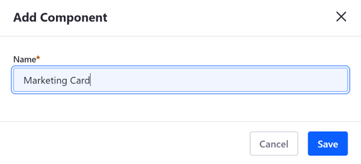
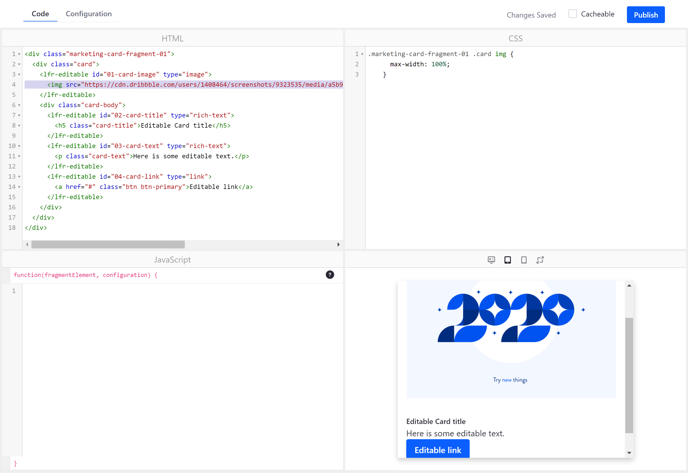
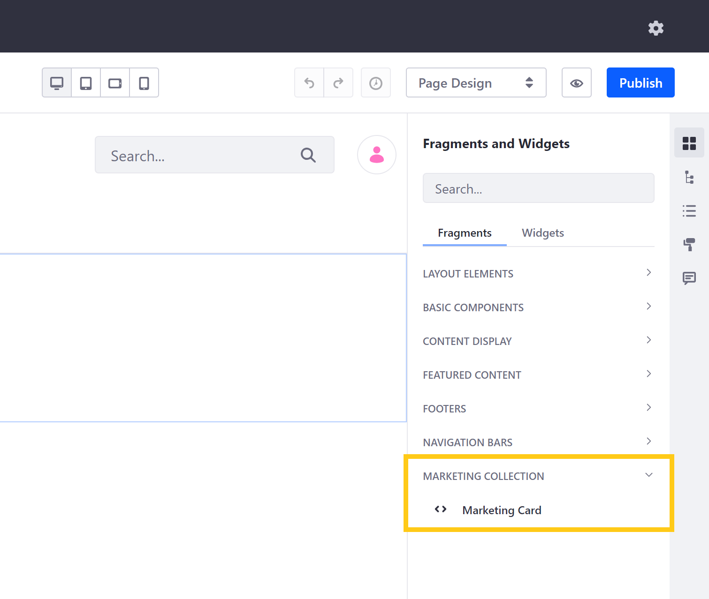

# Using the Fragments Editor

The built-in [Fragments Editor](../reference/fragments/page-fragment-editor-interface-reference.md) has everything you need to develop Fragments inside Liferay DXP. You'll organize Fragments in *Collections*, so users can find the functionality they need to build pages. Collections can differentiate between types of Fragments, the functionality provided, or Fragments used by different groups or departments.

Here you'll learn how to create a Collection and a Fragment using the built-in editor. You'll develop the Fragment, publish it, and add it to a page.

## Create a Fragment Collection

First, you must create a Collection:

1. Run the command below to start the Docker container:

    ```bash
    docker run -it -p 8080:8080 [$LIFERAY_LEARN_DXP_DOCKER_IMAGE$]
    ```

1. Access the site at `http://localhost:8080`; user name `test@liferay.com`; password `test`.

1. Go to the site you're building.

1. From the Site Menu on the left side of the screen, go to *Design* &rarr; *Fragments*. From this page you can manage your Fragments and Collections. See [Managing Page Fragments](../../displaying-content/using-fragments/managing-page-fragments.md) for more information on the available actions for Fragments.

    ```note::
       In Liferay DXP 7.1 and 7.2, instead navigate to *Site* → *Site Builder* → *Page Fragments* from the Product Menu to access the Fragments.
    ```

1. Click the *Add* button () and enter a name and optional description for the Collection.


## Add a Fragment to the Collection

Now that you have a Collection, you can add a Fragment:

1. With the Collection selected, click the [] in the Collection to create a new Fragment [Component](../../creating-pages/building-and-managing-content-pages/content-pages-overview.md#basic-components).

    ```note::
      Prior to Liferay DXP 7.3, a Fragment could either be a Section or a Component. In Liferay DXP 7.3+, all Fragments are Components.
    ```

1. Enter a name for the Fragment and click *Save*.

The editor appears with panes for your Fragment's HTML, CSS, and JavaScript and a pane for previewing the Fragment.




### Default HTML

Here's what the generated HTML looks like:

```bash 
<div class="fragment_203">
</div>
```

You can use the generated `div` element as a wrapper for your content. The `div` has a `class` attribute `class="fragment_203"`. It ends in a randomly generated integer as an attempt to uniquely identify the Fragment, so that it doesn't conflict with other components on a page. 

```tip::
   Wrap your HTML in an element (such as a `div`) that can be uniquely distinguished from other components on a page.
```

### Default CSS 

The default CSS looks like this:

```bash 
.fragment_203 {
}
```

The style properties you add between the curly brackets apply to the Fragment Component.

### Default JavaScript 

The default JavaScript looks like this:

```java 
function(fragmentElement, configuration) {

}
```

The `fragmentElement` provides access to the current Fragment Component node. The `configuration` accesses the Fragment's [configuration options](./adding-configuration-options-to-fragments.md). You can add additional functionality via JavaScript here.

Now that your Fragment's initial sources are in place, it's time to develop it.

## Develop Your Fragment

You can use standard HTML, CSS, and JavaScript components to create your Fragment. Additionally, you can use Liferay's [Fragment-specific tags and attributes](../reference/fragments/fragment-specific-tags-reference.md) to make Fragment parts editable or to embed widgets in your Fragment.

Here are some editing shortcuts:

* Enter an open angle bracket (`<`) to access standard HTML tags and Liferay's Fragment-specific tags.

* Start an element attribute with `data` to access Liferay's [editable Fragment attributes](../reference/fragments/fragment-specific-tags-reference.md) .


Here is HTML for a Marketing Card Fragment:

```html
<div class="fragment_card_203">
	<div class="card">
		

		<div class="card-body">
			<h5
				class="card-title"
				data-lfr-editable-id="02-title"
				data-lfr-editable-type="rich-text"
			>
				Editable Card Title
			</h5>

			<p
				class="card-text"
				data-lfr-editable-id="03-text"
				data-lfr-editable-type="rich-text"
			>
				Here is some editable text.
			</p>

			<a
				class="btn btn-primary"
				data-lfr-editable-id="04-label"
				data-lfr-editable-type="link"
				href="#"
			>
				Editable Link
			</a>
		</div>
	</div>
</div>
```

The leading `div` wraps the Fragment markup. Its `class="fragment_card_203"` attribute identifies it on pages. The `<div class="card">` element is next in the hierarchy. It wraps the remaining elements in a Clay [`card` component](https://clayui.com/docs/components/card/markup.html).

```note::
   `Clay <https://clayui.com/>`_ is Liferay's Web implementation of `Lexicon <https://lexicondesign.io/docs/lexicon/>`_ that provides a `Bootstrap <https://getbootstrap.com/>`_-based component library.
```

Next an `img` element specifies an [editable image](../reference/fragments/fragment-specific-tags-reference.md#making-images-editable) . The `card-img-top` class places the image atop the Fragment's card. The default image source is Liferay's Lexicon symbol, but the `data-lfr-editable-[id|type]` attributes allow users to set a different image.

The `<div class="card-body">` element wraps the card's title, text, and button. All of the `data-lfr-editable-[id|type]` attributes make all of these elements [editable](../reference/fragments/fragment-specific-tags-reference.md) .

Here is CSS to use with the Marketing Card Fragment:

```css
.fragment_card_203 .card {
	max-width: 100%;
}

.fragment_card_203 .card img {
	background-color: #0000FF;
	height: 300px;
}
```

The first style property `max-width: 100%` resizes the card to fit 100% of the content. The second style property set applies a blue background color to the image and makes the image 300 pixels high.

1. Replace the default HTML with the Marketing Card Fragment HTML above.

1. Replace the default CSS with the Marketing Card Fragment CSS above.

The preview pane on the bottom right renders the Fragment as you update it.



## Publish Your Fragment 

It's time to publish your fragment and add it to a page.

1. In the Fragments Editor, click *Publish* to save your work and make it available to add to a [Content Page](../../creating-pages/understanding-pages/understanding-pages.md#content-pages).

1. Go to a Content Page such as the Home Page and click the () icon.

1. In the [Fragments and Widgets pane](../../creating-pages/building-and-managing-content-pages/content-pages-overview.md#fragments), expand the *Marketing Collection* heading. The *Marketing Card* appears below it. 

    

1. Drag the *Marketing Card* onto the page.

The Fragment renders on your page.



Great! You've successfully created a Fragment Collection, added a new Fragment to it, and added the Fragment to a page.

```note::
  Since Liferay DXP 7.2 SP1+ and Liferay Portal CE 7.2 GA2+, you can create Fragments on the *Global* Site to make them available for all Sites. To expose this feature in the initial releases of these versions, you must create a ``.config`` file named ``com.liferay.fragment.web.internal.configuration.FragmentGlobalPanelAppConfiguration.config`` and add the ``enabled=B"true"`` property. Then copy it to your Liferay DXP instance's ``osgi/configs`` folder. Global Fragments are inherited by child Sites, so they can only be edited from the Global Site. Any resources the Global Page Fragment references (e.g., image) from the Global Site are copied to a Site that leverages the Page Fragment.
```

## Related Information

* [Fragment-Specific Tags](../reference/fragments/fragment-specific-tags-reference.md)
* [Using the Fragments Toolkit](./using-the-fragments-toolkit.md)
* [Adding Configuration Options to Fragments](./adding-configuration-options-to-fragments.md)
