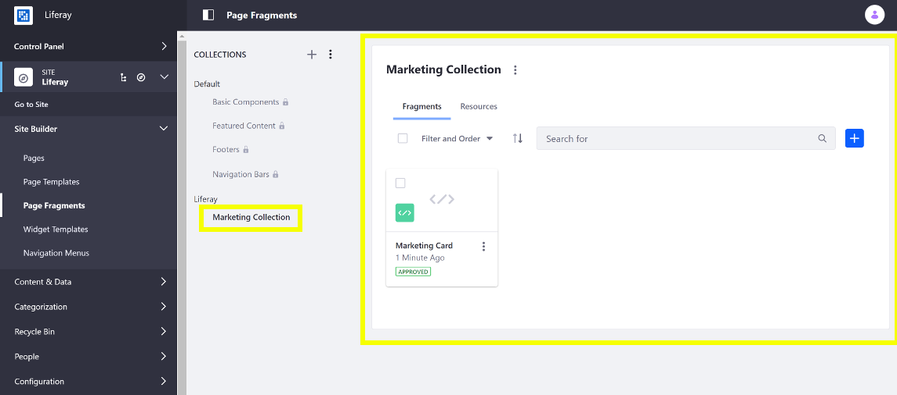
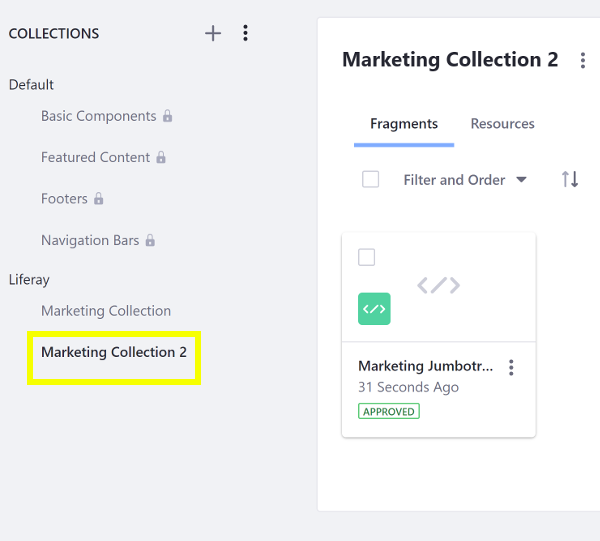

# Using the Fragments Toolkit

The Fragments Toolkit helps you develop and manage fragments locally, using your favorite tools. Here you'll use the toolkit to import an example fragment collection and to create and import your own fragment collection.

## Import a Fragment Collection

First, deploy an example to see what a fragment collection looks like:

1. Run the command below to start the Docker container:

    ```bash
    docker run -it -p 8080:8080 [$LIFERAY_LEARN_DXP_DOCKER_IMAGE$]
    ```

1. Download and unzip the [example](https://learn.liferay.com/dxp/7.x/en/site-building/developer-guide/developing-page-fragments/liferay-x2y6.zip)

    ```bash
    curl https://learn.liferay.com/dxp/7.x/en/site-building/developer-guide/developing-page-fragments/liferay-x2y6.zip -O
    ```

    ```bash
    unzip liferay-x2y6.zip -d liferay-x2y6
    ```

1. Set up the Fragments Toolkit for the tutorial:

    ```bash
    cd liferay-x2y6
    ```

    ```bash
    ./setup_tutorial.sh
    ```

1. Import the fragment collection in the Docker container with the Fragments Toolkit using the `npm run import` command below. Alternatively, you can [import the fragment collection manually](../../displaying-content/using-fragments/managing-page-fragments.md).

    ```bash
    npm run import
    ? Liferay host & port (http://localhost:8080)
    ? Username (test@liferay.com)
    ? Password [hidden]

    Checking connection...
    Connection successful

    ? Company ID liferay.com
    ? Group ID Liferay
    Building project...
    Importing project...
    ✔ Fragment X2Y6 Card imported
    Project imported
    ```

1. Verify that the fragment collection is available. Point your browser to `https://localhost:8080`, and under the Site Menu on the left side of the screen, go to *Design* &rarr; *Fragments*. The collection appears in the collection list.

    

    ```note::
       For Liferay DXP 7.1 and 7.2, instead navigate to *Site* → *Site Builder* → *Page Fragments* under the Product Menu to get to the *Fragments* page.
    ```

Great! You successfully deployed a fragment collection created with the Fragments Toolkit.

## Collection Format Overview

Fragment collections use this project structure:

* `collection.json`: a text file which describes your collection.

    ```json 
    {
        "description": "optional description",
        "name": "collection name"
    }
    ```

* `language.properties` (optional): language keys defined for the collection.

    * `[fragment-name]/`: a folder containing all of the files for a fragment.

        * `configuration.json`(optional): a JSON file that defines the fragment's configuration. See [Adding Configuration Options to Fragments](./adding-configuration-options-to-fragments.md) for more information.

        * `fragment.json`: a text file that describes a Page Fragment with this format:

          ```json
          {
              "configurationPath": "configuration.json",
              "cssPath": "styles.css",
              "htmlPath": "index.html",
              "jsPath": "main.js",
              "name": "fragment name",
              "thumbnailPath": "thumbnail.png",
              "type": "[component|react]"
           }
           ```

          Update the `*Path` properties with the names of your CSS, configuration, JavaScript, and HTML files.

        * `index.html`: the HTML source for the fragment.

        * `main.js`: the JavaScript source for the fragment.

        * `styles.css`: the CSS source for the fragment.

        * `thumbnail.png` (optional): an image that's displayed when the fragment is in a list.

    * `resources/` (optional): a folder containing any additional images or files the fragment needs. See [Including Default Resources in Fragments](./including-default-resources-with-fragments.md) for more information.

The Fragments Toolkit facilitates creating fragment collections.
 
## Add a New Collection and Fragment

The example's `package.json` file provides the Fragments Toolkit. Follow these steps to add a new fragment collection and a new fragment:

1. Set up the Fragments Toolkit if you haven't done so already.

    ```bash
    cd liferay-x2y6
    ```

    ```bash
    ./setup_tutorial.sh 
    ```

1. Create a collection for the fragment(s) with the `npm run add-collection` command and answer the prompts with your collection's name and an optional description:

    ```bash
    npm run add-collection

    > x2y6@ add-collection /home/jhinkey/examples/liferay-x2y6
    > yo liferay-fragments:collection

    ? Collection name My Collection
    ? Collection description 
       create src/my-collection/collection.json
    ```

1. In the collection's folder, create a fragment:

    ```bash
    cd my-collection 
    ```

    ```bash
    npm run add-fragment
    ```

    The CLI starts the process:

    ```bash
    > x2y6@ add-fragment liferay-x2y6\my-collection
    > yo liferay-fragments:fragment
    ```

1. Enter a name and select the fragment's type and collection.

    ```bash
    ? Fragment name (required) My Jumbotron
    ? Fragment type Component
    ```

    ```note::
      In versions prior to Liferay DXP 7.3, you can add a Section or a Component. In Liferay Portal 7.3+, all Page Fragments are Components.
    ```

1. Here you can choose whether to use React to process fragment JavaScript before importing the fragment to Liferay. This option requires Liferay 7.3+. If you're using Liferay version 7.2 or below, decline using React. For the purpose of this tutorial, please decline using React.

    ```bash
    ? Use React (or other JS framework)? No
    ```

1. Since you declined using React, the toolkit asks whether you want to use the new editable element syntax. This is available for Liferay 7.3+. If you're using Liferay version 7.2 or below, please decline using the new syntax.

    ```bash
    ? Use new data-lfr editable syntax? Yes
    ```

    ```note::
    If you accepted using React in your fragment, the toolkit assumes you're on Liferay 7.3+ and configures the new editable element syntax.
    ```

1. Select the collection you just created (`My Collection`).

    ```bash
    ? Choose a collection (my-collection)
       create src/my-collection/my-jumbotron/index.html
       create src/my-collection/my-jumbotron/main.js
       create src/my-collection/my-jumbotron/styles.css
       create src/my-collection/my-jumbotron/fragment.json
       create src/my-collection/my-jumbotron/configuration.json
    ```

    ```note::
        The ``fragment.json`` defines the paths to the fragment's CSS, HTML, and JavaScript. If you change any of these file names, update their paths in the ``fragment.json``.
    ```

1. Write the fragment's HTML (`index.html`), CSS (`styles.css`), JavaScript (`main.js`), and any [configuration options](./adding-configuration-options-to-fragments.md) (`configuration.json`).

Here's the generated fragment HTML:

```html
<div class="my-jumbotron">
    <h1 data-lfr-editable-id="title" data-lfr-editable-type="text">
        My Jumbotron
    </h1>
</div>
```

You can build off of the above HTML and use Bootstrap styling to create a fragment like this one:

```html
<div class="component-x276-my-jumbotron">
    <div class="jumbotron">
        <h1
            class="display-4"
            data-lfr-editable-id="01-title"
            data-lfr-editable-type="rich-text"
        >
            Editable Jumbotron Headline
        </h1>

        <p
            class="lead"
            data-lfr-editable-id="02-lead"
            data-lfr-editable-type="rich-text"
        >
            Edit this text to call extra attention to featured content or information.
        </p>

        <hr />

        <p
            data-lfr-editable-id="03-text"
            data-lfr-editable-type="rich-text"
        >
            Edit this text to provide more information.
        </p>

        <a
            class="btn btn-primary btn-lg"
            data-lfr-editable-id="04-label"
            data-lfr-editable-type="link"
            href="#"
        >
            Editable Link
        </a>
    </div>
</div>
```

```tip::
  In the ``index.html``, use the main wrapper element (the ``<div>`` in the example above) to uniquely identify the fragment so it doesn't conflict with other components on the page.
```

You can also include resources in your fragments. See [Including Default Resources in Fragments](./including-default-resources-with-fragments.md) for more information.

```note::
  The fragment and configuration object are passed in as arguments in JavaScript and are available as the parameters ``fragmentElement`` and ``configuration``.
```

## Import and Test

You can import the updated fragments as you did above:

1. Run the import command and provide your credentials:

    ```bash
    cd my-collection
    ```

    ```bash
    npm run import
    ```

1. Verify that the new fragment collection is available. Point your browser to `https://localhost:8080`, and under the Site Menu on the left side of the screen, go to *Design* &rarr; *Fragments*. The collection appears in the collection list.



Great! Now you know how to use the Fragments Toolkit to create fragments.

## Related Information

* [Creating a Contributed Fragment Collection](./creating-a-contributed-fragment-collection.md)
* [Developing Page Fragments with the Editor](./using-the-fragments-editor.md)
