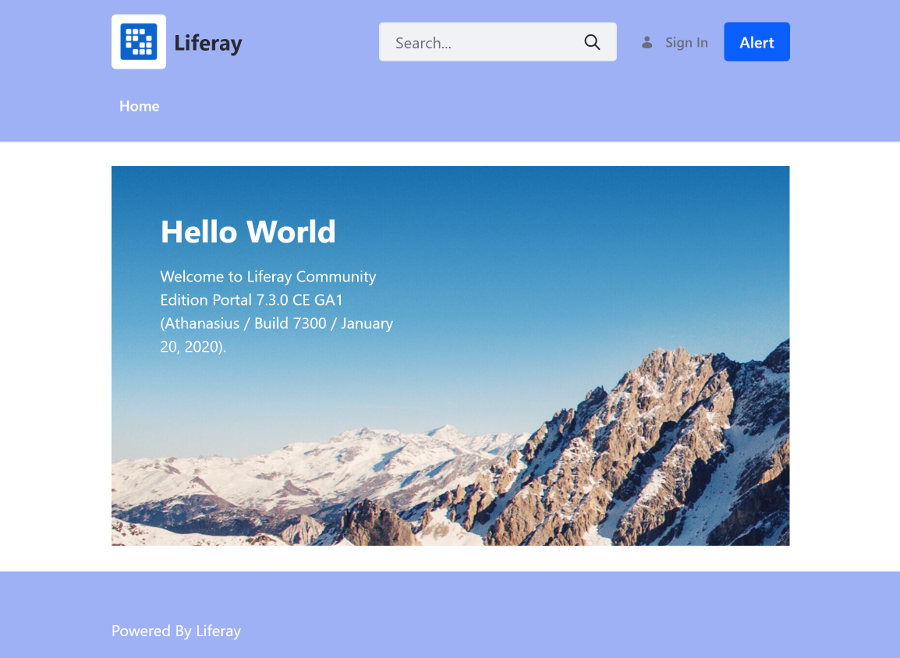

# Developing a Theme

Themes are x that can be used to create a custom look and feel for pages. Create your own Theme by following the steps, as described below:

```note::
   Starting with Liferay DXP 7.1+, the overall design of [Content Pages](../../creating-pages/content-pages-overview.md) can be accomplished with [Page Fragments](TODO). Starting with Liferay DXP 7.3+ users can define the common elements of a page (Header, Footer, etc.) in the [Master Page Template](TODO). These look and feel changes can be implemented without needing to develop a theme.
```

<!-- opening screenshot of the end result - the goal of what a person would hope to accomplish. -->

## Overview

1. [Deploy an Example](#deploy-an-example)
1. [Walk Through the Example](#walk-through-an-example)
1. [Additional Information](#additional-information)

## Deploy an Example

> Liferay DXP 7.3+

First you must deploy an example Theme. Follow these steps:

1. Start the Docker container with a bind mount:

    ```bash
    docker run -d -it -p 8080:8080 -p 8000:8000 --name mylrdev -v C:\Users\liferay\Desktop\liferay-docker:/mnt/liferay liferay/portal:7.3.0-ga1
    ```

1. Download and unzip [Example Theme](https://github.com/liferay/liferay-learn/tree/master/docs/dxp/7.x/en/site-building/dev/01-developing-a-theme/developing-a-theme/1581698982liferay22.zip):

    ```bash
    curl https://github.com/liferay/liferay-learn/tree/master/docs/dxp/7.x/en/site-building/dev/01-developing-a-theme/developing-a-theme/1581698982liferay22.zip
    ```

<!-- missing unzip command? -->

1. Install the Theme's dependencies:

    ```bash
    npm install
    ```

1. Build the Theme's WAR.

    **If you're running Liferay JS Themes Toolkit v9.5.0+:**

    ```bash
    npm run build
    ```

    **Otherwise run:**

    ```bash
    node_modules\.bin\gulp build
    ```

    You can check the version of the toolkit by running `npm list -g generator-liferay-theme`.

1. <!-- This part, I think there's two possibilities: 1. Brian is going to work with us to implement a standard docker deploy command (similar to what exists in commerce w/ gradle deploy - or 2. these instructions say "Copy the Theme War to the ..." and then right below we provide a sample `cp sample-theme.war path/to/your/bind/mount` type sample command.) --> Copy the Theme's WAR to the `[host_folder]/deploy` folder for your Docker image's [bind mount](TODO), or create the `[host_folder]/deploy` folder if it doesn't exist.

    ```note::
    You must restart the Docker container if you're creating the `[host_folder]/deploy` folder for the first time in your bind mount.
    ```

1. Confirm the deployment to the Liferay Docker container console:

    ```bash
    INFO [fileinstall-/opt/liferay/osgi/war][BundleStartStopLogger:39] STARTED my-liferay-theme_1.0.0 [1114]
    ```

1. Verify that the Theme is available. Open your browser to `https://localhost:8080`, open the Product Menu and go to *Control Panel* &rarr; *Configuration* &rarr; *Components*, and select the *Themes* tab.

    

Great! You successfully built and deployed a custom Theme. Next, you'll walk through the example and learn how it works.

## Walk Through the Example

* [Generate the Theme](#generate-the-theme)
* [Build the base files](#build-the-base-files)
* [Customize the CSS](#customize-the-css)
* [Customize the Theme templates](#customize-the-theme-templates)
* [Customize the JavaScript](#customize-the-javascript)

### Generate the Theme

1. Install the [Liferay Theme Generator](./installing-the-theme-generator.md), if it's not installed.
1. Run the Liferay Theme Generator and follow the prompts to create the Theme. The example Theme generates a Theme based on the Classic Theme with this command:

    ```bash
    yo liferay-theme:classic
    ```

    ```note::
      The `liferay-theme:classic` sub-generator is available in Liferay DXP 7.3+.
    ```

### Build the Base Files

Run the build script for your Liferay JS Toolkit version. If you're unsure of your version run `npm list -g generator-liferay-theme` from your command line to print it.

**v9.5.0+:**

```bash
npm run build
```

**Older versions:**

```bash
node_modules\.bin\gulp build
```

### Customize the CSS

Add custom CSS to the Theme's `/src/css/_custom.scss` file:

```scss
.navbar-classic {
  background-color: #9EB1F5;
  
  &.navbar-light {
    ul > li > a.nav-link.text-truncate {
      color: #FFF;
    }
  }
}
```

```note::
  This changes the background color of the Header and updates the font color of the navigation links. Styles are condensed by using `Sass <https://sass-lang.com/>`_, as demonstrated by the nested styles in the example code.
```

```css
#footer {
	background-color: #9EB1F5;
}
```

```note::
  This updates the Footer's background color to match the Header.
```


### Customize the Theme Templates

Add your HTML markup customizations to the Theme templates in the `/src/templates/` folder. If this folder doesn't exist, you must create it. Copy the Theme templates from the `/build/templates/` folder to the `/src/templates/` folder to modify them.

```markup
...
<div class="autofit-col">
  <@liferay.user_personal_bar />
</div>

<div class="ml-3 autofit-col">
  <button name="Alert Button" onclick="alert('You pushed the button.')" class="btn btn-primary">Alert</button>
</div>
...
```

```note::
  This adds a new button to the Header beside the User Personal Bar in `portal_normal.ftl`.
```


### Customize the JavaScript

Add custom JavaScript to the generated `/src/js/main.js` file. If this folder doesn't exist, you must create it. You can copy the `main.js` file from the `/build/js/` folder to get started.

```javascript
console.log('My Theme is loaded to the page.');
```

```note::
  This prints a message in the browser's console when the Theme is loaded on page.
```

## Related Information

* [Apply a New Theme](TODO:applying-themes)
* [Installing the Theme Generator](./installing-the-theme-generator.md)