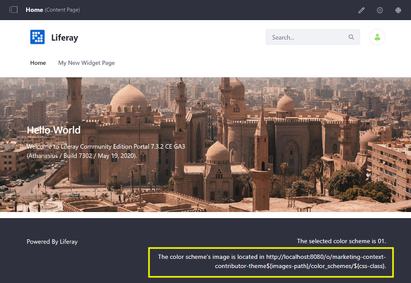

# Injecting Additional Context Variables and Functionality into Your Theme Templates

JSPs can access contextual objects inherit to the platform (request, session, etc.) because they are native to Java EE. To access these same objects in your Theme's FreeMarker templates, you must inject them into the FreeMarker template's context via a *Context Contributor*. Several of the common objects (`themeDisplay`, `serviceContext`, etc.) have already been injected into the context and are available by default as [FreeMarker macros](./product-freemarker-macros).

You can create a Context Contributor to use non-JSP templating languages for Themes, widget templates, and any other templates used in Liferay DXP.

Here, you'll learn how to create a Context Contributor:

1. [Deploy an Example Context Contributor](#deploy-an-example-context-contributor)
1. [Inject a New Object and Deploy the Updates](#inject-a-new-object-and-deploy-the-updates)

## Deploy an Example Context Contributor

First, deploy an example to see how a Context Contributor works:

1. Run the command below to start the Docker container:

    ```bash
    docker run -it -p 8080:8080 liferay/portal:7.3.2-ga3
    ```

1. Download and unzip the [Marketing Context Contributor and Marketing Context Contributor Theme](https://learn.liferay.com/dxp/7.x/en/site-building/developer-guide/developing-themes/extending-themes/liferay-c5v9.zip):

    ```bash
    curl https://learn.liferay.com/dxp/7.x/en/site-building/developer-guide/developing-themes/extending-themes/liferay-c5v9.zip
    ```

    ```bash
    unzip liferay-c5v9.zip
    ```

1. Install the Marketing Context Contributor Theme's dependencies and deploy it. This Theme will use the new variable added to the Theme's FreeMarker context:

    ```bash
    cd liferay-c5v9/marketing-context-contributor-theme
    ```

    ```bash
    npm install
    ```

    ```bash
    .\gradlew deploy -Ddeploy.docker.container.id=$(docker ps -lq)
    ```

    ```note::
      If testing on Windows, you may need to build the Theme first with `.\gradlew build` and then manually copy the WAR with `docker cp [war-name] docker-container-name:/opt/liferay/osgi/war` directly if deployment fails.
    ```

1. Confirm the deployment to the Liferay Docker container console. The log message below should appear in the Docker console:

    ```bash
    INFO  [fileinstall-/opt/liferay/osgi/modules][BundleStartStopLogger:39] STARTED marketing-context-contributor-theme_1.0.0 [1141]
    ```

1. Apply the Theme to the Site. Open your browser to `https://localhost:8080`, open the Product Menu, and go to *Site Builder* &rarr; *Pages* under the Site Menu.
1. Click the () next to Public Pages.
1. Scroll down and click the *Change Current Theme* button. Click the Marketing Context Contributor Theme thumbnail next to the Classic Theme.

    

1. Click *Save* to apply the changes, and go back to the Home Page and you'll receive an error in the Portal log:

    ```bash
    com.liferay.portal.kernel.template.TemplateException: Unable to process template marketing-context-contributor-theme_SERVLET_CONTEXT_/templates/portal_normal.ftl
    ...
    Caused by: freemarker.core.InvalidReferenceException: The following has evaluated to null or missing:_==> colorSchemeId...
    ```

    You've deployed the Theme, but the `colorSchemeId` variable is not in the Theme's FreeMarker context yet.

1. From the module root, build and deploy the Context Contributor's JAR:

    ```bash
    cd liferay-c5v9
    ```
    
    ```bash
    .\gradlew deploy -Ddeploy.docker.container.id=$(docker ps -lq)
    ```

    ```note::
      If testing on Windows, you may need to build the module first with `.\gradlew build` and then manually copy the JAR with `docker cp [jar-name] docker-container-name:/opt/liferay/osgi/modules` directly if deployment fails.
    ```

1. Open your browser to `https://localhost:8080` once again and refresh the page to see that the Theme is no longer broken. The Theme prints the current Color Scheme ID in the Footer (01 by default, since no Color Scheme is chosen or available).

    

Great! You successfully deployed a Theme Contributor and a Theme that uses it.

## Breaking Down the Context Contributor

The Marketing Context Contributor is an OSGi module that contains a Component class that implements the `TemplateContextContributor` service and [`TemplateContextContributor` interface](https://docs.liferay.com/portal/7.3-latest/javadocs/portal-kernel/com/liferay/portal/kernel/template/TemplateContextContributor.html).

The `@Component` annotation sets the `type` property to the type of context to inject into: 

* `TYPE_THEME`: inject context-specific variables for your Theme. This is what the example Context Contributor uses.
* `TYPE_GLOBAL`: inject into every context execution in Liferay DXP (Themes, widget templates, DDM templates, etc, as defined in [TemplateContextContributor](https://docs.liferay.com/portal/7.3-latest/javadocs/portal-kernel/com/liferay/portal/kernel/template/TemplateContextContributor.html)).

```java
@Component(
    immediate = true,
    property = {"type=" + TemplateContextContributor.TYPE_THEME},
    service = TemplateContextContributor.class
)
```

To follow naming conventions, the class name begins with the entity to inject context-specific variables for, followed by *TemplateContextContributor* (e.g., `MarketingThemeTemplateContextContributor`):

```java
public class MarketingThemeTemplateContextContributor
	implements TemplateContextContributor {
    
}
```

The class overwrites the `prepare(Map<String,Object>, HttpServletRequest)` method to inject new or modified variables into the `contextObjects` map. This is the template's context that was described earlier. The Marketing Theme Context Contributor adds a new `colorSchemeId` variable into the Theme context for the Marketing Theme. This example is fairly simple, but it illustrates the requirements:

```java
@Override
public void prepare(
	Map<String, Object> contextObjects,
	HttpServletRequest httpServletRequest) {

	ThemeDisplay themeDisplay =
		(ThemeDisplay)httpServletRequest.getAttribute(
			WebKeys.THEME_DISPLAY);

	if (themeDisplay != null) {
    contextObjects.put("colorSchemeId", themeDisplay.getColorSchemeId());
  }
}
```

The Marketing Context Contributor Theme uses the injected variable in its `liferay-c5v9/marketing-context-contributor-theme/src/templates/portal_normal.ftl` file:

```markup
<footer id="footer" role="contentinfo">
  <div class="container">
    <div class="row">
      ...
      <div class="col-md-6 text-center text-md-right">
        <p>The selected color scheme is ${colorSchemeId}.</p>
      </div>
    </div>
  </div>
</footer>
```

## Inject a New Object and Deploy the Updates

1. Open the `liferay-c5v9/c5v9-impl/src/main/java/com/liferay/learn/context/contributor/MarketingThemeTemplateContextContributor.java` file, and update it to include the new `colorSchemeImagesPath` variable as shown below:

    ```java
    if (themeDisplay != null) {
        contextObjects.put("colorSchemeId", themeDisplay.getColorSchemeId());
        contextObjects.put("colorSchemeImagesPath", themeDisplay.getgetPathColorSchemeImages());
    }
    ```

1. Open the Marketing Context Contributor Theme's `portal_normal.ftl` file and update it to use the newly injected variable in the Footer, as shown below:

    ```markup
    <footer id="footer" role="contentinfo">
      <div class="container">
        <div class="row">
          ...
          <div class="col-md-6 text-center text-md-right">
            <p>The selected color scheme is ${colorSchemeId}.</p>
            <p>The color scheme's image is located in ${colorSchemeImagesPath}.</p>
          </div>
        </div>
      </div>
    </footer>
    ```

1. Build and deploy the updated Context Contributor's JAR:

    ```bash
    cd liferay-c5v9
    ```

    ```bash
    .\gradlew deploy -Ddeploy.docker.container.id=$(docker ps -lq)
    ```

    ```note::
      If testing on Windows, you may need to build the module first with `.\gradlew build` and then manually copy the JAR with `docker cp [jar-name] docker-container-name:/opt/liferay/osgi/modules` directly if deployment fails. Manually copy the Theme's WAR as well with `docker cp [war-name] docker-container-name:/opt/liferay/osgi/war` directly if deployment fails.
    ```

1. Open your browser to `https://localhost:8080` once again and refresh the page to see the addition of the Color Scheme images path in the Footer.

    

## Related Information

* [Developing A Theme](../developing-a-theme.md)
* [Packaging Independent UI Resources for Your Site](./packaging-independent-ui-resources-for-your-site.md)
